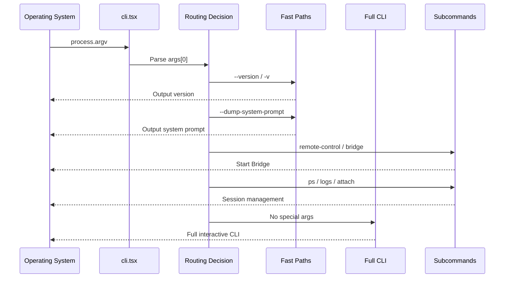

# CLI Entry Points

## Overview

Claude Code's entry points are distributed across three main files: [cli.tsx](/restored-src/src/entrypoints/cli.tsx) is the main entry responsible for command-line argument routing; [main.tsx](/restored-src/src/main.tsx) is the full CLI initialization entry; [init.ts](/restored-src/src/entrypoints/init.ts) contains shared initialization logic.

## File Structure

```
restored-src/src/
├── main.tsx             # Full CLI initialization (~803KB, main file)
├── cli.tsx              # Bootstrap entry: argument routing + fast paths
└── entrypoints/
    ├── cli.tsx         # Actual path of cli.tsx (alias/reexport of cli.tsx)
    ├── init.ts         # Shared initialization logic
    └── mcp.ts          # MCP entry point
```

> **Note**: Both `main.tsx` and `cli.tsx` are in `restored-src/src/` root directory — they are **not symlinks**. They are independent files: `cli.tsx` (~100 lines) is the bootstrap entry, `main.tsx` (~803KB) is the full CLI initialization main file.

## Entry Files in Detail

### cli.tsx — Argument Routing Core

[cli.tsx](/restored-src/src/entrypoints/cli.tsx) is the starting point of the entire CLI. Its core design philosophy is **lazy loading**: when detecting special arguments like `--version`, it returns directly without loading any business modules.

#### Fast-Path Detection Order

```typescript
async function main(): Promise<void> {
  const args = process.argv.slice(2)

  // Priority 1: Version check — completely zero imports
  if (args.length === 1 && (args[0] === '--version' || args[0] === '-v')) {
    console.log(`${MACRO.VERSION} (Claude Code)`)
    return
  }

  // Priority 2: Experimental special modes (ordered by internal usage frequency)
  if (args[0] === '--dump-system-prompt') { /* ... */ }
  if (args[0] === '--claude-in-chrome-mcp') { /* ... */ }
  if (args[0] === '--chrome-native-host') { /* ... */ }
  if (args[0] === '--computer-use-mcp') { /* ... */ }
  if (args[0] === '--daemon-worker') { /* ... */ }

  // Priority 3: Main command routing
  if (args[0] === 'remote-control' || args[0] === 'bridge') { /* Bridge */ }
  if (args[0] === 'daemon') { /* Daemon */ }
  if (args[0] === 'ps' || args[0] === 'logs' || ...) { /* BG sessions */ }
  if (args[0] === 'new' || args[0] === 'list') { /* Templates */ }
  if (args[0] === 'environment-runner') { /* BYOC */ }
  if (args[0] === 'self-hosted-runner') { /* Self-hosted runner */ }

  // Priority 4: Full CLI
  const { main: cliMain } = await import('../main.js')
  await cliMain()
}
```

### main.tsx — Full CLI Initialization

[main.tsx](/restored-src/src/main.tsx) loads the full feature set including the REPL interface, Analytics, and Telemetry. This file is very large (500+ lines) but never executes for `--version` fast paths.

#### Preloading Optimization

main.tsx triggers three parallel preloads at module evaluation time:

```typescript
// These run before all other imports
profileCheckpoint('main_tsx_entry')        // Startup profiling
startMdmRawRead()                          // MDM config parallel read
startKeychainPrefetch()                    // Keychain credentials parallel prefetch
```

### init.ts — Shared Initialization Logic

[init.ts](/restored-src/src/entrypoints/init.ts) contains initialization steps shared between Bridge and the full CLI: config loading, trust dialog verification, Analytics Sink initialization, and OAuth token checks.

## Command-Line Argument Parsing Architecture



## CLI Fast Path Performance Data

| Path | Loaded Modules | Typical Latency |
|------|---------------|----------------|
| `--version` | 0 | < 5ms |
| `--dump-system-prompt` | 2-3 | ~50ms |
| `remote-control` | 5-10 | ~200ms |
| Full CLI | 100+ | ~500-2000ms |

## Source References

- [cli.tsx](/restored-src/src/entrypoints/cli.tsx)
- [main.tsx](/restored-src/src/main.tsx)
- [init.ts](/restored-src/src/entrypoints/init.ts)
- [mcp.ts](/restored-src/src/entrypoints/mcp.ts)

## Related Documents

- [CLI Core and Entry](../cli/_index.md)
- [Startup and Fast Paths](startup.md)

---

*Generated by [Nium-Wiki v0.0.0](https://github.com/niuma996/nium-wiki) | 2026-03-31*
