# Startup and Fast Paths

## Overview

Claude Code's startup flow is designed around a **performance-first** principle. All non-essential modules use lazy loading to ensure fast paths like `--version` have minimal startup time. The `profileCheckpoint` system and preloading mechanisms ensure the full CLI also starts quickly.

## Startup Profiling System

[startupProfiler.ts](/restored-src/src/utils/startupProfiler.ts) provides startup performance analysis, recording checkpoints at critical module-loading points.

### Core API

```typescript
// Record a performance checkpoint
profileCheckpoint(name: string): void

// Output the complete startup time report
profileReport(): string
```

### Checkpoint Sequence

```mermaid
gantt
    title CLI Startup Timeline
    dateFormat x
    axisFormat %Lms

    section Fast Path
    cli_entry             :done, p1, 0, 1ms
    cli_version_output     :done, p2, 1, 5ms

    section Full CLI
    cli_entry             :done, p3, 0, 2ms
    cli_before_main_import :done, p4, 5, 50ms
    cli_after_main_import :done, p5, 55, 200ms
    main_tsx_entry        :done, p6, 200, 205ms
    cli_before_main       :done, p7, 210, 800ms
    cli_after_main        :done, p8, 810, 1500ms
```



## Fast Path Optimization Strategies

### 1. Zero-Import Principle

The `--version` path is the strictest fast path: it imports no modules at all, directly outputting the hardcoded `MACRO.VERSION`.

```typescript
// No await import() statements at all
// MACRO.VERSION is inlined at build time via macro
if (args.length === 1 && (args[0] === '--version' || args[0] === '-v')) {
  console.log(`${MACRO.VERSION} (Claude Code)`)
  return
}
```

### 2. Conditional Loading

Each fast path only loads the minimum module set it needs:

| Path | Loaded Modules | Count |
|------|---------------|-------|
| `--dump-system-prompt` | config.js, prompts.js | 2 |
| `remote-control` | bridgeEnabled, bridgeMain, auth | 5 |
| `ps/logs/attach/kill` | config.js, bg.js | 2 |
| `environment-runner` | environment-runner/main.js | 1 |

### 3. Preloading Mechanism

main.tsx triggers long-running I/O operations in parallel at module evaluation time:

```typescript
// Parallel execution: total time = max(plutil, keychain1, keychain2), not sum
startMdmRawRead()       // ~135ms subprocess
startKeychainPrefetch() // OAuth + API Key two Keychain reads
profileCheckpoint('main_tsx_entry')
```

## Conditional Compilation and Build-Time Optimization

### The feature() Function

`feature('FEATURE_NAME')` is a build-time feature switch macro based on Bun's static evaluation for DCE:

```typescript
// In cli.tsx
if (feature('BRIDGE_MODE') && (args[0] === 'remote-control' || ...)) {
  // External build: feature('BRIDGE_MODE') = false, entire block eliminated
  // Internal build: full logic retained
}

if (feature('DAEMON') && args[0] === 'daemon') {
  // Same pattern
}
```

### Internal vs External Build Differences

| Feature | Internal Build | External Build |
|---------|---------------|----------------|
| Remote Control Bridge | ✅ Retained | ❌ Eliminated |
| Daemon Process | ✅ Retained | ❌ Eliminated |
| BYOC Runner | ✅ Retained | ❌ Eliminated |
| Template Jobs | ✅ Retained | ❌ Eliminated |
| System Prompt Export | ✅ Retained | ❌ Eliminated |

## Environment Adaptation

### Remote Container Environment

```typescript
if (process.env.CLAUDE_CODE_REMOTE === 'true') {
  // 16GB container: allocate 8GB heap memory
  process.env.NODE_OPTIONS = `--max-old-space-size=8192`
}
```

### macOS Corepack Fix

```typescript
// Prevent yarn's corepack auto-pinning from polluting package.json
process.env.COREPACK_ENABLE_AUTO_PIN = '0'
```

### Ablation Baseline (Internal Build)

```typescript
if (feature('ABLATION_BASELINE') && process.env.CLAUDE_CODE_ABLATION_BASELINE) {
  // Force-disable all optimization features to measure baseline performance
  for (const k of [
    'CLAUDE_CODE_SIMPLE',
    'CLAUDE_CODE_DISABLE_THINKING',
    'DISABLE_INTERLEAVED_THINKING',
    'DISABLE_COMPACT',
    'DISABLE_AUTO_COMPACT',
    'CLAUDE_CODE_DISABLE_AUTO_MEMORY',
    'CLAUDE_CODE_DISABLE_BACKGROUND_TASKS'
  ]) {
    process.env[k] = '1'
  }
}
```

## Fast Path Implementation Pattern

The core pattern for fast paths is a series of short-circuit checks at the top of the `main()` function:

```typescript
async function main(): Promise<void> {
  const args = process.argv.slice(2)

  // Use if-elseif chain, ordered by priority
  if (condition1) { return executionPath1 }
  if (condition2) { return executionPath2 }
  // ...
  if (conditionN) { return executionPathN }

  // Default: full CLI
  return defaultPath
}
```

## Source References

- [startupProfiler.ts](/restored-src/src/utils/startupProfiler.ts)
- [cli.tsx](/restored-src/src/entrypoints/cli.tsx)
- [main.tsx](/restored-src/src/main.tsx)
- [keychainPrefetch.ts](/restored-src/src/utils/secureStorage/keychainPrefetch.js)
- [rawRead.js](/restored-src/src/utils/settings/mdm/rawRead.js)

## Related Documents

- [CLI Core and Entry](../cli/_index.md)
- [CLI Entry Points](entrypoints.md)

---

*Generated by [Nium-Wiki v0.0.0](https://github.com/niuma996/nium-wiki) | 2026-03-31*
