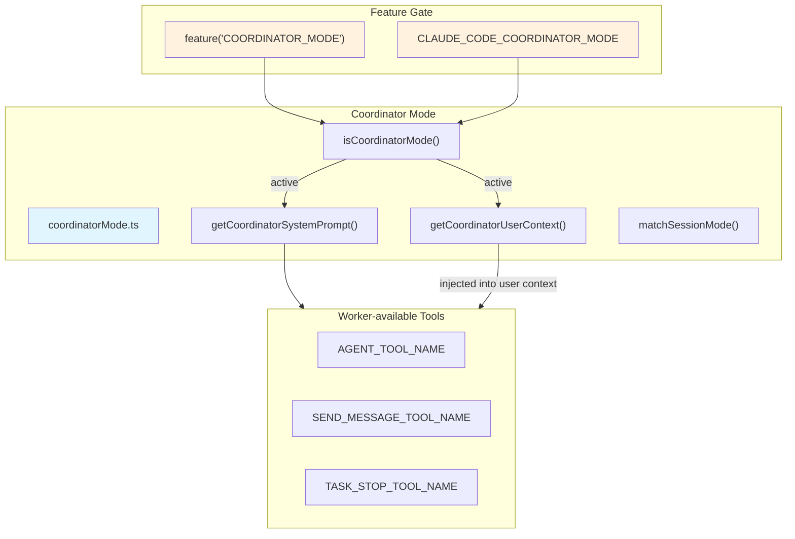
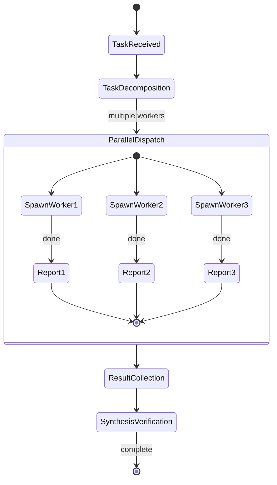

# Coordinator Mode

## Overview

Coordinator Mode is an advanced multi-agent collaboration mode in Claude Code where a single "coordinator" LLM orchestrates multiple parallel worker agents to accomplish complex, multi-step tasks. The coordinator handles task decomposition, parallel scheduling, result synthesis, and quality verification — while delegating actual research and implementation to worker subagents.

It is gated by both a GrowthBook feature flag (`COORDINATOR_MODE`) and the environment variable (`CLAUDE_CODE_COORDINATOR_MODE`), and is mutually exclusive with Fork Subagent mode.

## Architecture Position



## Core Concepts

### Coordinator vs. Worker Responsibility Boundary



| Responsibility | Coordinator | Worker |
|----------------|------------|--------|
| Understand task | ✅ | ❌ (receives synthesized directive only) |
| Decompose task | ✅ | ❌ |
| Parallel scheduling | ✅ (AGENT_TOOL) | ❌ |
| Merge results | ✅ | ❌ |
| Verify quality | ✅ | ❌ |
| Tool execution | ❌ (dispatch only) | ✅ |
| Continue conversation | ✅ (SEND_MESSAGE) | ❌ |
| Stop workers | ✅ (TASK_STOP) | ❌ |

### Four-Phase Workflow

The coordinator system prompt defines a standard workflow:

```
1. Research    → Gather context, assess feasibility
2. Synthesis   → Merge findings into a unified plan
3. Implementation → Parallel dispatch workers
4. Verification → Check output quality, retry if needed
```

## API Summary

| Function | Description | Signature |
|----------|-------------|-----------|
| `isCoordinatorMode` | Whether coordinator mode is active | `() => boolean` |
| `matchSessionMode` | Syncs mode state on session restore | `(sessionMode) => string \| undefined` |
| `getCoordinatorUserContext` | Injects worker tool context | `(mcpClients, scratchpadDir?) => { workerToolsContext: string }` |
| `getCoordinatorSystemPrompt` | Full coordinator system prompt | `() => string` |

## Feature Details

### 1. Dual-Gate Mechanism

```typescript
export function isCoordinatorMode(): boolean {
  // Layer 1: GrowthBook build-time feature gate
  if (!feature('COORDINATOR_MODE')) return false

  // Layer 2: Runtime environment variable
  return isEnvTruthy(process.env.CLAUDE_CODE_COORDINATOR_MODE)
}
```

- **Build-time gate** (`feature('COORDINATOR_MODE')`): resolved at compile time via `bun:bundle`, controllable per build/channel
- **Runtime gate** (env var): enables toggling without rebuilding

### 2. Session Mode Sync

On session resume, stored session metadata carries a `mode` field. If it differs from the current `isCoordinatorMode()` result, `process.env` is mutated directly to align:

```typescript
export function matchSessionMode(
  sessionMode: 'coordinator' | 'normal' | undefined,
): string | undefined {
  const currently = isCoordinatorMode()

  // Case 1: stored as coordinator, currently normal → unset env var
  if (sessionMode === 'coordinator' && !currently) {
    delete process.env.CLAUDE_CODE_COORDINATOR_MODE
    return 'Resuming in coordinator mode'
  }

  // Case 2: stored as normal, currently coordinator → set env var
  if (sessionMode !== 'coordinator' && currently) {
    process.env.CLAUDE_CODE_COORDINATOR_MODE = '1'
    return 'Resuming in normal mode'
  }

  return undefined  // no switch needed
}
```

Fires analytics event: `tengu_coordinator_mode_switched`

### 3. Worker Tools Context

```typescript
export function getCoordinatorUserContext(
  mcpClients: ReadonlyArray<{ name: string }>,
  scratchpadDir?: string,
): { [k: string]: string } {
  if (!isCoordinatorMode()) return {}

  // Simple mode: workers restricted to 3 core tools
  if (isEnvTruthy(process.env.CLAUDE_CODE_SIMPLE)) {
    return { workerToolsContext: 'Tools: Bash, Read, Edit' }
  }

  // Standard mode: all async agent tools minus internal ones
  const allowedTools = ASYNC_AGENT_ALLOWED_TOOLS.filter(
    t => !INTERNAL_WORKER_TOOLS.has(t),
  )

  let ctx = `Worker-available tools: ${allowedTools.join(', ')}`

  // Append MCP servers
  if (mcpClients.length > 0) {
    ctx += `\nConnected MCP servers: ${mcpClients.map(c => c.name).join(', ')}`
  }

  // Append scratchpad (Statsig-gated)
  if (scratchpadDir && checkStatsigFeatureGate_CACHED_MAY_BE_STALE('tengu_scratch')) {
    ctx += `\nScratchpad directory: ${scratchpadDir}`
  }

  return { workerToolsContext: ctx }
}
```

### 4. Internal Tools — Workers Forbidden

```typescript
const INTERNAL_WORKER_TOOLS = new Set([
  TEAM_CREATE_TOOL_NAME,      // workers cannot spawn more teams
  TEAM_DELETE_TOOL_NAME,       // workers cannot delete teams
  SEND_MESSAGE_TOOL_NAME,      // workers cannot continue convos (coordinator-only)
  SYNTHETIC_OUTPUT_TOOL_NAME,  // workers cannot generate synthetic output
])
```

### 5. Coordinator System Prompt Structure

`getCoordinatorSystemPrompt()` returns a ~300-line multi-section system prompt:

| Section | Content | Importance |
|---------|---------|-----------|
| 1 | Role definition: single coordinator directs workers | ★★★ |
| 2 | Tool docs: AGENT_TOOL, SEND_MESSAGE, TASK_STOP | ★★★ |
| 3 | Worker result format: `<task-notification>` XML | ★★ |
| 4 | Worker capabilities: varies by CLAUDE_CODE_SIMPLE | ★★ |
| 5 | Task workflow: Research→Synthesis→Implementation→Verification | ★★★ |
| 6 | Worker failure handling: SEND_MESSAGE to same worker | ★★ |
| 7 | Stopping workers: TASK_STOP to redirect in-flight workers | ★★ |
| 8 | Writing worker prompts: most detailed section, with good/bad examples | ★★★ |

### 6. Continue vs. Spawn Decision

The coordinator must decide whether to continue an existing worker (`SEND_MESSAGE`) or spawn a new one (`AGENT_TOOL`):

| Scenario | Action | Rationale |
|----------|--------|-----------|
| Worker failed unexpectedly | SEND_MESSAGE (same type) | Reuse existing context, continue forward |
| Task clearly out of scope | TASK_STOP → AGENT_TOOL (new type) | Redirect or replace |
| Need entirely new research area | AGENT_TOOL (new type) | Isolate concerns |
| Information gathered is incomplete | SEND_MESSAGE (follow-up) | Deepen current work |

## Usage Examples

### Enable Coordinator Mode

```bash
# Via environment variable
export CLAUDE_CODE_COORDINATOR_MODE=1
claude

# Or switch mid-session (matchSessionMode syncs automatically)
```

### Fetch Coordinator System Prompt

```typescript
import { getCoordinatorSystemPrompt } from './coordinator/coordinatorMode'

if (isCoordinatorMode()) {
  const sysPrompt = getCoordinatorSystemPrompt()
  // → ~300 lines, includes full worker dispatching guide
}
```

### Inject Worker Tools Context

```typescript
import { getCoordinatorUserContext } from './coordinator/coordinatorMode'

const mcpClients = [{ name: 'filesystem' }, { name: 'git' }]
const userCtx = getCoordinatorUserContext(mcpClients, '/tmp/scratch')
// → { workerToolsContext: "Worker-available tools: Bash, Read, Edit..." }
```

## Design Decisions

### Mutual Exclusion with Fork

Coordinator mode and Fork Subagent are mutually exclusive. Both are parallelization mechanisms, but coordinator mode relies on complex调度 strategies unsuitable for lightweight implicit forking.

### Self-Contained Worker Prompts

Worker directives must be fully self-contained because workers cannot see the coordinator's full conversation history. The coordinator must synthesize all findings before delegating. This is intentional: it prevents workers from relying on implicit context, ensuring each worker can operate independently.

### Process-Level Mode Switching

Mode sync via `process.env` mutation rather than in-memory-only switching. Advantage: all subsequent `isCoordinatorMode()` calls are immediately consistent. Risk: state mutation is visible to other modules in the same process. Initialization order must be handled carefully.

## Source References

- [coordinatorMode.ts](/restored-src/src/coordinator/coordinatorMode.ts)

## Related Documents

- [Agents & Coordination](../agent/_index.md)
- [Agent Tool](../agent/agent-tool.md)
- [Fork Subagent](../agent/fork-subagent.md)

---

*Generated by [Nium-Wiki v0.0.0](https://github.com/niuma996/nium-wiki) | 2026-04-01*
