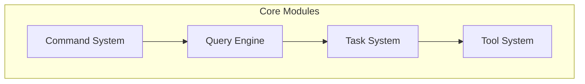

# Core Modules

## Overview

The core modules are the engine part of Claude Code, responsible for coordinating AI model calls, task management, and tool execution.

## Submodules

| Module | Description | Document |
|--------|-------------|----------|
| [Command System](commands.md) | Manage all slash commands | [commands.md](commands.md) |
| [Tool System](tools.md) | Tool implementation and execution | [tools.md](tools.md) |
| [Query Engine](query.md) | Query flow and model interaction | [query.md](query.md) |

## Architecture Position

## Related Documents

- [Architecture Docs](../architecture.md)
- [Home](../index.md)

---

*Generated by [Nium-Wiki v0.0.0](https://github.com/niuma996/nium-wiki) | 2026-03-31*
