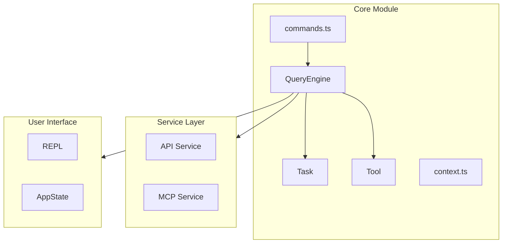

# Core Module

## Overview

The core module contains Claude Code's core engine components, responsible for coordinating AI queries, task management, and tool execution.

## Architecture Location



## Core Components

| Component | File | Description | Key Locations |
|-----------|------|-------------|---------------|
| QueryEngine | [QueryEngine.ts](/restored-src/src/QueryEngine.ts#L184-L200) | Query engine, handles AI conversation lifecycle | Class definition L184, config types L130 |
| Task | [Task.ts](/restored-src/src/Task.ts#L72-L76) | Task management, supports local/remote agents and workflows | Type definition L6, ID generation L98 |
| Tool | [Tool.ts](/restored-src/src/Tool.ts) | Tool base class, abstraction for all tools | Base class definition, tool registry |
| Commands | [commands.ts](/restored-src/src/commands.ts) | Command system, registers and manages slash commands | Command registration and management |
| Context | [context.ts](/restored-src/src/context.ts) | Context management | Context state maintenance |

## QueryEngine

QueryEngine is the core class of the query engine, responsible for managing conversation lifecycle and session state. Core implementation located at [QueryEngine.ts](/restored-src/src/QueryEngine.ts#L184).

### Key Features

- **Conversation Management**: Manages multi-turn conversation message history
- **Task Coordination**: Creates and manages Task instances
- **Tool Execution**: Coordinates tool calls and result handling
- **Permission Checking**: Handles tool usage permissions and denial tracking
- **Session Persistence**: Supports conversation recovery and history

### Main Methods

| Method | Description | Source Location |
|--------|-------------|----------------|
| `QueryEngine` | Constructor, initializes engine | [L200](/restored-src/src/QueryEngine.ts#L200) |
| `submitMessage()` | Submits user message and returns async generator | [L209](/restored-src/src/QueryEngine.ts#L209) |
| `abortController` | Abort controller | [L187](/restored-src/src/QueryEngine.ts#L187) |
| `permissionDenials` | Permission denial tracking array | [L188](/restored-src/src/QueryEngine.ts#L188) |

### QueryEngineConfig Type

```typescript
// Source: [QueryEngine.ts L130-L173](/restored-src/src/QueryEngine.ts#L130-L173)
export type QueryEngineConfig = {
  cwd: string
  tools: Tools
  commands: Command[]
  mcpClients: MCPServerConnection[]
  agents: AgentDefinition[]
  canUseTool: CanUseToolFn
  getAppState: () => AppState
  setAppState: (f: (prev: AppState) => AppState) => void
  initialMessages?: Message[]
  readFileCache: FileStateCache
  customSystemPrompt?: string
  appendSystemPrompt?: string
  userSpecifiedModel?: string
  fallbackModel?: string
  thinkingConfig?: ThinkingConfig
  maxTurns?: number
  maxBudgetUsd?: number
  taskBudget?: { total: number }
  // ... more config options
}
```

### Usage Example

[Source: QueryEngine.ts](/restored-src/src/QueryEngine.ts#L200-L237)
```typescript
const engine = new QueryEngine({
  cwd,
  tools,
  commands,
  mcpClients,
  agents,
  canUseTool,
  getAppState,
  setAppState,
  initialMessages: [],
})

for await (const message of engine.submitMessage(prompt)) {
  // Process message
}
```

### Permission Denial Tracking

QueryEngine maintains a `permissionDenials` array at [L188](/restored-src/src/QueryEngine.ts#L188) to track all tool permission denials. Denials are recorded in the `wrappedCanUseTool` function at [L244-L271](/restored-src/src/QueryEngine.ts#L244-L271):

```typescript
// Track denials for SDK reporting
if (result.behavior !== 'allow') {
  this.permissionDenials.push({
    tool_name: sdkCompatToolName(tool.name),
    tool_use_id: toolUseID,
    tool_input: input,
  })
}
```

## Task System

The Task system manages various task types in Claude Code. Core type definitions located at [Task.ts](/restored-src/src/Task.ts).

### Task Types

[Source: Task.ts L6-L13](/restored-src/src/Task.ts#L6-L13)
```typescript
export type TaskType =
  | 'local_bash'
  | 'local_agent'
  | 'remote_agent'
  | 'in_process_teammate'
  | 'local_workflow'
  | 'monitor_mcp'
  | 'dream'
```

| Type | Description | Use Case |
|------|-------------|----------|
| `local_bash` | Local Bash command | Execute shell commands |
| `local_agent` | Local agent | Create local sub-agent |
| `remote_agent` | Remote agent | Create remote sub-agent |
| `in_process_teammate` | In-process teammate | Internal collaboration tasks |
| `local_workflow` | Local workflow | Automated workflows |
| `monitor_mcp` | MCP monitor | Monitor MCP servers |
| `dream` | Dream mode | Automated task execution |

### Task Status

[Source: Task.ts L15-L20](/restored-src/src/Task.ts#L15-L20)
```typescript
export type TaskStatus =
  | 'pending'
  | 'running'
  | 'completed'
  | 'failed'
  | 'killed'
```

| Status | Description |
|--------|-------------|
| `pending` | Waiting to execute |
| `running` | Currently executing |
| `completed` | Completed |
| `failed` | Execution failed |
| `killed` | Terminated |

### Terminal State Check

[Source: Task.ts L27-L29](/restored-src/src/Task.ts#L27-L29)
```typescript
export function isTerminalTaskStatus(status: TaskStatus): boolean {
  return status === 'completed' || status === 'failed' || status === 'killed'
}
```

### Task ID Generation

[Source: Task.ts L98-L106](/restored-src/src/Task.ts#L98-L106)
Task IDs use base-36 encoding with prefix to identify task type:

```typescript
const TASK_ID_PREFIXES: Record<string, string> = {
  local_bash: 'b', // Keep as 'b' for backward compatibility
  local_agent: 'a',
  remote_agent: 'r',
  in_process_teammate: 't',
  local_workflow: 'w',
  monitor_mcp: 'm',
  dream: 'd',
}

export function generateTaskId(type: TaskType): string {
  const prefix = getTaskIdPrefix(type)
  const bytes = randomBytes(8)
  let id = prefix
  for (let i = 0; i < 8; i++) {
    id += TASK_ID_ALPHABET[bytes[i]! % TASK_ID_ALPHABET.length]
  }
  return id
}
```

ID prefix mapping:
- `b` - Local Bash
- `a` - Local agent
- `r` - Remote agent
- `t` - In-process teammate
- `w` - Local workflow
- `m` - MCP monitor
- `d` - Dream mode

### TaskStateBase Base State

[Source: Task.ts L45-L57](/restored-src/src/Task.ts#L45-L57)
```typescript
export type TaskStateBase = {
  id: string
  type: TaskType
  status: TaskStatus
  description: string
  toolUseId?: string
  startTime: number
  endTime?: number
  totalPausedMs?: number
  outputFile: string
  outputOffset: number
  notified: boolean
}
```

### Create Task State

[Source: Task.ts L108-L125](/restored-src/src/Task.ts#L108-L125)
```typescript
export function createTaskStateBase(
  id: string,
  type: TaskType,
  description: string,
  toolUseId?: string,
): TaskStateBase {
  return {
    id,
    type,
    status: 'pending',
    description,
    toolUseId,
    startTime: Date.now(),
    outputFile: getTaskOutputPath(id),
    outputOffset: 0,
    notified: false,
  }
}
```

## File Structure

```
restored-src/src/
├── QueryEngine.ts     # Query engine
├── Task.ts           # Task management
├── Tool.ts           # Tool base class
├── commands.ts       # Command system
├── context.ts        # Context management
├── main.tsx          # Main entry
├── query.ts          # Query implementation
├── tasks.ts          # Task list
├── tools.ts          # Tool registry
├── history.ts        # History
├── ink.ts           # Ink components
├── setup.ts         # Setup
└── ...
```

## Design Decisions

### 1. Async Generator Pattern

QueryEngine uses async generator pattern (`async *`) to handle streaming responses, allowing progressive processing of incremental content from API returns.

### 2. Conditional Compilation

Uses `feature()` function for conditional compilation, supporting differentiated features between internal builds and external releases:

```typescript
const getCoordinatorUserContext = feature('COORDINATOR_MODE')
  ? require('./coordinator/coordinatorMode.js').getCoordinatorUserContext
  : () => ({})
```

### 3. Permission Tracking

QueryEngine tracks all tool permission denials, recording to `permissionDenials` array for SDK reporting.

## Source References

- [QueryEngine.ts](/restored-src/src/QueryEngine.ts#L184-L200) - Query engine core implementation
- [Task.ts](/restored-src/src/Task.ts#L1-L125) - Task system types and functions
- [Tool.ts](/restored-src/src/Tool.ts) - Tool base class
- [commands.ts](/restored-src/src/commands.ts) - Command system

**Key Type Definitions**
- [QueryEngineConfig L130-L173](/restored-src/src/QueryEngine.ts#L130-L173)
- [TaskType L6-L13](/restored-src/src/Task.ts#L6-L13)
- [TaskStatus L15-L20](/restored-src/src/Task.ts#L15-L20)
- [TaskStateBase L45-L57](/restored-src/src/Task.ts#L45-L57)

**Key Functions**
- [submitMessage L209](/restored-src/src/QueryEngine.ts#L209) - Submit message async generator
- [generateTaskId L98](/restored-src/src/Task.ts#L98) - Generate task ID
- [isTerminalTaskStatus L27](/restored-src/src/Task.ts#L27) - Check terminal status
- [createTaskStateBase L108](/restored-src/src/Task.ts#L108) - Create task state

## Related Documents

- [Query Engine](query.md)
- [Command System](commands.md)
- [Tool System](tools.md)
- [Hook System](hooks.md)
- [Architecture Documentation](../architecture.md)

---

*Generated by [Nium-Wiki v0.0.0](https://github.com/niuma996/nium-wiki) | 2026-05-16*
