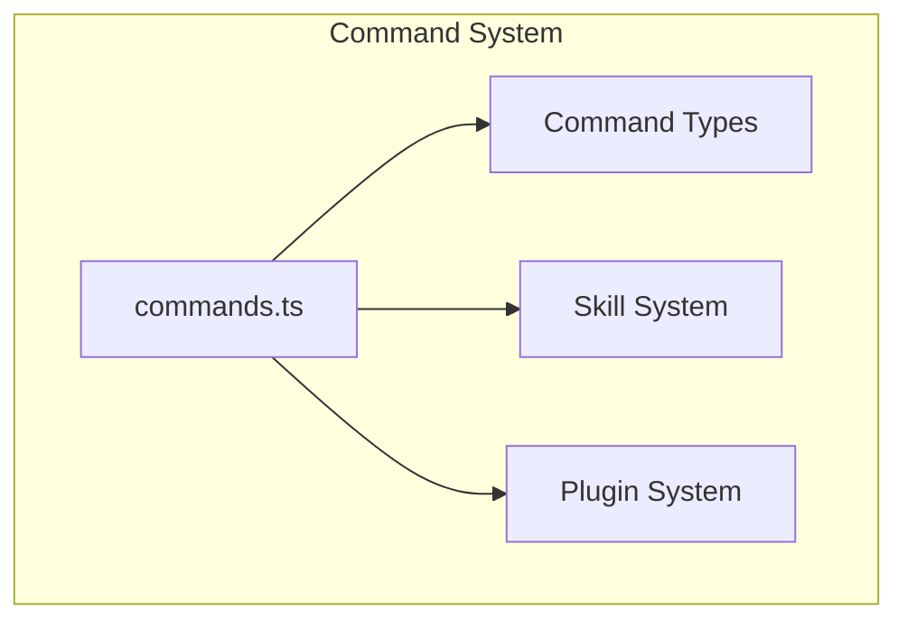
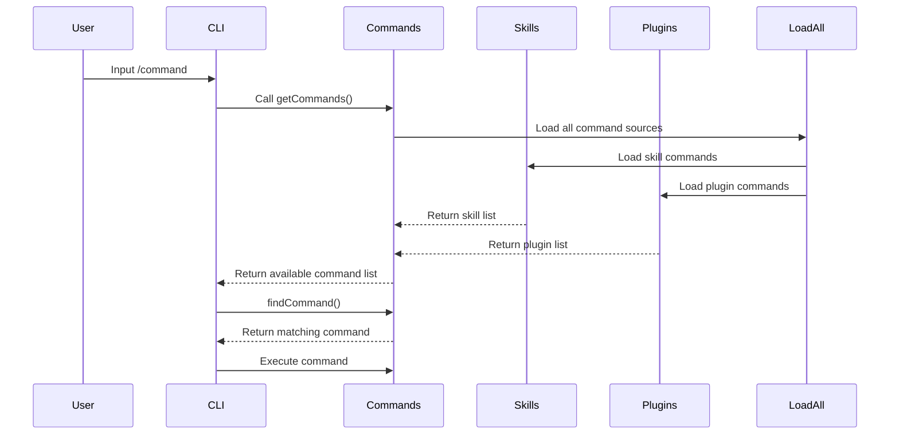

# Command System

## Overview

The command system is one of the core modules of Claude Code, responsible for managing and executing all slash commands. The system supports 80+ built-in commands and provides extension mechanisms for plugins and skills.

The command system uses a lazy loading strategy, loading command modules only when needed, ensuring fast startup performance. The core implementation is in the [commands.ts](/restored-src/src/commands.ts#L1) file.

**Core Source Code Locations**
- [commands.ts](/restored-src/src/commands.ts#L1) - Command system main file
- [commands/](/restored-src/src/commands/) - Command implementation directory
- [loadSkillsDir.ts](/restored-src/src/skills/loadSkillsDir.ts#L1) - Skill loading
- [types/command.ts](/restored-src/src/types/command.ts) - Command type definitions

## Architecture



## Features

| Feature | Description | Related Files |
|---------|-------------|---------------|
| Command Registration | Unified registration of all built-in commands | [commands.ts](/restored-src/src/commands.ts) |
| Dynamic Loading | Support for skill and plugin commands | [loadSkillsDir.ts](/restored-src/src/skills/loadSkillsDir.ts) |
| Availability Check | Command-level availability control | `meetsAvailabilityRequirement()` |
| Feature Gating | Conditional loading based on feature flags | `feature()` function |
| Remote Mode Filtering | Filter remote-unsafe commands | `REMOTE_SAFE_COMMANDS` |

## File Structure

```
restored-src/src/
├── commands.ts              # Command system main file
├── commands/               # Command implementation directory
│   ├── help/              # /help command
│   ├── config/            # /config command
│   ├── login/             # /login command
│   ├── logout/            # /logout command
│   ├── commit/           # /commit command
│   ├── review/            # /review command
│   ├── diff/              # /diff command
│   ├── tasks/             # /tasks command
│   ├── skills/            # /skills command
│   ├── mcp/               # /mcp command
│   ├── agents/            # /agents command
│   ├── context/           # /context command
│   ├── compact/           # /compact command
│   ├── resume/            # /resume command
│   └── ...                # 70+ other commands
```

## Core Workflow



## API Summary

| Function | Description | Return Type |
|----------|-------------|-------------|
| `getCommands(cwd)` | Get all available commands | `Promise<Command[]>` |
| `findCommand(name, commands)` | Find specified command | `Command \| undefined` |
| `getCommand(name, commands)` | Get command (throws if not found) | `Command` |
| `hasCommand(name, commands)` | Check if command exists | `boolean` |
| `meetsAvailabilityRequirement(cmd)` | Check command availability | `boolean` |
| `getSkillToolCommands(cwd)` | Get skill command list | `Promise<Command[]>` |
| `filterCommandsForRemoteMode(commands)` | Filter remote-safe commands | `Command[]` |

## Command Types

| Type | Description | Examples |
|------|-------------|----------|
| `prompt` | Prompt-type command, expanded to text | `/help`, `/skills` |
| `local` | Local command, text output | `/version`, `/compact` |
| `local-jsx` | Local JSX command, renders UI | `/config`, `/tasks` |
| `special` | Special command | Internal use |

## Command Availability

Commands support multiple availability controls:

```typescript
type Availability = 'claude-ai' | 'console'

// Example: Only available to Claude.ai subscribers
{
  name: 'voice',
  availability: ['claude-ai'],
  // ...
}
```

## Feature Gating

Conditional compilation using the `feature()` function:

```typescript
// Only load when VOICE_MODE is enabled
const voiceCommand = feature('VOICE_MODE')
  ? require('./commands/voice/index.js').default
  : null

// Only available in KAIROS mode
const assistantCommand = feature('KAIROS')
  ? require('./commands/assistant/index.js').default
  : null
```

## Remote Mode Security

Only safe commands can be used in remote mode:

```typescript
export const REMOTE_SAFE_COMMANDS: Set<Command> = new Set([
  session, exit, clear, help, theme, color,
  vim, cost, usage, copy, btw, feedback,
  plan, keybindings, statusline, stickers, mobile,
])
```

## Source Code References

**Core Files**
- [commands.ts](/restored-src/src/commands.ts#L1) - Command system main file
- [types/command.ts](/restored-src/src/types/command.ts) - Command type definitions
- [skills/loadSkillsDir.ts](/restored-src/src/skills/loadSkillsDir.ts#L1) - Skill loading

**Command Implementation Examples**
- [commands/help/](/restored-src/src/commands/help/) - /help command
- [commands/config/](/restored-src/src/commands/config/) - /config command
- [commands/commit/](/restored-src/src/commands/commit/) - /commit command
- [commands/review/](/restored-src/src/commands/review/) - /review command
- [commands/plan/](/restored-src/src/commands/plan/) - /plan command
- [commands/memory/](/restored-src/src/commands/memory/) - /memory command
- [commands/mcp/](/restored-src/src/commands/mcp/) - /mcp command

**Key Functions**
- [getCommands()](/restored-src/src/commands.ts) - Get all commands
- [findCommand()](/restored-src/src/commands.ts) - Find command
- [meetsAvailabilityRequirement()](/restored-src/src/commands.ts) - Availability check

## Related Documentation

- [Query Engine](query.md)
- [Tool System](tools.md)
- [Skill System](skills.md)
- [Core Module Index](_index.md)

---

*Generated by [Nium-Wiki v0.0.0](https://github.com/niuma996/nium-wiki) | 2026-05-16*
