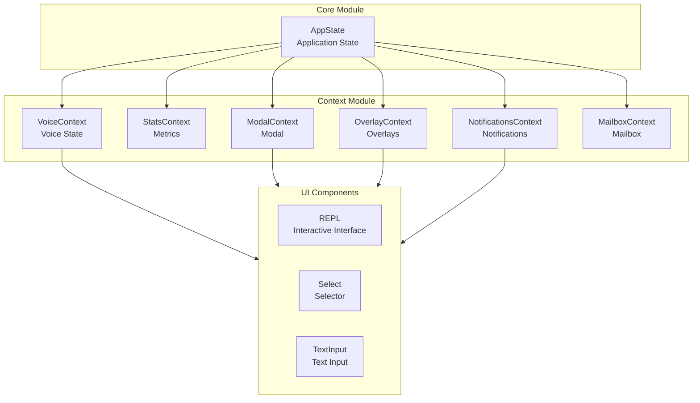
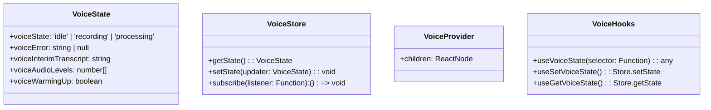
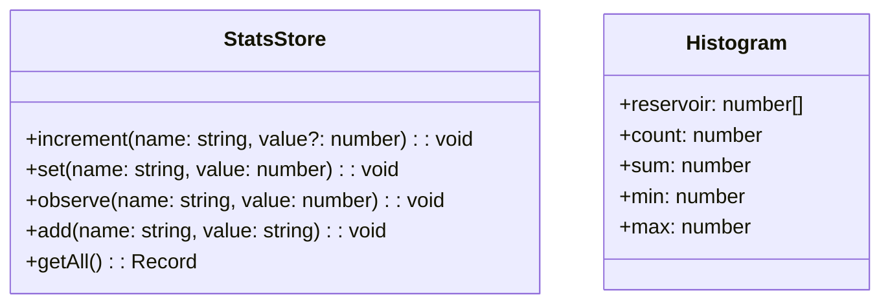
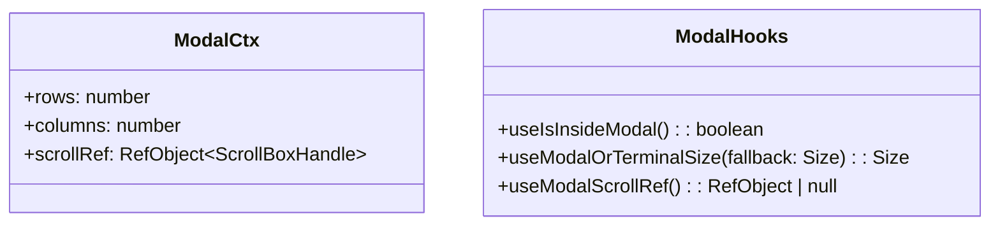
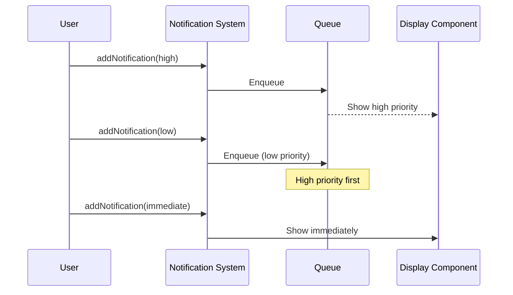
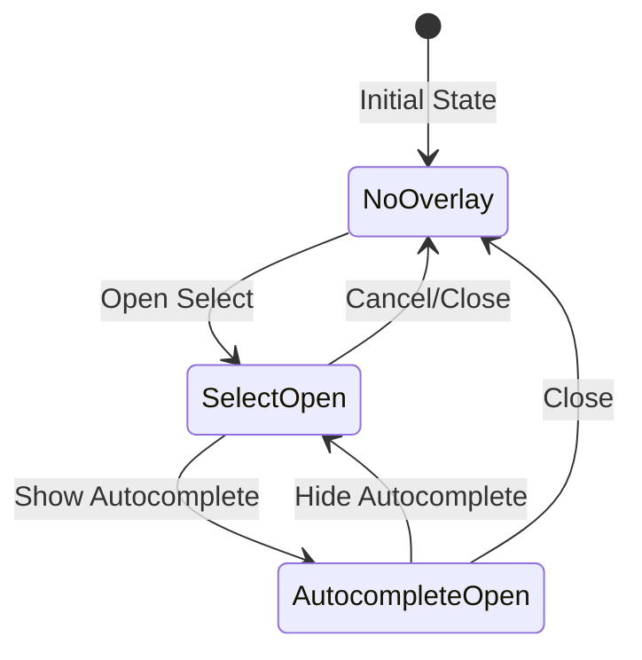

# Context Module

The Context module is a core collection of React Context components for managing application state in Claude Code, including voice input, statistics, modals, notifications, and overlays.

## Architecture Position



## File Structure

```
restored-src/src/context/
├── voice.tsx              # Voice input state management
├── stats.tsx              # Statistics collection
├── modalContext.tsx       # Modal context
├── notifications.tsx       # Notification queue system
├── overlayContext.tsx     # Overlay management
├── mailbox.tsx            # Message mailbox
├── fpsMetrics.tsx         # FPS performance metrics
├── promptOverlayContext.tsx  # Prompt overlay
└── QueuedMessageContext.tsx  # Message queue
```

## Core Components

### VoiceContext - Voice State Management

VoiceContext manages voice input state using `useSyncExternalStore` for efficient reactive updates.



**Exported Hooks:**

| Hook | Description |
|------|-------------|
| `useVoiceState(selector)` | Subscribe to voice state slice, re-render only when selected value changes |
| `useSetVoiceState()` | Get state setter for synchronous updates |
| `useGetVoiceState()` | Get sync reader for reading state inside callbacks |

**Usage Example:**

```typescript
import { useVoiceState, useSetVoiceState } from './context/voice'

function VoiceIndicator() {
  const voiceState = useVoiceState(s => s.voiceState)
  const setVoiceState = useSetVoiceState()

  return (
    <div>
      {voiceState === 'recording' ? 'Recording...' : 'Idle'}
      <button onClick={() => setVoiceState({ voiceState: 'idle' })}>
        Stop
      </button>
    </div>
  )
}
```

### StatsContext - Statistics Collection

StatsContext provides three data collection types: metrics, histograms, and sets, with percentile calculations.



**Exported Hooks:**

| Hook | Description |
|------|-------------|
| `useStats()` | Get StatsStore instance |
| `useCounter(name)` | Returns increment function |
| `useGauge(name)` | Returns setter function |
| `useTimer(name)` | Returns observer function for recording durations |
| `useSet(name)` | Returns add function for discrete values |

**Usage Example:**

```typescript
import { useCounter, useTimer, useGauge } from './context/stats'

function MetricsComponent() {
  const increment = useCounter('user_actions')
  const recordTime = useTimer('request_duration')
  const setActive = useGauge('active_users')

  const handleAction = async () => {
    increment()
    const start = Date.now()
    await doSomething()
    recordTime(Date.now() - start)
  }

  return <button onClick={handleAction}>Execute Action</button>
}
```

### ModalContext - Modal Context

ModalContext detects when a component is rendered inside a modal and provides available size information.



**Usage Example:**

```typescript
import { useIsInsideModal, useModalOrTerminalSize } from './context/modalContext'

function SelectComponent({ options }) {
  const isInsideModal = useIsInsideModal()
  const { rows } = useModalOrTerminalSize({ rows: 20, columns: 80 })

  // Limit visible options when inside modal
  const visibleOptions = isInsideModal
    ? options.slice(0, rows - 5)
    : options

  return <Select options={visibleOptions} />
}
```

### NotificationsContext - Notification System

The notification system supports priority queues, auto-timeout, notification folding, and invalidation.



**Notification Types:**

```typescript
type TextNotification = {
  key: string
  text: string
  color?: keyof Theme
  priority: 'low' | 'medium' | 'high' | 'immediate'
  timeoutMs?: number
  invalidates?: string[]
  fold?: (acc: Notification, incoming: Notification) => Notification
}

type JSXNotification = {
  key: string
  jsx: React.ReactNode
  priority: 'low' | 'medium' | 'high' | 'immediate'
  timeoutMs?: number
}
```

**Usage Example:**

```typescript
import { useNotifications } from './context/notifications'

function NotificationButton() {
  const { addNotification } = useNotifications()

  const showWarning = () => {
    addNotification({
      key: 'save-warning',
      text: 'File not saved',
      priority: 'high',
      timeoutMs: 10000,
      invalidates: ['save-success']
    })
  }

  return <button onClick={showWarning}>Show Warning</button>
}
```

### OverlayContext - Overlay Management

OverlayContext coordinates Escape key handling between overlays and cancel requests.



**Exported Hooks:**

| Hook | Description |
|------|-------------|
| `useRegisterOverlay(id, enabled?)` | Register overlay, auto-manages lifecycle |
| `useIsOverlayActive()` | Check if any overlay is active |
| `useIsModalOverlayActive()` | Check if any modal overlay (non-autocomplete) is active |

**Usage Example:**

```typescript
import { useRegisterOverlay, useIsOverlayActive } from './context/overlayContext'

function Select({ onCancel }) {
  useRegisterOverlay('select', !!onCancel)
  const isOverlayActive = useIsOverlayActive()

  useKeybinding('escape', () => {
    if (isOverlayActive) {
      onCancel?.()
    }
  })

  return <SelectUI />
}
```

## Best Practices

### 1. Context Subscription Optimization

Use selector functions to avoid unnecessary re-renders:

```typescript
// ✅ Good: Subscribe to only needed state
const count = useVoiceState(s => s.voiceAudioLevels.length)

// ❌ Bad: Subscribe to entire state, any change triggers re-render
const state = useVoiceState()
```

### 2. State Update Patterns

Use `setState` for sync updates; use `useEffect` for async operations:

```typescript
// ✅ Good: Sync update
const setVoiceState = useSetVoiceState()
button.onClick = () => setVoiceState({ voiceState: 'idle' })

// ✅ Good: Async operation
useEffect(() => {
  if (condition) {
    addNotification({ key: 'test', text: 'Hello', priority: 'low' })
  }
}, [condition])
```

### 3. Conditional Overlay Registration

Dynamically register overlays based on feature availability:

```typescript
// ✅ Good: Conditional registration
useRegisterOverlay('select', !!onCancel)

// ❌ Bad: Always register
useRegisterOverlay('select', true)
```

## Design Decisions

### Why use `useSyncExternalStore`?

VoiceContext uses `useSyncExternalStore` instead of simple `useContext` because:

1. **External state sync**: VoiceState is managed by non-React systems (e.g., Web Audio API)
2. **Selector optimization**: Reference equality checks avoid unnecessary re-renders
3. **Consistency guarantee**: Ensures consistent state during concurrent renders

### Reservoir Sampling for Statistics Histogram

StatsContext uses Algorithm R for reservoir sampling to maintain a fixed sample size in infinite data streams:

```typescript
if (h.reservoir.length < RESERVOIR_SIZE) {
  h.reservoir.push(value)
} else {
  const j = Math.floor(Math.random() * h.count)
  if (j < RESERVOIR_SIZE) {
    h.reservoir[j] = value
  }
}
```

## Related Documents

- [Application State Management](/wiki/core/state.md)
- [REPL Interface](/wiki/ui/repl.md)
- [Tools System](/wiki/core/tools.md)

---

*Generated by Nium-Wiki | 2026-04-01*
