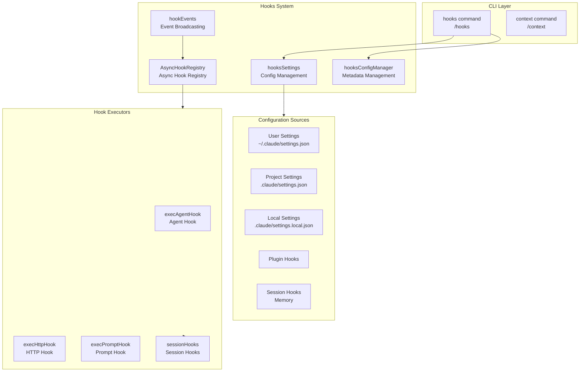
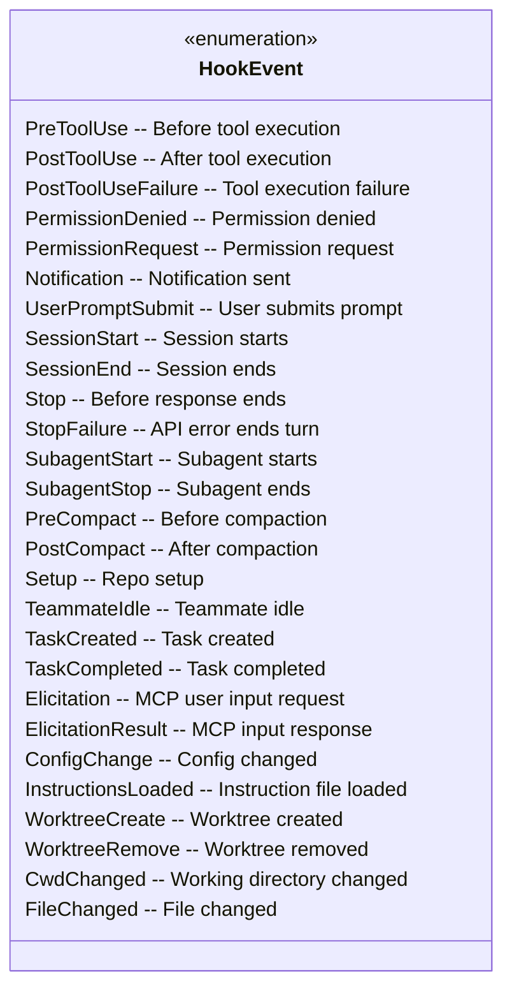
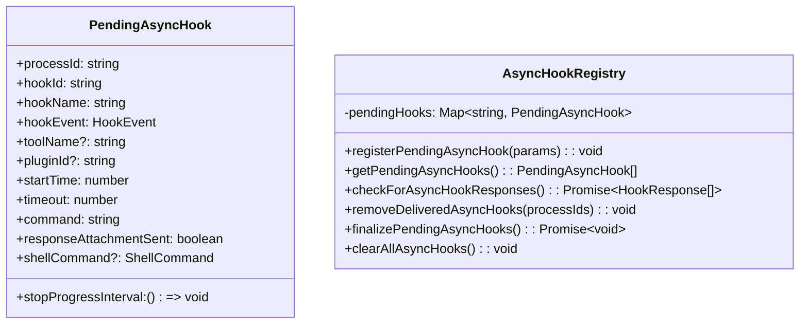
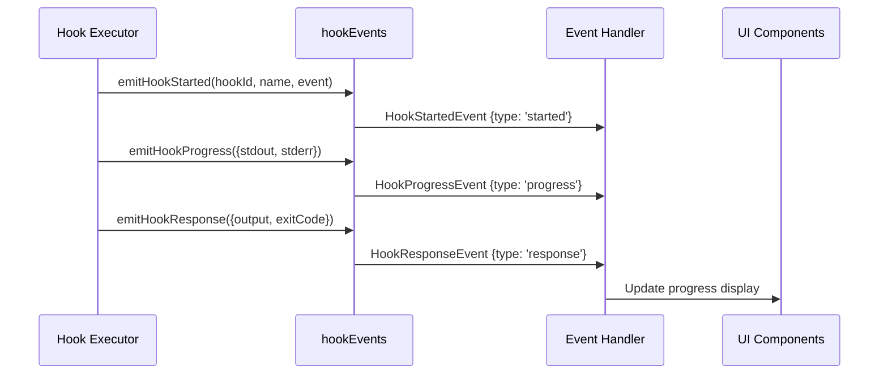
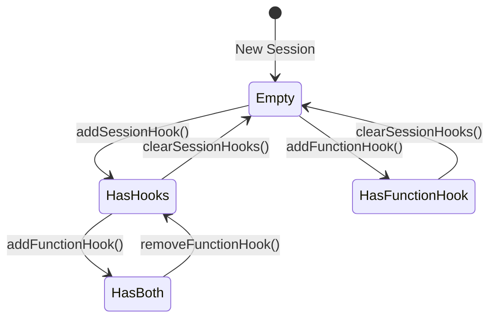
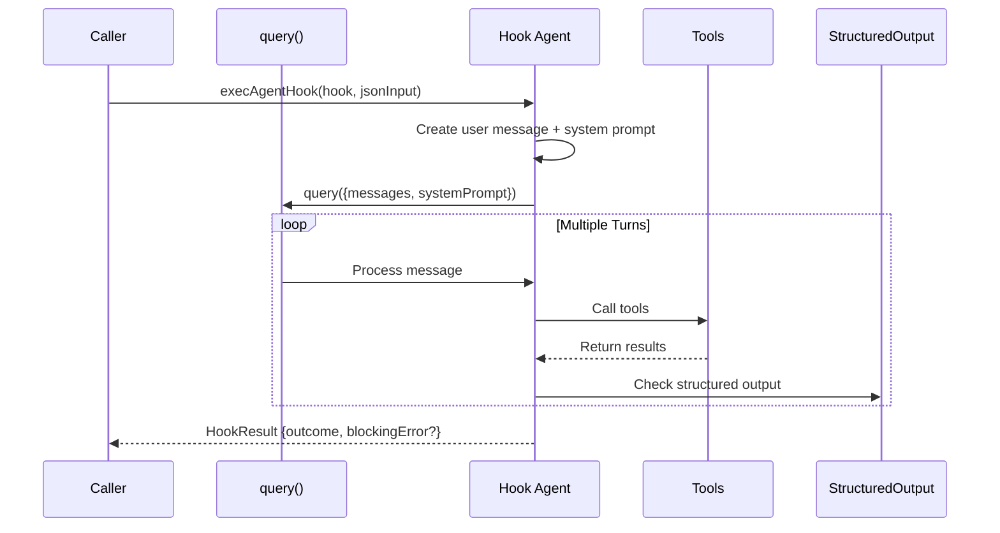
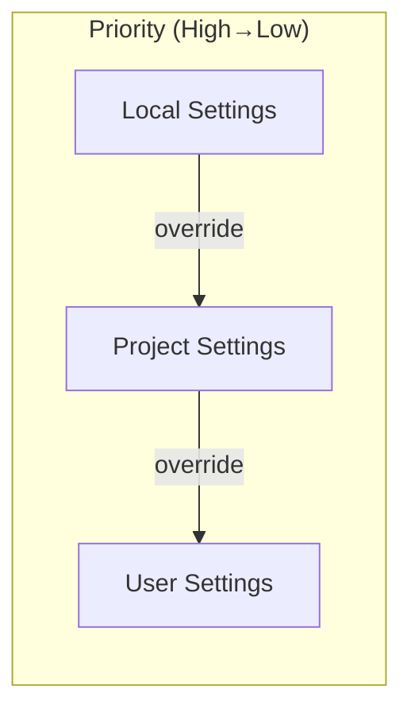
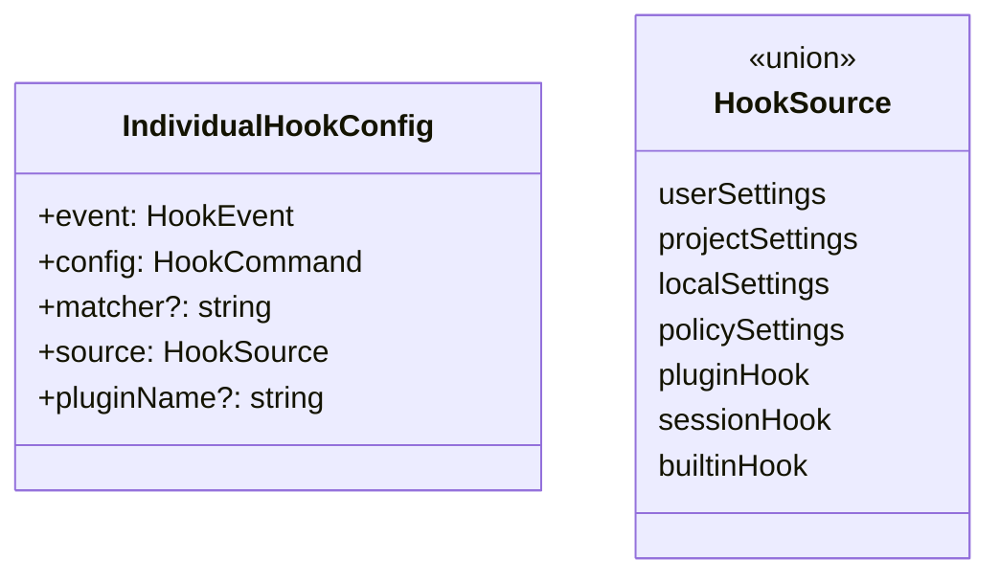

# Hooks Module

The Hooks module is Claude Code's event-driven extension system, allowing custom logic execution at specific lifecycle events. Through hooks, developers can inject custom handling at critical moments like tool execution, session state changes, and configuration updates.

## Architecture Position



## File Structure

```
restored-src/src/
├── commands/
│   ├── hooks/
│   │   ├── index.ts           # hooks command entry
│   │   └── hooks.tsx          # HooksConfigMenu UI component
│   └── context/
│       ├── index.ts           # context command entry
│       ├── context.tsx         # ContextVisualization
│       └── context-noninteractive.ts
│
└── utils/
    └── hooks/
        ├── AsyncHookRegistry.ts    # Async hook management
        ├── hookEvents.ts           # Event system
        ├── hookHelpers.ts          # Helper functions
        ├── hooksSettings.ts        # Settings management
        ├── hooksConfigManager.ts   # Config manager
        ├── hooksConfigSnapshot.ts  # Config snapshot
        ├── sessionHooks.ts         # Session hooks
        ├── execAgentHook.ts        # Agent hook executor
        ├── execHttpHook.ts         # HTTP hook executor
        ├── execPromptHook.ts       # Prompt hook executor
        ├── execPromptHook.ts
        ├── fileChangedWatcher.ts   # File watcher
        ├── registerFrontmatterHooks.ts
        ├── registerSkillHooks.ts
        ├── skillImprovement.ts
        ├── postSamplingHooks.ts
        ├── ssrfGuard.ts
        └── apiQueryHookHelper.ts
```

## Hook Types

### Hook Event Types

The hooks system supports 26 event types covering tool execution, session lifecycle, configuration changes, and more:



### Hook Command Types

| Type | Description | Config Fields |
|------|-------------|---------------|
| `command` | Execute shell command | `command`, `shell`, `if?`, `timeout?` |
| `prompt` | Execute prompt hook, append output to context | `prompt`, `if?`, `timeout?` |
| `agent` | Use LLM Agent to verify conditions | `prompt`, `model?`, `if?`, `timeout?` |
| `http` | Send HTTP request | `url`, `method?`, `headers?`, `body?` |
| `function` | Execute TypeScript callback (session-level) | `callback`, `timeout?` |

## Core Components

### AsyncHookRegistry - Async Hook Management

Manages async hook registration, state tracking, and response collection.



**Key Features:**

- **Timeout management**: Default 15s timeout, configurable
- **Progress tracking**: `startHookProgressInterval` sends stdout updates periodically
- **Response collection**: Parses JSON line output, supports `{"ok": true/false, "reason": "..."}` format

### HookEvents - Event Broadcasting System

An event system independent of the main message stream for broadcasting hook execution events.



**Event Types:**

```typescript
type HookStartedEvent = {
  type: 'started'
  hookId: string
  hookName: string
  hookEvent: string
}

type HookProgressEvent = {
  type: 'progress'
  hookId: string
  hookName: string
  hookEvent: string
  stdout: string
  stderr: string
  output: string
}

type HookResponseEvent = {
  type: 'response'
  hookId: string
  hookName: string
  hookEvent: string
  output: string
  stdout: string
  stderr: string
  exitCode?: number
  outcome: 'success' | 'error' | 'cancelled'
}
```

### SessionHooks - Session-Level Hooks

Session hooks are temporary, in-memory callbacks that are not persisted to config files.



**Exported Functions:**

| Function | Description |
|----------|-------------|
| `addSessionHook()` | Add command or prompt hook |
| `addFunctionHook()` | Add function hook, returns hook ID |
| `removeFunctionHook()` | Remove function hook by ID |
| `removeSessionHook()` | Remove specific hook |
| `getSessionHooks()` | Get all session hooks |
| `getSessionFunctionHooks()` | Get function hooks |
| `clearSessionHooks()` | Clear all session hooks |

**Function Hook Callback:**

```typescript
type FunctionHookCallback = (
  messages: Message[],
  signal?: AbortSignal
) => boolean | Promise<boolean>
```

### HookHelpers - Helper Functions

Provides hook response schema and structured output tool creation.

```typescript
// Hook response schema
const hookResponseSchema = z.object({
  ok: z.boolean().describe('Whether condition is met'),
  reason: z.string().describe('Reason if not met').optional(),
})

// Create structured output tool
const tool = createStructuredOutputTool()

// Register structured output enforcement
registerStructuredOutputEnforcement(setAppState, sessionId)
```

## Hook Execution Flow

### Agent Hook Execution Flow



**Agent Hook Features:**

- Default timeout: 60 seconds
- Max 50 conversation turns
- Auto-injects `SyntheticOutputTool`
- Filters disallowed tools (subagents, plan mode, etc.)

### HTTP Hook Execution

HTTP hooks support integration with external services, returning JSON format responses:

```typescript
type HttpHookResult = {
  hookSpecificOutput?: {
    watchPaths?: string[]  // Dynamically update file watching
  }
}
```

## Configuration Management

### Configuration Source Priority



### Hook Registry



## Usage Examples

### Basic Command Hook

```json
{
  "hooks": {
    "PreToolUse": [
      {
        "matcher": "Bash",
        "hooks": [
          {
            "type": "command",
            "command": "echo 'Tool: {tool_name}'",
            "shell": "bash"
          }
        ]
      }
    ]
  }
}
```

### Agent Hook Verification

```json
{
  "hooks": {
    "Stop": [
      {
        "matcher": "",
        "hooks": [
          {
            "type": "agent",
            "prompt": "Verify that the code meets: {argument}",
            "timeout": 30
          }
        ]
      }
    ]
  }
}
```

### Session Hook (Code Integration)

```typescript
import { addFunctionHook, removeFunctionHook } from './utils/hooks/sessionHooks'

// Add verification hook
const hookId = addFunctionHook(
  setAppState,
  sessionId,
  'UserPromptSubmit',
  '',
  async (messages) => {
    const lastMessage = messages[messages.length - 1]
    const content = lastMessage.content[0]?.text ?? ''
    return content.length <= 1000
  },
  'Prompt content must be less than 1000 characters'
)

// Remove hook
removeFunctionHook(setAppState, sessionId, 'UserPromptSubmit', hookId)
```

## CLI Commands

### /hooks Command

View current session's hook configurations:

```bash
/claude hooks
```

Displays:
- All hooks grouped by event
- Hook sources (user/project/local/plugin/session)
- Matcher configuration
- Hook type and command

### /context Command

Visualize current context usage:

```bash
/claude context
```

Displays:
- Message count statistics
- Token usage
- Context compression information
- Distribution by tool usage

## Best Practices

### 1. Hook Timeout Settings

```json
{
  "type": "command",
  "command": "long-running-script.sh",
  "timeout": 300
}
```

Recommendations:
- Quick checks: `timeout: 5-10`
- Medium operations: `timeout: 30-60`
- Long-running tasks: `timeout: 300+`

### 2. Conditional Execution

Use `if` field to limit hook triggering conditions:

```json
{
  "type": "command",
  "command": "check-format.sh",
  "if": "Bash(git *)"
}
```

### 3. Async Response Handling

For hooks requiring long processing, return structured JSON:

```bash
#!/bin/bash
# Return success
echo '{"ok": true}'
# Return failure with reason
echo '{"ok": false, "reason": "Code format does not comply"}'
```

### 4. Error Handling

Exit code meanings:
- `0`: Success, stdout shown to model or user
- `2`: Blocking error, stderr shown to model and blocks operation
- Other: Non-blocking error, stderr shown to user only

## Design Decisions

### Why Use Map Instead of Record?

SessionHooks uses `Map<string, SessionStore>` instead of `Record<string, SessionStore>`:

```typescript
// Map: O(1) insert, doesn't change container reference
prev.sessionHooks.set(sessionId, { hooks: newHooks })
return prev  // Reference unchanged, Object.is short-circuits

// Record: O(N) copy each time, O(N²) total complexity
prev.sessionHooks[sessionId] = { hooks: newHooks }
return { ...prev }  // Triggers all listeners
```

### Why Distinguish Sync and Async Hooks?

- **Sync hooks**: Command returns immediately, determine result via exit code and stdout
- **Async hooks**: Command may run long, collect JSON responses via periodic polling

### Structured Output Tool Design

Hook system enforces `SyntheticOutputTool` for structured results:
- Ensures consistent hook response format
- Avoids parsing natural language output
- Supports complex verification logic

## Related Documents

- [Tools System](/wiki/core/tools.md)
- [Query Engine](/wiki/core/query.md)
- [Configuration System](/wiki/core/commands.md)

---

*Generated by Nium-Wiki | 2026-04-01*
