# Hooks Module

The Hooks module is Claude Code's event-driven extension system, allowing custom logic execution at specific lifecycle events. Through hooks, developers can inject custom handling at critical moments like tool execution, session state changes, and configuration updates.

## Architecture Position

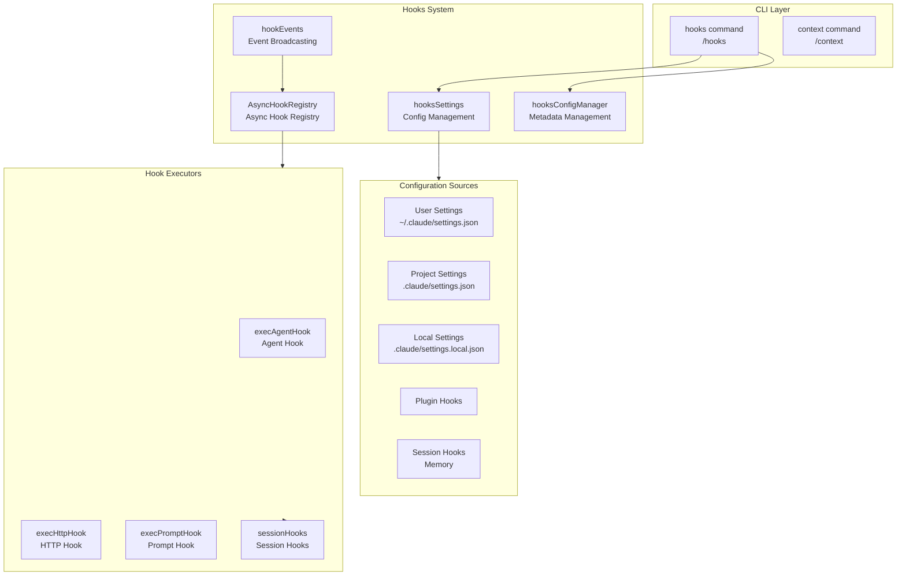

## File Structure

```
restored-src/src/
├── commands/
│   └── hooks/
│       └── hooks.tsx              # HooksConfigMenu UI component (/hooks command)
│
├── components/hooks/
│   ├── HooksConfigMenu.tsx        # Hook config menu component
│   ├── SelectHookMode.tsx         # Hook mode selector
│   └── ViewHookMode.tsx          # Hook view mode
│
├── schemas/
│   └── hooks.ts                  # Hook Zod schema definitions
│
├── types/
│   └── hooks.ts                  # Hook type definitions (HookResult, AggregatedHookResult, etc.)
│
└── utils/hooks/
    ├── AsyncHookRegistry.ts      # Async hook management (timeout, progress tracking)
    ├── hookEvents.ts             # Event broadcasting system
    ├── hookHelpers.ts            # Helpers (structured output, argument substitution)
    ├── hooks.ts                  # Hook response schemas, HookCallback types
    ├── hooksSettings.ts          # Config management, hook source resolution
    ├── hooksConfigManager.ts     # Hook config UI metadata management
    ├── hooksConfigSnapshot.ts    # Config snapshot
    ├── sessionHooks.ts           # Session-level hooks (temporary/in-memory)
    ├── execAgentHook.ts          # Agent hook executor (LLM verification)
    ├── execHttpHook.ts           # HTTP hook executor
    ├── execPromptHook.ts         # Prompt hook executor
    ├── postSamplingHooks.ts     # Post-sampling hooks (internal API)
    ├── registerFrontmatterHooks.ts  # Frontmatter hook registration
    ├── registerSkillHooks.ts    # Skill hook registration (supports once: true)
    ├── apiQueryHookHelper.ts    # API query hook utilities
    └── ssrfGuard.ts            # HTTP hook SSRF protection
```

## Hook Types

### Hook Event Types

The hooks system supports 26 event types covering tool execution, session lifecycle, configuration changes, and more:

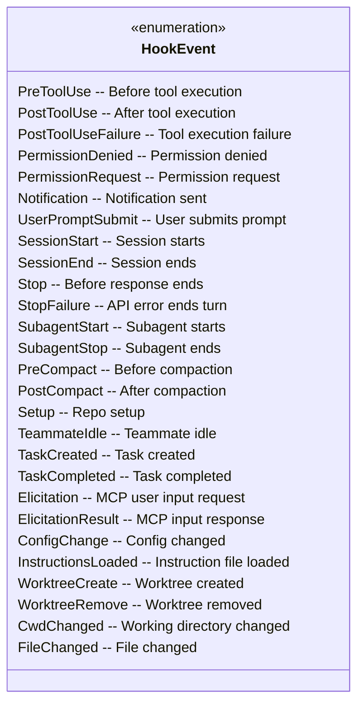

### Hook Command Types

| Type | Description | Config Fields |
|------|-------------|---------------|
| `command` | Execute shell command | `command`, `shell`, `if?`, `timeout?` |
| `prompt` | Execute prompt hook, append output to context | `prompt`, `if?`, `timeout?` |
| `agent` | Use LLM Agent to verify conditions | `prompt`, `model?`, `if?`, `timeout?` |
| `http` | Send HTTP request | `url`, `method?`, `headers?`, `body?` |
| `function` | Execute TypeScript callback (session-level) | `callback`, `timeout?` |

## Core Type System

### HookResult and AggregatedHookResult

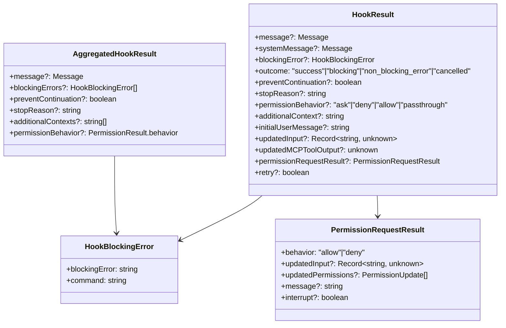

### HookCallback - Internal Callback Type

`HookCallback` is the type for internal hooks (builtin/internal) registered via code, not via config files, and cannot be persisted to `settings.json`:

```typescript
type HookCallback = {
  type: 'callback'
  callback: (
    input: HookInput,
    toolUseID: string | null,
    abort: AbortSignal | undefined,
    hookIndex?: number,      // For SessionStart hooks to compute CLAUDE_ENV_FILE path
    context?: HookCallbackContext,
  ) => Promise<HookJSONOutput>
  timeout?: number           // Timeout in seconds
  internal?: boolean        // Internal hooks (e.g. analytics) excluded from tengu_run_hook metrics
}

type HookCallbackContext = {
  getAppState: () => AppState
  updateAttributionState: (
    updater: (prev: AttributionState) => AttributionState,
  ) => void
}
```

**Builtin Callback Hook Examples**: `sessionFileAccessHooks` (session file access analytics), `classifierApprovalsHook` (classifier approvals).

### FunctionHook - Session Function Type

`FunctionHook` is another session-scoped callback type that implements validation logic via TypeScript functions:

```typescript
type FunctionHook = {
  type: 'function'
  id?: string                // Unique ID for removeFunctionHook
  timeout?: number
  callback: (messages: Message[], signal?: AbortSignal) => boolean | Promise<boolean>
  errorMessage: string
  statusMessage?: string
}
```

### Sync Hook Response Schema

```typescript
const syncHookResponseSchema = z.object({
  continue: z.boolean().optional(),        // Default true
  suppressOutput: z.boolean().optional(),   // Default false
  stopReason: z.string().optional(),
  decision: z.enum(['approve', 'block']).optional(),
  reason: z.string().optional(),
  systemMessage: z.string().optional(),
  hookSpecificOutput: z.union([...])        // Event-specific output fields
})
```

Each event supports different `hookSpecificOutput` fields:

| Event | Specific Fields |
|-------|----------------|
| `PreToolUse` | `permissionDecision`, `updatedInput`, `additionalContext` |
| `UserPromptSubmit` | `additionalContext` |
| `SessionStart` | `additionalContext`, `initialUserMessage`, `watchPaths` |
| `PermissionRequest` | `decision: {behavior: 'allow'|'deny', ...}` |
| `Elicitation` | `action: 'accept'|'decline'|'cancel'`, `content` |
| `CwdChanged` | `watchPaths` |
| `FileChanged` | `watchPaths` |
| `WorktreeCreate` | `worktreePath` |

## Core Components

### AsyncHookRegistry - Async Hook Management

Manages async hook registration, state tracking, and response collection.

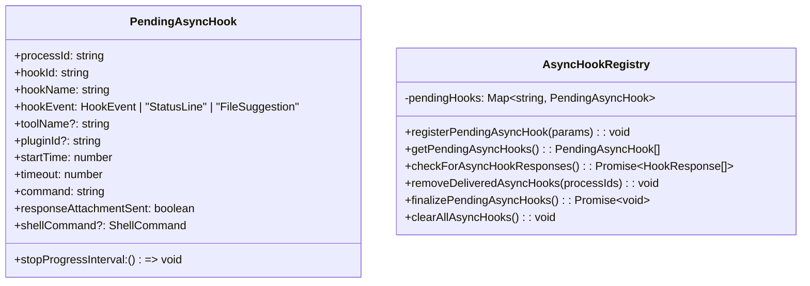

**Key Features:**

- **Timeout management**: Default 15s timeout, overridable via `asyncTimeout` field
- **Progress tracking**: `startHookProgressInterval` sends stdout updates periodically
- **Response collection**: Parses JSON line output, supports `{"ok": true/false, "reason": "..."}` format
- **Special event types**: Supports `StatusLine` and `FileSuggestion` (for internal UI feedback)
- **SessionStart completion**: Auto-invalidates session env cache (`invalidateSessionEnvCache`)

### HookEvents - Event Broadcasting System

An event system independent of the main message stream for broadcasting hook execution events.

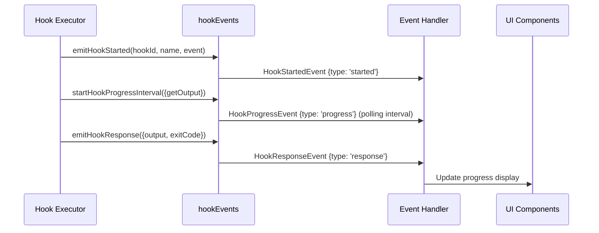

**Event Types:**

```typescript
type HookStartedEvent = {
  type: 'started'
  hookId: string
  hookName: string
  hookEvent: string
}

type HookProgressEvent = {
  type: 'progress'
  hookId: string
  hookName: string
  hookEvent: string
  stdout: string
  stderr: string
  output: string
}

type HookResponseEvent = {
  type: 'response'
  hookId: string
  hookName: string
  hookEvent: string
  output: string
  stdout: string
  stderr: string
  exitCode?: number
  outcome: 'success' | 'error' | 'cancelled'
}
```

**Event Filtering Mechanism:**

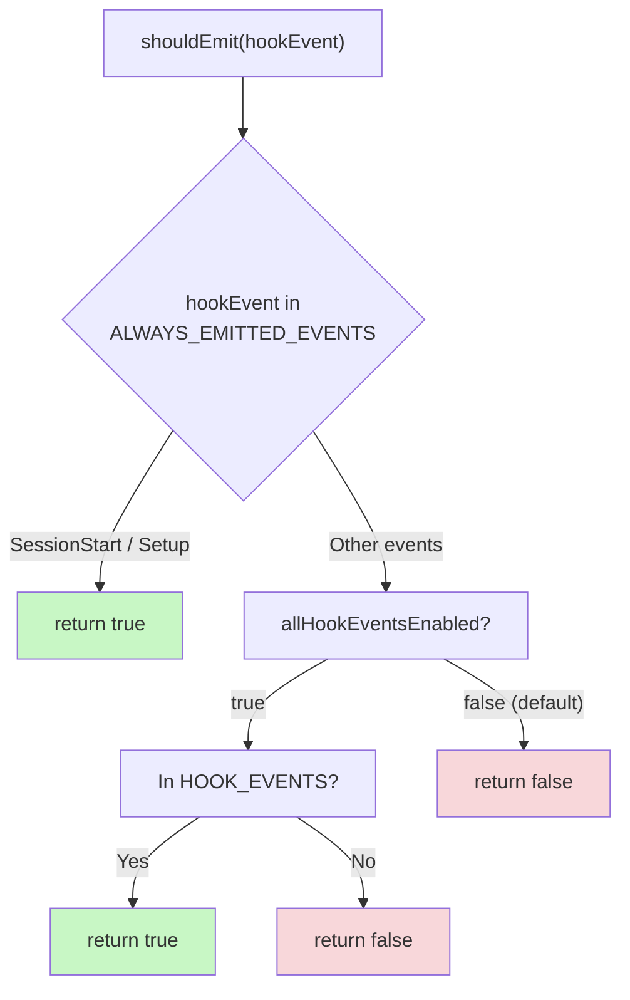

- **Always emitted**: `SessionStart` and `Setup` always broadcast regardless of `includeHookEvents` setting
- **Conditional**: Other events are **not broadcast by default** (`allHookEventsEnabled` defaults to `false`). They only broadcast after `setAllHookEventsEnabled(true)` — enabled when SDK's `includeHookEvents` option is `true`, or in `CLAUDE_CODE_REMOTE` mode
- **Pending buffer**: When no handler is registered, events are buffered in memory (max 100), and flushed when handler registers

```typescript
// Enable all event broadcasting
setAllHookEventsEnabled(true)

// Register event handler (for SDK includeHookEvents mode)
registerHookEventHandler((event) => { /* convert to SDK messages */ })

// Clear state (for testing)
clearHookEventState()
```

### SessionHooks - Session-Level Hooks

Session hooks are temporary, in-memory callbacks that are not persisted to config files. Uses `Map` instead of `Record` to support O(1) in-place mutations, avoiding O(N²) state copy overhead:

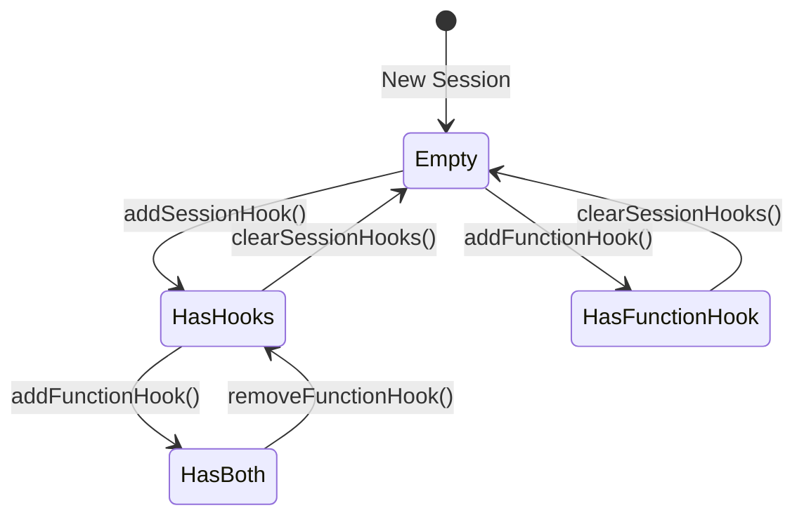

**Exported Functions:**

| Function | Description |
|----------|-------------|
| `addSessionHook()` | Add command or prompt hook |
| `addFunctionHook()` | Add function hook, returns hook ID |
| `removeFunctionHook()` | Remove function hook by ID |
| `removeSessionHook()` | Remove specific hook |
| `getSessionHooks()` | Get all non-function hooks (excluding callbacks) |
| `getSessionFunctionHooks()` | Get all function hooks |
| `getSessionHookCallback()` | Get full hook entry including callback |
| `clearSessionHooks()` | Clear all session hooks |

**Session Hook Storage Structure:**

```typescript
type SessionStore = {
  hooks: {
    [event in HookEvent]?: SessionHookMatcher[]
  }
}

type SessionHookMatcher = {
  matcher: string
  skillRoot?: string       // Skill scope isolation
  hooks: Array<{
    hook: HookCommand | FunctionHook
    onHookSuccess?: OnHookSuccess  // Callback on successful execution
  }>
}
```

**Map vs Record Optimization:**

```typescript
// Map: O(1) in-place mutation, Object.is short-circuits, no listener triggers
prev.sessionHooks.set(sessionId, { hooks: newHooks })
return prev  // Reference unchanged, all listeners skipped

// Record: O(N) copy each time, O(N²) total complexity
prev.sessionHooks[sessionId] = { hooks: newHooks }
return { ...prev }  // Triggers all ~30 listeners
```

This is especially important for high-concurrency `parallel()` multi-agent scenarios — N concurrent agents registering hooks would cause O(N²) complexity with Record.

### registerFrontmatterHooks - Frontmatter Hook Registration

Registers hooks from Agent or Skill frontmatter, converting them to session-scoped session hooks:

```typescript
registerFrontmatterHooks(
  setAppState,
  sessionId,     // Agent ID (for Agent scope isolation)
  hooks,         // hooks config from frontmatter
  sourceName,    // Human-readable name for logging
  isAgent = false
)
```

**Agent Special Handling**: Agent `Stop` hooks are automatically converted to `SubagentStop`, because subagents fire `SubagentStop` on completion (not `Stop`):

```typescript
if (isAgent && event === 'Stop') {
  targetEvent = 'SubagentStop'
}
```

### registerSkillHooks - Skill Hook Registration

Registers hooks from Skill frontmatter, supporting `once: true` one-shot hooks:

```typescript
registerSkillHooks(
  setAppState,
  sessionId,
  hooks,
  skillName,
  skillRoot   // Sets CLAUDE_PLUGIN_ROOT env var
)
```

**One-Shot Hooks**: Hooks with `once: true` are automatically removed after first successful execution:

```typescript
const onHookSuccess = hook.once
  ? () => removeSessionHook(setAppState, sessionId, eventName, hook)
  : undefined
```

### postSamplingHooks - Post-Sampling Hooks (Internal API)

`postSamplingHooks` is an **internal-only** mechanism for injecting custom logic after model sampling completes:

```typescript
type PostSamplingHook = (context: REPLHookContext) => Promise<void> | void

type REPLHookContext = {
  messages: Message[]        // Full message history including assistant responses
  systemPrompt: SystemPrompt
  userContext: { [k: string]: string }
  systemContext: { [k: string]: string }
  toolUseContext: ToolUseContext
  querySource?: QuerySource
}

// Register
registerPostSamplingHook(hook)

// Execute (called after sampling completes)
await executePostSamplingHooks(messages, systemPrompt, userContext, ...)
```

**Usage Example**: `apiQueryHookHelper.ts` implements `ApiQueryHook` based on this, supporting custom logic injection before/after API queries (message building, response parsing, etc.).

### hookHelpers - Helper Functions

Provides hook response schema and structured output tool creation.

```typescript
// Hook response schema (used by agent/prompt hooks)
const hookResponseSchema = z.object({
  ok: z.boolean().describe('Whether condition is met'),
  reason: z.string().describe('Reason if not met').optional(),
})

// Create structured output tool (forces hooks to use JSON format responses)
const tool = createStructuredOutputTool()

// Register structured output enforcement (ensures Agent calls SyntheticOutputTool)
registerStructuredOutputEnforcement(setAppState, sessionId)

// Argument substitution: supports $ARGUMENTS, $ARGUMENTS[0], $0, etc.
addArgumentsToPrompt(prompt, jsonInput)
```

**Structured Output Enforcement** is used in `ask.tsx`, `execAgentHook.ts`, and background verification to ensure LLM output strictly conforms to `hookResponseSchema`.

### hooksConfigManager - Configuration Metadata Management

Provides per-event descriptions, Matcher candidate values, etc. for the `/hooks` command UI:

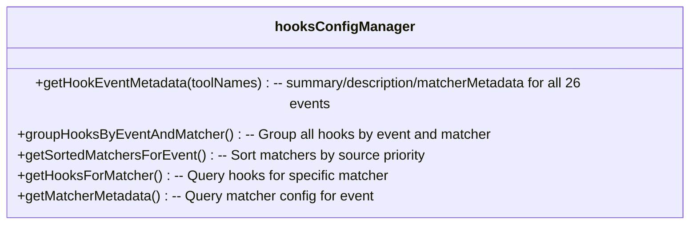

**Event Description Examples** (partial):

| Event | Summary | Matcher Field |
|-------|---------|--------------|
| `PreToolUse` | Before tool execution | `tool_name` |
| `PostToolUse` | After tool execution | `tool_name` |
| `PermissionRequest` | When permission dialog shown | `tool_name` |
| `Elicitation` | MCP requests user input | `mcp_server_name` |
| `CwdChanged` | Working directory changed | — |
| `FileChanged` | Monitored file changed | File name glob |
| `InstructionsLoaded` | Instruction file loaded | `load_reason` |

**Matcher Priority**: Local Settings > Project Settings > User Settings > Plugin Hooks (lowest)

## Hook Execution Flow

### Agent Hook Execution Flow

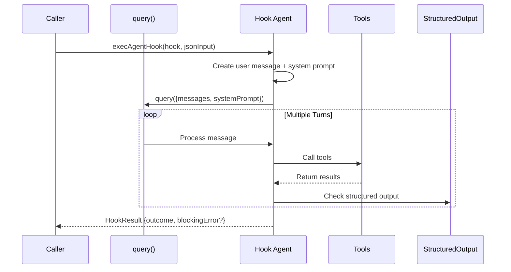

**Agent Hook Features:**

- Default timeout: 60 seconds
- Max 50 conversation turns
- Auto-injects `SyntheticOutputTool`
- Filters disallowed tools (subagents, plan mode, etc.)
- Creates user message directly (not via `processUserInput`) to avoid `UserPromptSubmit` recursion

### HTTP Hook Execution

HTTP hooks support integration with external services, with sandbox network proxy and SSRF protection:

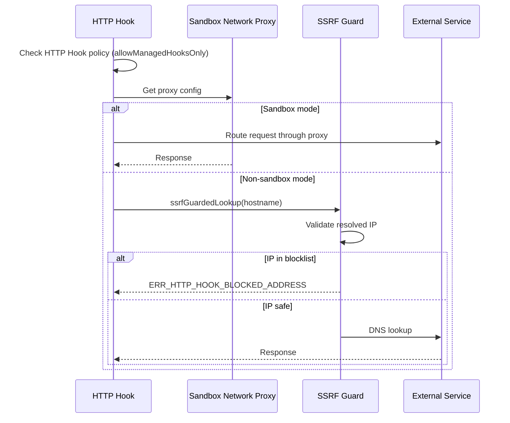

**SSRF Protection Blocklist (ssrfGuard.ts):**

| Address Range | Example | Description |
|--------------|---------|-------------|
| 0.0.0.0/8 | 0.0.0.0 | This network |
| 10.0.0.0/8 | 10.x.x.x | Private |
| 100.64.0.0/10 | 100.64.x.x | CGNAT (Alibaba cloud metadata 100.100.100.200) |
| 169.254.0.0/16 | 169.254.x.x | Link-local (cloud metadata) |
| 172.16.0.0/12 | 172.16.x.x | Private |
| 192.168.0.0/16 | 192.168.x.x | Private |
| IPv6 fc00::/7 | — | Unique local |
| IPv6 fe80::/10 | — | Link-local |

**Exception**: 127.0.0.0/8 and ::1 (loopback) always allowed, for local development.

**Return Result:**

```typescript
type HttpHookResult = {
  hookSpecificOutput?: {
    watchPaths?: string[]  // Dynamically update file watching
  }
}
```

### Elicitation Protocol (MCP User Input Request)

Elicitation is the protocol for MCP servers requesting user input, controlled via two hook events:

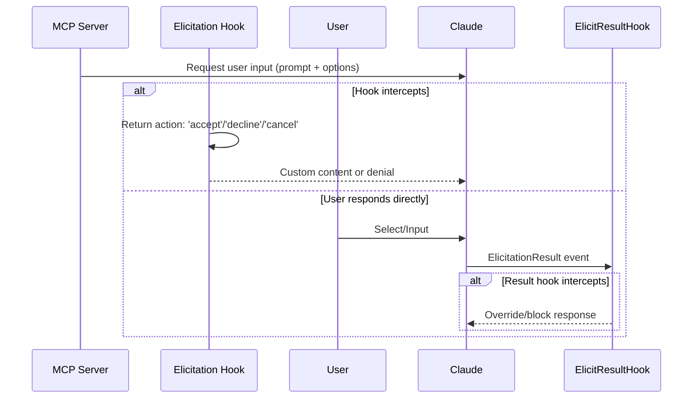

**Elicitation Hook Input Schema:**

```typescript
type PromptRequest = {
  prompt: string       // Request ID (for correlating response)
  message: string      // Message to display to user
  options: Array<{
    key: string
    label: string
    description?: string
  }>
}
```

**Hook Response Example:**

```json
{
  "hookSpecificOutput": {
    "hookEventName": "Elicitation",
    "action": "accept",
    "content": { "selectedKey": "option-1" }
  }
}
```

## Configuration Management

### Configuration Source Priority

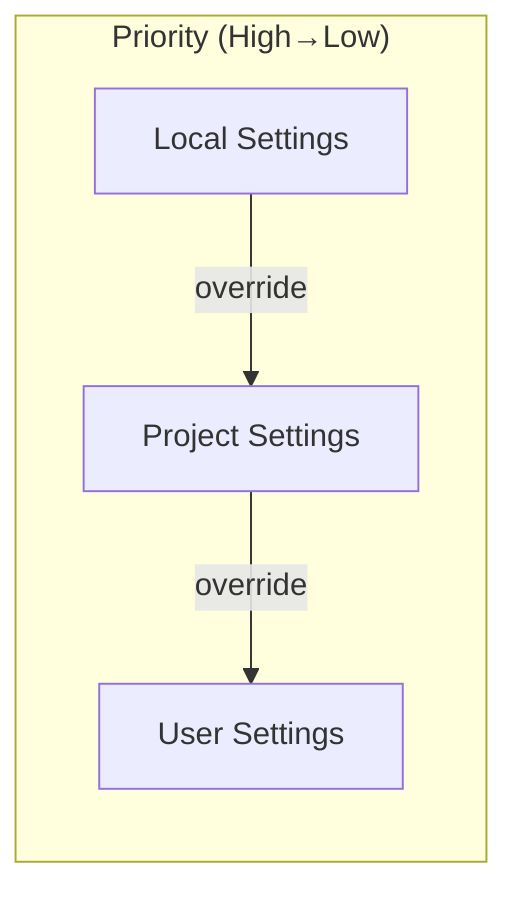

### Hook Registry

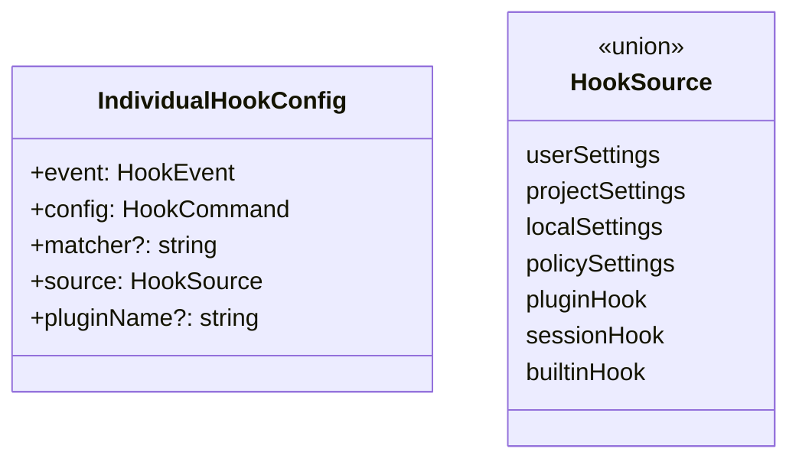

## Usage Examples

### Basic Command Hook

```json
{
  "hooks": {
    "PreToolUse": [
      {
        "matcher": "Bash",
        "hooks": [
          {
            "type": "command",
            "command": "echo 'Tool: {tool_name}'",
            "shell": "bash"
          }
        ]
      }
    ]
  }
}
```

### Agent Hook Verification

```json
{
  "hooks": {
    "Stop": [
      {
        "matcher": "",
        "hooks": [
          {
            "type": "agent",
            "prompt": "Verify that the code meets: {argument}",
            "timeout": 30
          }
        ]
      }
    ]
  }
}
```

### One-Shot Hook (once: true)

```json
{
  "hooks": {
    "SessionStart": [
      {
        "matcher": "",
        "hooks": [
          {
            "type": "command",
            "command": "setup-env.sh",
            "once": true
          }
        ]
      }
    ]
  }
}
```

### Skill Frontmatter Hook Registration

```yaml
# skill.md
---
hooks:
  PreToolUse:
    - matcher: "Bash"
      hooks:
        - type: command
          command: echo "Running skill task"
          if: "Bash(git *)"
  SubagentStop:
    - matcher: ""
      hooks:
        - type: prompt
          prompt: "Summarize: {argument}"
---
```

```typescript
// Register during Agent/Skill load
import { registerFrontmatterHooks } from './utils/hooks/registerFrontmatterHooks'

registerFrontmatterHooks(setAppState, agentId, hooksConfig, 'my-agent', true)
```

### Session Hook (Code Integration)

```typescript
import { addFunctionHook } from './utils/hooks/sessionHooks'

// Add verification hook
const hookId = addFunctionHook(
  setAppState,
  sessionId,
  'UserPromptSubmit',
  '',
  async (messages) => {
    const lastMessage = messages[messages.length - 1]
    const content = lastMessage.content[0]?.text ?? ''
    return content.length <= 1000
  },
  'Prompt content must be less than 1000 characters'
)

// Remove hook
removeFunctionHook(setAppState, sessionId, 'UserPromptSubmit', hookId)
```

## CLI Commands

### /hooks Command

View current session's hook configurations:

```bash
/hooks
```

Displays:
- All hooks grouped by event
- Hook sources (user/project/local/plugin/session)
- Matcher configuration
- Hook type and command

### /context Command

Visualize current context usage:

```bash
/context
```

Displays:
- Message count statistics
- Token usage
- Context compression information
- Distribution by tool usage

## Best Practices

### 1. Hook Timeout Settings

```json
{
  "type": "command",
  "command": "long-running-script.sh",
  "timeout": 300
}
```

Recommendations:
- Quick checks: `timeout: 5-10`
- Medium operations: `timeout: 30-60`
- Long-running tasks: `timeout: 300+`

### 2. Conditional Execution

Use `if` field to limit hook triggering conditions:

```json
{
  "type": "command",
  "command": "check-format.sh",
  "if": "Bash(git *)"
}
```

### 3. Async Response Handling

For hooks requiring long processing, return structured JSON:

```bash
#!/bin/bash
# Return success
echo '{"ok": true}'
# Return failure with reason
echo '{"ok": false, "reason": "Code format does not comply"}'
```

### 4. Error Handling

Exit code meanings:
- `0`: Success, stdout shown to model or user
- `2`: Blocking error, stderr shown to model and blocks operation
- Other: Non-blocking error, stderr shown to user only

## Design Decisions

### Why Use Map Instead of Record?

SessionHooks uses `Map<string, SessionStore>` instead of `Record<string, SessionStore>`:

```typescript
// Map: O(1) in-place mutation, Object.is short-circuits, no listener triggers
prev.sessionHooks.set(sessionId, { hooks: newHooks })
return prev  // Reference unchanged, all listeners skipped

// Record: O(N) copy each time, O(N²) total complexity
prev.sessionHooks[sessionId] = { hooks: newHooks }
return { ...prev }  // Triggers all ~30 listeners
```

### Why Distinguish Sync and Async Hooks?

- **Sync hooks**: Command returns immediately, determine result via exit code and stdout
- **Async hooks**: Command may run long, collect JSON responses via periodic polling

### Structured Output Tool Design

Hook system enforces `SyntheticOutputTool` for structured results:
- Ensures consistent hook response format
- Avoids parsing natural language output
- Supports complex verification logic

## Related Documents

- [Tools System](/wiki/core/tools.md)
- [Query Engine](/wiki/core/query.md)
- [Configuration System](/wiki/core/commands.md)

---

**Source references**
- [types/hooks.ts](/restored-src/src/types/hooks.ts)
- [utils/hooks.ts](/restored-src/src/utils/hooks.ts)
- [utils/hooks/AsyncHookRegistry.ts](/restored-src/src/utils/hooks/AsyncHookRegistry.ts)
- [utils/hooks/hookEvents.ts](/restored-src/src/utils/hooks/hookEvents.ts)
- [utils/hooks/sessionHooks.ts](/restored-src/src/utils/hooks/sessionHooks.ts)
- [utils/hooks/hooksSettings.ts](/restored-src/src/utils/hooks/hooksSettings.ts)
- [utils/hooks/hooksConfigManager.ts](/restored-src/src/utils/hooks/hooksConfigManager.ts)
- [utils/hooks/hookHelpers.ts](/restored-src/src/utils/hooks/hookHelpers.ts)
- [utils/hooks/execAgentHook.ts](/restored-src/src/utils/hooks/execAgentHook.ts)
- [utils/hooks/execPromptHook.ts](/restored-src/src/utils/hooks/execPromptHook.ts)
- [utils/hooks/execHttpHook.ts](/restored-src/src/utils/hooks/execHttpHook.ts)
- [utils/hooks/ssrfGuard.ts](/restored-src/src/utils/hooks/ssrfGuard.ts)
- [utils/hooks/postSamplingHooks.ts](/restored-src/src/utils/hooks/postSamplingHooks.ts)
- [utils/hooks/registerFrontmatterHooks.ts](/restored-src/src/utils/hooks/registerFrontmatterHooks.ts)
- [utils/hooks/registerSkillHooks.ts](/restored-src/src/utils/hooks/registerSkillHooks.ts)
- [utils/hooks/apiQueryHookHelper.ts](/restored-src/src/utils/hooks/apiQueryHookHelper.ts)
- [commands/hooks/hooks.tsx](/restored-src/src/commands/hooks/hooks.tsx)

*Generated by Nium-Wiki | 2026-04-08*
