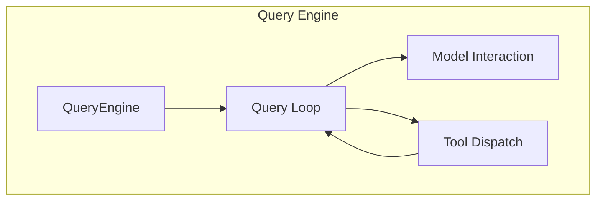
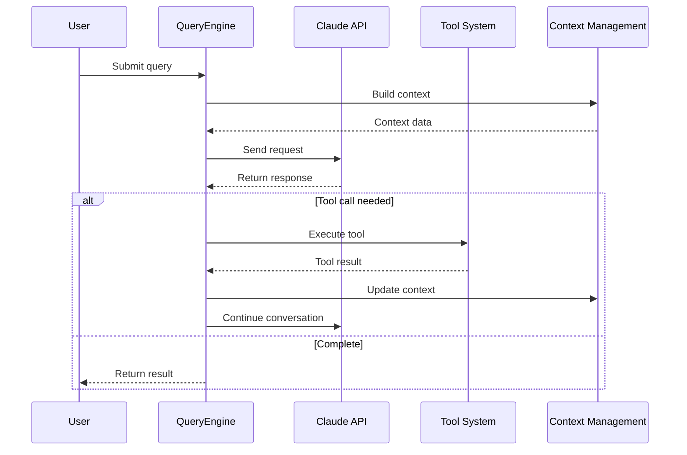
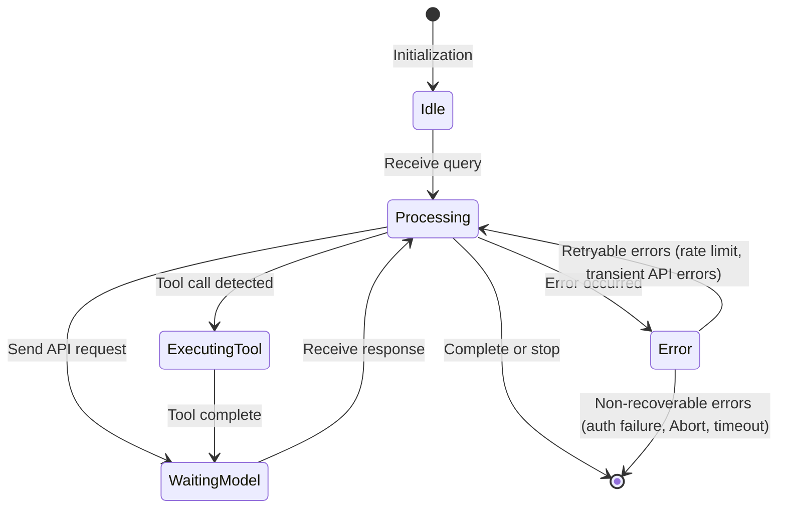
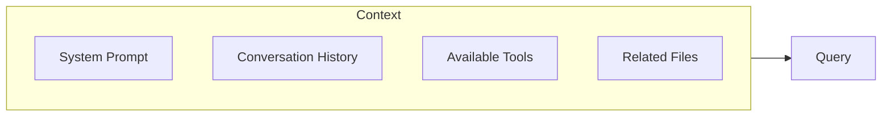

# Query Engine

## Overview

The Query Engine is the brain of Claude Code, responsible for coordinating user queries, AI model invocations, and tool execution. The engine interacts with the Claude model in a looped iterative manner until the task is completed or the maximum iteration count is reached.

The core implementation is in the [QueryEngine.ts](/restored-src/src/QueryEngine.ts#L184) file, which mainly includes:
- [QueryEngine class definition L184](/restored-src/src/QueryEngine.ts#L184)
- [QueryEngineConfig configuration type L130](/restored-src/src/QueryEngine.ts#L130)
- [submitMessage main method L209](/restored-src/src/QueryEngine.ts#L209)

## Architecture Position



**Core Source Files**
- [QueryEngine.ts](/restored-src/src/QueryEngine.ts#L184) - Main engine class
- [query.ts](/restored-src/src/query.ts) - Query loop generator
- [context.ts](/restored-src/src/context.ts) - Context management
- [query/tokenBudget.ts](/restored-src/src/query/tokenBudget.ts) - Token budget
- [query/stopHooks.ts](/restored-src/src/query/stopHooks.ts) - Stop hooks

## Features

| Feature | Description | Related File | Key Location |
|---------|-------------|--------------|-------------|
| Query Loop | Main loop processes user input and model responses | [QueryEngine.ts](/restored-src/src/QueryEngine.ts#L184) | submitMessage L209 |
| Context Management | Maintains conversation context and history | [context.ts](/restored-src/src/context.ts) | Context state management |
| Token Budget | Manages context window and token usage | [query/tokenBudget.ts](/restored-src/src/query/tokenBudget.ts) | TokenBudget class |
| Stop Hooks | Supports custom stop conditions | [query/stopHooks.ts](/restored-src/src/query/stopHooks.ts) | stopHooks config |

## Core Workflow



## Query Loop State



## API Summary

### QueryEngine Class (Core)

| Method | Description | Signature | Source Location |
|--------|-------------|-----------|-----------------|
| `QueryEngine` | Constructor | `constructor(config: QueryEngineConfig)` | [L200](/restored-src/src/QueryEngine.ts#L200) |
| `submitMessage(prompt, opts?)` | Main entry point: async generator that processes user messages and yields streaming events | `async *submitMessage(prompt, options?)` | [L209](/restored-src/src/QueryEngine.ts#L209) |
| `config` | Configuration object | Private property | [L185](/restored-src/src/QueryEngine.ts#L185) |
| `mutableMessages` | Mutable messages array | Private property | [L186](/restored-src/src/QueryEngine.ts#L186) |
| `abortController` | Abort controller | Private property | [L187](/restored-src/src/QueryEngine.ts#L187) |
| `permissionDenials` | Permission denial tracking | Private property | [L188](/restored-src/src/QueryEngine.ts#L188) |
| `totalUsage` | Total usage | Private property | [L189](/restored-src/src/QueryEngine.ts#L189) |

### query() Function (Query Loop Generator)

| Method | Description | Signature | Source Location |
|--------|-------------|-----------|-----------------|
| `query(params)` | Low-level async generator that encapsulates query loop logic | `async *query(params: QueryParams)` | [query.ts](/restored-src/src/query.ts) |

> **Note**: `QueryEngine` does not have public `stop()` / `pause()` / `resume()` methods. Stopping is implemented through `AbortController` (passed via `config.abortController`); pausing is controlled via internal `stopHookActive` state.

### Key Private Properties Details

#### mutableMessages [L186](/restored-src/src/QueryEngine.ts#L186)
Maintains the conversation history message array, persisted across turns:
```typescript
private mutableMessages: Message[]
```

#### abortController [L187](/restored-src/src/QueryEngine.ts#L187)
AbortController instance used for interrupting queries:
```typescript
private abortController: AbortController
```

#### permissionDenials [L188](/restored-src/src/QueryEngine.ts#L188)
Tracks all tool permission denials for SDK reporting:
```typescript
private permissionDenials: SDKPermissionDenial[]
```

#### totalUsage [L189](/restored-src/src/QueryEngine.ts#L189)
Cumulative API usage statistics:
```typescript
private totalUsage: NonNullableUsage
```

## Query Input

The actual type is `QueryParams` (defined in [query.ts](/restored-src/src/query.ts)):

```typescript
export type QueryParams = {
  messages: Message[]                        // Conversation history
  systemPrompt: SystemPrompt                 // System prompt
  userContext: { [k: string]: string }     // User context (key-value pairs)
  systemContext: { [k: string]: string }    // System context (key-value pairs)
  canUseTool: CanUseToolFn                  // Tool permission check function
  toolUseContext: ToolUseContext             // Tool execution context
  fallbackModel?: string                     // Fallback model
  querySource: QuerySource                   // Query source identifier
  maxOutputTokensOverride?: number           // Max output token override
  maxTurns?: number                         // Max turns
  skipCacheWrite?: boolean                   // Skip cache write
  taskBudget?: { total: number }            // API task_budget (beta feature)
  deps?: QueryDeps                          // Query dependencies
}
```

> **Note**: Fields such as `message` / `attachments` / `options` / `temperature` / `topP` / `stopSequences` do **not** exist in `QueryParams`. Model parameters are processed through functions like `getMainLoopModel()` / `parseUserSpecifiedModel()`.

## Context Management

Context management is a critical part of the query engine:



## Task Budget

`QueryParams.taskBudget` is the API-level `output_config.task_budget` (beta), used to limit the total output token count for the entire agentic turn:

```typescript
taskBudget?: { total: number }  // API task_budget beta feature
```

> **Note**: The `TokenBudget` interface described in the Wiki (`maxTokens` / `systemPrompt` / `history` / `tools` / `remaining`) does **not exist** in the source code.

## Stop Conditions

Multiple stop conditions are supported:

| Condition | Description | Priority |
|-----------|-------------|----------|
| Explicit stop | Triggered by user or command | High |
| Token exhaustion | Maximum token count reached | High |
| Stop sequence | Matches specified sequence | Medium |
| Custom hooks | `stopHooks` configuration | Low |

## Error Handling

| Error Type | Handling Strategy |
|------------|-------------------|
| API errors | Retry (exponential backoff) |
| Rate limiting | Wait and retry |
| Timeout | Increase timeout or segment processing |
| Context too long | Auto compress or segment |

## Model and Parameter Configuration

Model selection and parameters are not directly passed through `QueryParams`, but processed through dedicated functions:

| Configuration | Processing Method |
|--------------|-------------------|
| Model selection | `getMainLoopModel()` / `parseUserSpecifiedModel()` / `getDefaultSubagentModel()` |
| Max tokens | `maxOutputTokensOverride` (in `QueryParams`) |
| Task budget | `taskBudget: { total: number }` (in `QueryParams`) |
| Temperature/topP | Processed at API layer via `getModelParams()`, not in `QueryParams` |
| Stop sequences | Processed via `stopHooks` configuration (inside query loop) |

## Source Code References

**Core Files**
- [QueryEngine.ts](/restored-src/src/QueryEngine.ts#L184) - Main engine class (L184)
- [QueryEngineConfig type](/restored-src/src/QueryEngine.ts#L130) - Configuration type (L130-L173)
- [query.ts](/restored-src/src/query.ts) - Query loop generator
- [context.ts](/restored-src/src/context.ts) - Context management

**Configuration and Tools**
- [query/tokenBudget.ts](/restored-src/src/query/tokenBudget.ts) - Token budget management
- [query/stopHooks.ts](/restored-src/src/query/stopHooks.ts) - Stop hooks configuration

**Key Types and Functions**
- [submitMessage L209](/restored-src/src/QueryEngine.ts#L209) - Main entry point method
- [QueryEngine constructor L200](/restored-src/src/QueryEngine.ts#L200) - Initialization
- [wrappedCanUseTool L244-L271](/restored-src/src/QueryEngine.ts#L244-L271) - Permission check wrapper

**Private Properties**
- [config L185](/restored-src/src/QueryEngine.ts#L185) - Configuration object
- [mutableMessages L186](/restored-src/src/QueryEngine.ts#L186) - Message history
- [abortController L187](/restored-src/src/QueryEngine.ts#L187) - Abort controller
- [permissionDenials L188](/restored-src/src/QueryEngine.ts#L188) - Permission denial tracking
- [totalUsage L189](/restored-src/src/QueryEngine.ts#L189) - Usage statistics

## Related Documents

- [Tool System](tools.md)
- [Command System](commands.md)
- [API Services](../../services/api.md)
- [Core Module Index](_index.md)

---

*Generated by [Nium-Wiki v0.0.0](https://github.com/niuma996/nium-wiki) | 2026-05-16*
