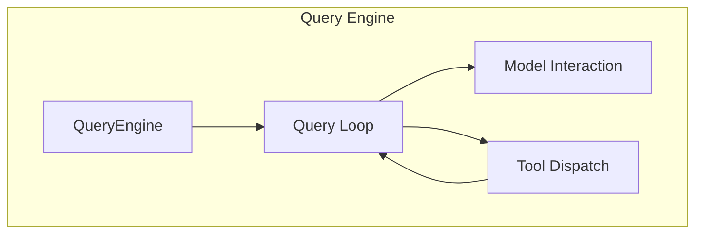
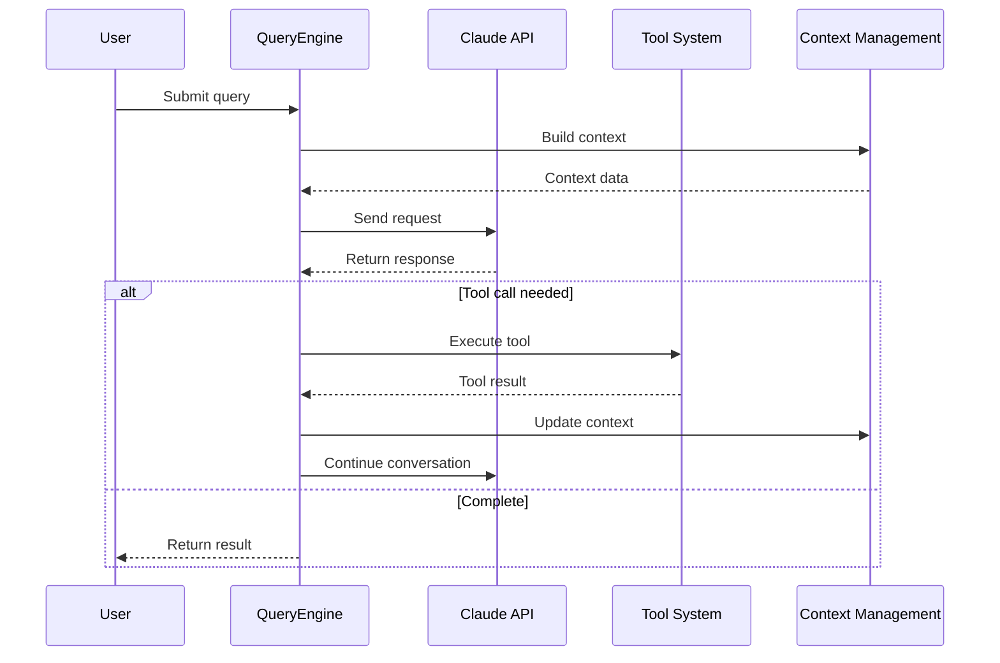
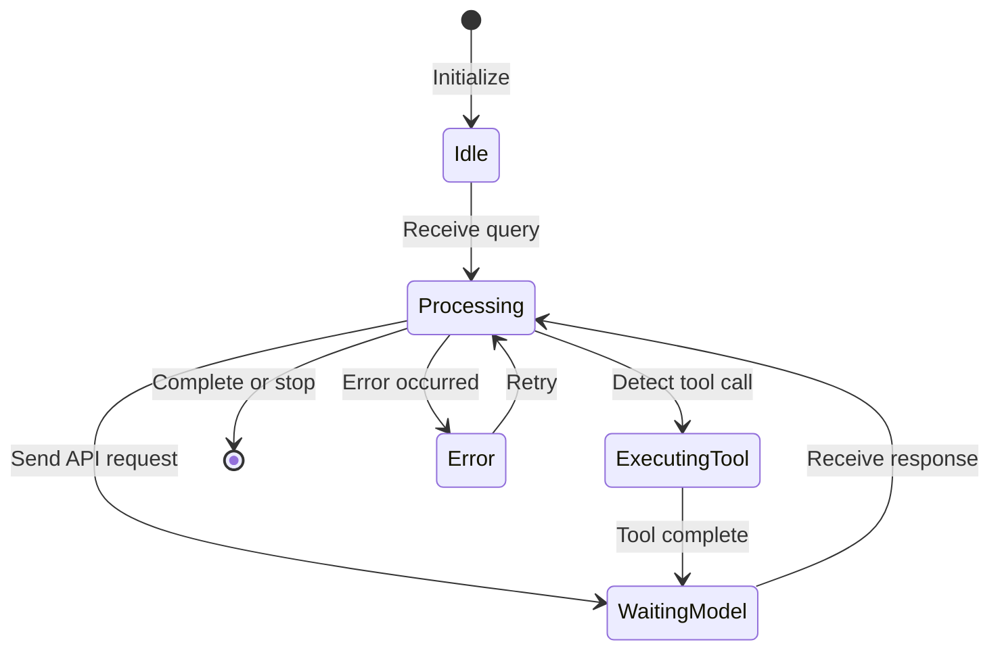
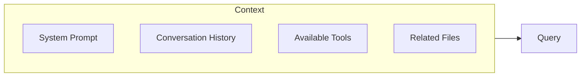

# Query Engine

## Overview

The query engine is the brain of Claude Code, responsible for coordinating user queries, AI model calls, and tool execution. The engine interacts with the Claude model through an iterative loop until the task is completed or the maximum iteration count is reached.

The core implementation is in [QueryEngine.ts](/restored-src/src/QueryEngine.ts).

## Architecture Position



## Features

| Feature | Description | Related Files |
|---------|-------------|---------------|
| Query Loop | Main loop for processing user input and model responses | [QueryEngine.ts](/restored-src/src/QueryEngine.ts) |
| Context Management | Maintain conversation context and history | [context.ts](/restored-src/src/context.ts) |
| Token Budget | Manage context window and token usage | [query/tokenBudget.ts](/restored-src/src/query/tokenBudget.ts) |
| Stop Hooks | Support custom stop conditions | [query/stopHooks.ts](/restored-src/src/query/stopHooks.ts) |

## Core Workflow



## Query Loop States



## API Summary

### QueryEngine Class (Core)

| Method | Description | Signature |
|--------|-------------|-----------|
| `submitMessage(prompt, ...)` | Main entry: async generator, processes user messages and yields stream events | `async *submitMessage(prompt, opts?)` |

### query() Function (Query Loop Generator)

| Method | Description | Signature |
|--------|-------------|-----------|
| `query(params)` | Low-level async generator, encapsulates query loop logic | `async *query(params: QueryParams)` |

> **Note**: `QueryEngine` has no `stop()` / `pause()` / `resume()` public methods. Stopping is done via `AbortController` (passed in `config.abortController`); pausing is controlled internally via `stopHookActive` state.

## Query Input

The actual type is `QueryParams` (defined in [query.ts](/restored-src/src/query.ts)):

```typescript
export type QueryParams = {
  messages: Message[]                        // Conversation history
  systemPrompt: SystemPrompt                 // System prompt
  userContext: { [k: string]: string }     // User context (key-value pairs)
  systemContext: { [k: string]: string }    // System context (key-value pairs)
  canUseTool: CanUseToolFn                  // Tool permission check function
  toolUseContext: ToolUseContext             // Tool execution context
  fallbackModel?: string                     // Fallback model
  querySource: QuerySource                   // Query source identifier
  maxOutputTokensOverride?: number           // Max output token override
  maxTurns?: number                         // Max turns
  skipCacheWrite?: boolean                   // Skip cache write
  taskBudget?: { total: number }            // API task_budget (beta feature)
  deps?: QueryDeps                           // Query dependencies
}
```

> **Note**: Fields such as `message` / `attachments` / `options` / `temperature` / `topP` / `stopSequences` do **not** exist in `QueryParams`. Model parameters are handled via `getMainLoopModel()` / `parseUserSpecifiedModel()` and other dedicated functions.

## Context Management

Context management is a key part of the query engine:



## Task Budget

`QueryParams.taskBudget` is the API-level `output_config.task_budget` (beta), used to cap total output tokens for an entire agentic turn:

```typescript
taskBudget?: { total: number }  // API task_budget beta feature
```

> **Note**: The `TokenBudget` interface described in this wiki (`maxTokens` / `systemPrompt` / `history` / `tools` / `remaining`) does **not** exist in the source code.

## Stop Conditions

Multiple stop conditions are supported:

| Condition | Description | Priority |
|-----------|-------------|----------|
| Explicit Stop | Triggered by user or command | High |
| Token Exhausted | Max tokens reached | High |
| Stop Sequence | Match specified sequence | Medium |
| Custom Hooks | `stopHooks` configuration | Low |

## Error Handling

| Error Type | Handling Strategy |
|------------|------------------|
| API Error | Retry (exponential backoff) |
| Rate Limit | Wait and retry |
| Timeout | Increase timeout or process in segments |
| Context Too Long | Auto compact or segment |

## Model and Parameter Configuration

Model selection and parameters are not passed directly via `QueryParams`, but handled by dedicated functions:

| Config Item | Handler |
|------------|---------|
| Model selection | `getMainLoopModel()` / `parseUserSpecifiedModel()` / `getDefaultSubagentModel()` |
| Max tokens | `maxOutputTokensOverride` (in `QueryParams`) |
| Task budget | `taskBudget: { total: number }` (in `QueryParams`) |
| Temperature / topP | Handled via `getModelParams()` at API layer, not in `QueryParams` |
| Stop sequences | Handled via `stopHooks` configuration (inside query loop) |

## Source References

- [QueryEngine.ts](/restored-src/src/QueryEngine.ts)
- [context.ts](/restored-src/src/context.ts)
- [query/tokenBudget.ts](/restored-src/src/query/tokenBudget.ts)
- [query/stopHooks.ts](/restored-src/src/query/stopHooks.ts)

## Related Documents

- [Tool System](tools.md)
- [Command System](commands.md)
- [API Service](../../services/api.md)

---

*Generated by [Nium-Wiki v0.0.0](https://github.com/niuma996/nium-wiki) | 2026-03-31*
