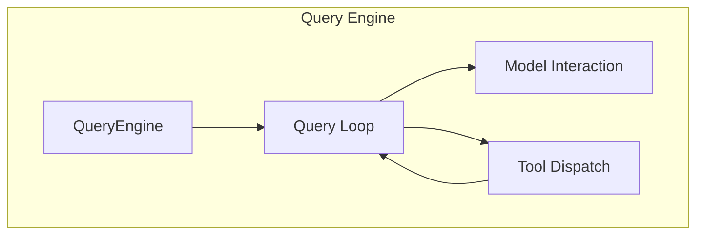
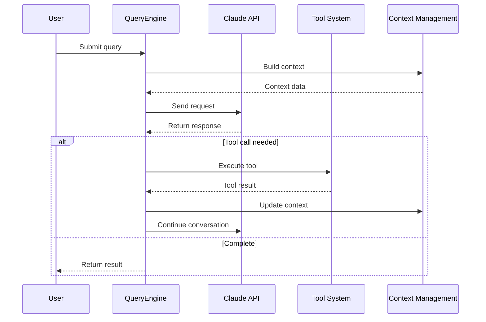
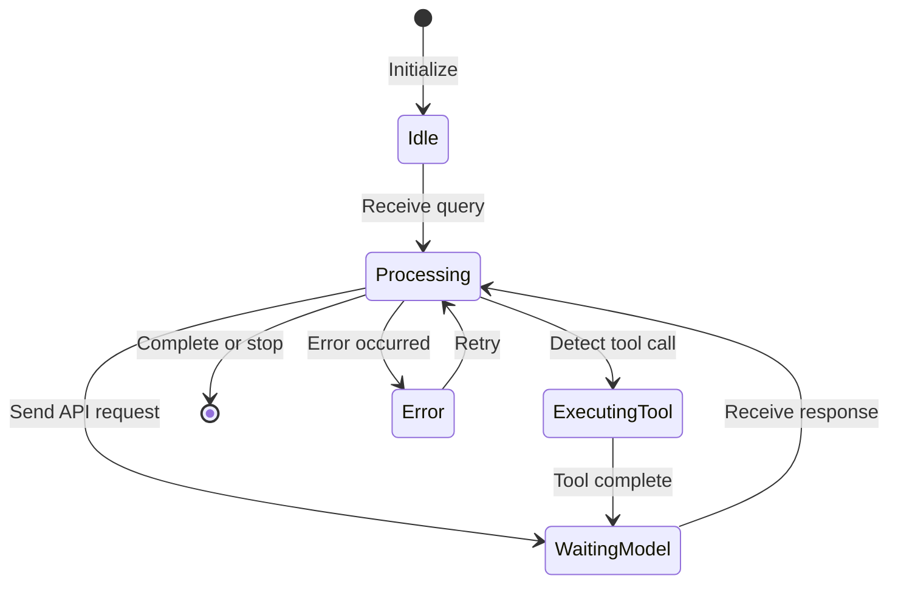
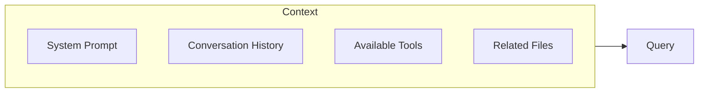

# Query Engine

## Overview

The query engine is the brain of Claude Code, responsible for coordinating user queries, AI model calls, and tool execution. The engine interacts with the Claude model through an iterative loop until the task is completed or the maximum iteration count is reached.

The core implementation is in [QueryEngine.ts](/restored-src/src/QueryEngine.ts).

## Architecture Position



## Features

| Feature | Description | Related Files |
|---------|-------------|---------------|
| Query Loop | Main loop for processing user input and model responses | [QueryEngine.ts](/restored-src/src/QueryEngine.ts) |
| Context Management | Maintain conversation context and history | [context.ts](/restored-src/src/context.ts) |
| Token Budget | Manage context window and token usage | [query/tokenBudget.ts](/restored-src/src/query/tokenBudget.ts) |
| Stop Hooks | Support custom stop conditions | [query/stopHooks.ts](/restored-src/src/query/stopHooks.ts) |

## Core Workflow



## Query Loop States



## API Summary

| Method | Description | Parameters |
|--------|-------------|------------|
| `query(input)` | Execute query | `QueryInput` |
| `stream(input)` | Stream query | `QueryInput` |
| `stop()` | Stop current query | None |
| `pause()` | Pause query | None |
| `resume()` | Resume query | None |

## Query Input

```typescript
interface QueryInput {
  message: string                    // User message
  attachments?: Attachment[]         // Attachments
  context?: QueryContext             // Extra context
  options?: QueryOptions             // Query options
}

interface QueryOptions {
  model?: string                     // Specified model
  maxTokens?: number                // Max tokens
  temperature?: number               // Temperature parameter
  stopSequences?: string[]          // Stop sequences
}
```

## Context Management

Context management is a key part of the query engine:



## Token Budget

Token budget management ensures context doesn't exceed model limits:

```typescript
interface TokenBudget {
  maxTokens: number          // Max tokens
  systemPrompt: number       // System prompt usage
  history: number            // History usage
  tools: number             // Tool definitions usage
  remaining: number          // Remaining available
}
```

## Stop Conditions

Multiple stop conditions are supported:

| Condition | Description | Priority |
|-----------|-------------|----------|
| Explicit Stop | Triggered by user or command | High |
| Token Exhausted | Max tokens reached | High |
| Stop Sequence | Match specified sequence | Medium |
| Custom Hooks | `stopHooks` configuration | Low |

## Error Handling

| Error Type | Handling Strategy |
|------------|------------------|
| API Error | Retry (exponential backoff) |
| Rate Limit | Wait and retry |
| Timeout | Increase timeout or process in segments |
| Context Too Long | Auto compact or segment |

## Configuration Options

| Option | Type | Default | Description |
|--------|------|---------|-------------|
| `model` | string | claude-opus-4-5 | Model to use |
| `maxTokens` | number | 8192 | Max response tokens |
| `temperature` | number | 1 | Generation temperature |
| `topP` | number | - | Top-p sampling |
| `stopSequences` | string[] | [] | Stop sequences |

## Source References

- [QueryEngine.ts](/restored-src/src/QueryEngine.ts)
- [context.ts](/restored-src/src/context.ts)
- [query/tokenBudget.ts](/restored-src/src/query/tokenBudget.ts)
- [query/stopHooks.ts](/restored-src/src/query/stopHooks.ts)

## Related Documents

- [Tool System](tools.md)
- [Command System](commands.md)
- [API Service](../../services/api.md)

---

*Generated by [Nium-Wiki v0.0.0](https://github.com/niuma996/nium-wiki) | 2026-03-31*
