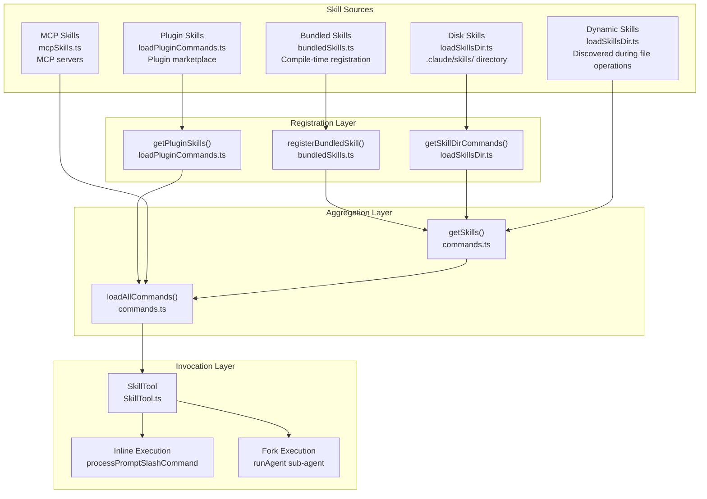
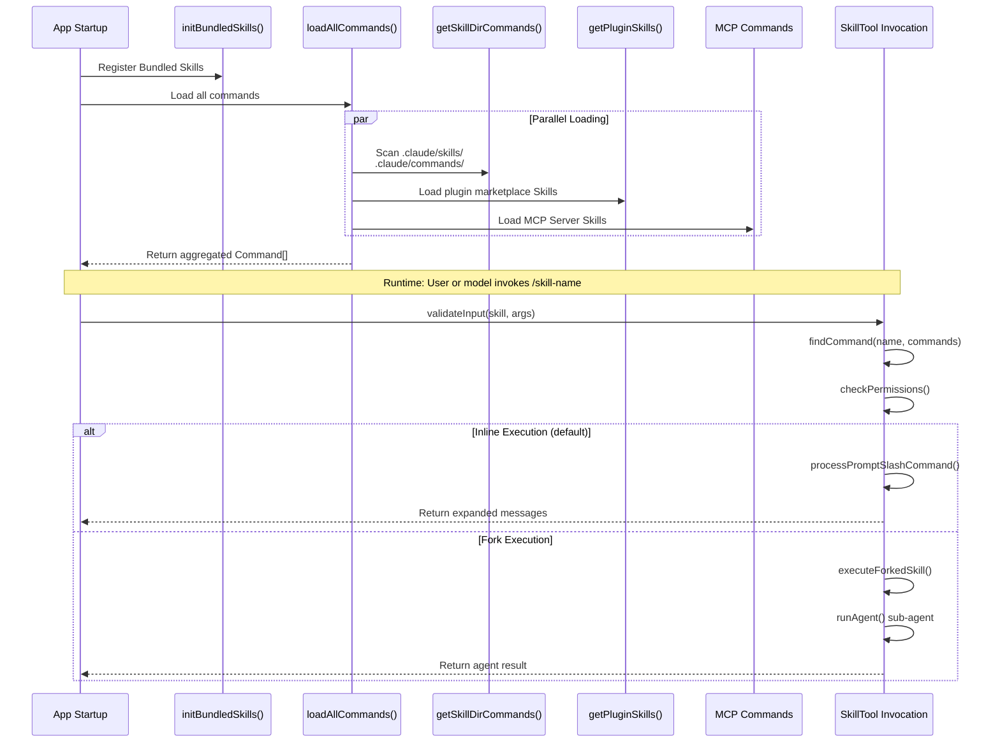
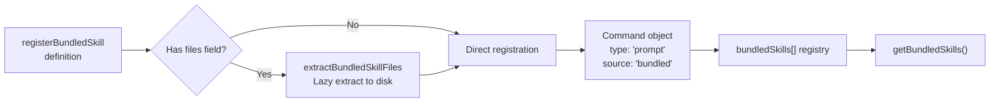
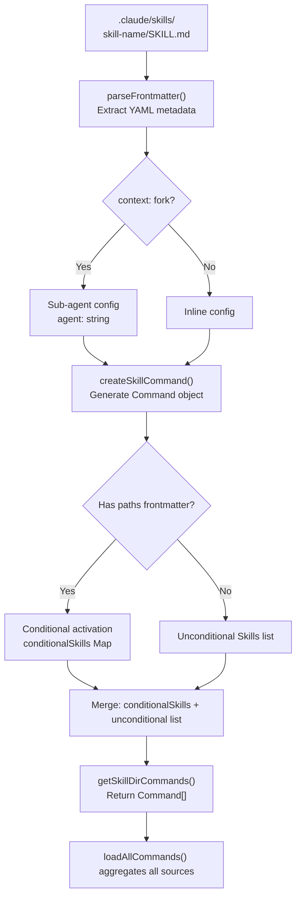
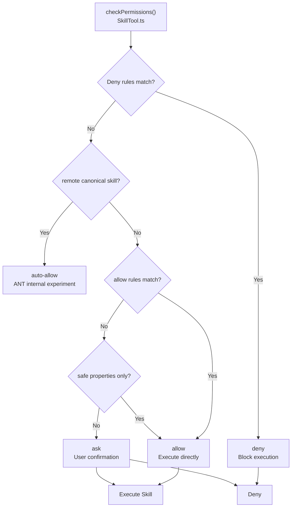
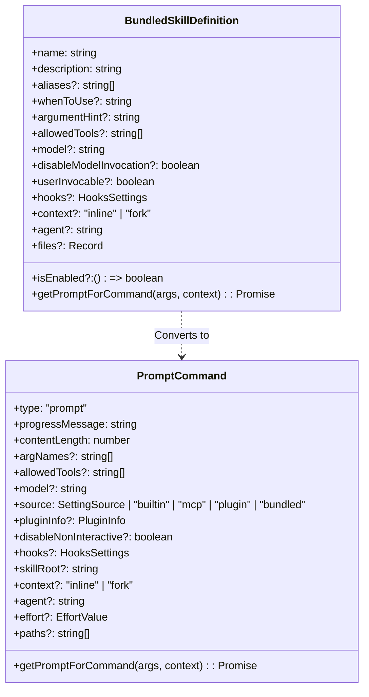
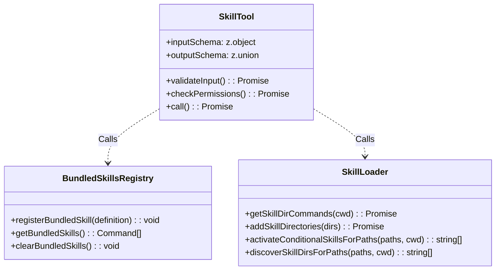

# Skills Module

## Overview

The Skills module is Claude Code's reusable command system, allowing users and AI models to invoke predefined prompt templates using the `/skill-name` syntax. Unlike regular slash commands, Skills focus on providing **domain-specific capabilities** — each Skill encapsulates complete instruction context for specific tasks (such as code review, commit generation, configuration updates), enabling the AI to provide consistent, professional results.

The core value of Skills lies in **decoupling and reuse**: prompt logic is separated from the tool system, Skills can carry their own tool whitelists (`allowed-tools`), model configurations (`model`), execution contexts (`inline`/`fork`), and lifecycle hooks (`hooks`), enabling CLI capability extension without modifying core code.

## Architecture Position



## Features

| Feature | Description | Related Files |
|---------|-------------|---------------|
| **Multi-source Loading** | Supports Bundled, Disk, Plugin, MCP, Dynamic five sources | [commands.ts](/restored-src/src/commands.ts#L353-L398) |
| **SKILL.md Format** | Disk Skills use `skill-name/SKILL.md` directory format | [loadSkillsDir.ts](/restored-src/src/skills/loadSkillsDir.ts#L406-L480) |
| **Frontmatter Configuration** | Supports description, allowed-tools, model, hooks and other metadata | [loadSkillsDir.ts](/restored-src/src/skills/loadSkillsDir.ts#L185-L265) |
| **Inline Execution** | Skill content expands into current conversation context (default) | [SkillTool.ts](/restored-src/src/tools/SkillTool/SkillTool.ts#L634-L841) |
| **Fork Execution** | Skill runs in isolated sub-agent with independent token budget | [SkillTool.ts](/restored-src/src/tools/SkillTool/SkillTool.ts#L122-L289) |
| **Permission Control** | Skill triggers permission prompts based on allowed-tools and safe-properties whitelist | [SkillTool.ts](/restored-src/src/tools/SkillTool/SkillTool.ts#L432-L578) |
| **Conditional Activation** | `paths` frontmatter controls when Skill activates based on matching files | [loadSkillsDir.ts](/restored-src/src/skills/loadSkillsDir.ts#L997-L1058) |
| **Dynamic Discovery** | Dynamically loads from nested `.claude/skills/` during file operations | [loadSkillsDir.ts](/restored-src/src/skills/loadSkillsDir.ts#L861-L915) |
| **Lifecycle Hooks** | Skills can register PreToolUse, PostToolUse and other hooks | [loadSkillsDir.ts](/restored-src/src/skills/loadSkillsDir.ts#L136-L153) |
| **Tool Budget** | Skill list occupies 1% of context window (~8000 characters) | [prompt.ts](/restored-src/src/tools/SkillTool/prompt.ts#L21-L41) |

## File Structure

```
restored-src/src/
├── skills/
│   ├── bundled/                      # Built-in Skills (compile-time registration)
│   │   ├── index.ts                  # initBundledSkills() initialization entry
│   │   ├── updateConfig.ts           # /update-config skill
│   │   ├── verify.ts                 # /verify skill
│   │   ├── debug.ts                 # /debug skill
│   │   ├── simplify.ts              # /simplify skill
│   │   ├── batch.ts                 # /batch skill
│   │   ├── stuck.ts                 # /stuck skill
│   │   ├── remember.ts              # /remember skill
│   │   ├── skillify.ts              # /skillify skill
│   │   ├── keybindings.ts           # /keybindings skill
│   │   ├── loop.ts                  # /loop skill (AGENT_TRIGGERS)
│   │   ├── scheduleRemoteAgents.ts  # /schedule-remote-agents (AGENT_TRIGGERS_REMOTE)
│   │   ├── claudeApi.ts            # /claude-api (BUILDING_CLAUDE_APPS)
│   │   └── ...
│   ├── bundledSkills.ts              # BundledSkillDefinition type definition and registration
│   ├── loadSkillsDir.ts             # Disk Skills loading (SKILL.md parsing, dynamic discovery, conditional activation)
│   └── mcpSkillBuilders.ts          # MCP Skill builder registration
│
├── tools/SkillTool/
│   ├── SkillTool.ts                 # SkillTool core implementation (validation, permissions, invocation)
│   ├── constants.ts                 # Tool names, context budget, formatting logic
│   └── prompt.ts                   # SkillTool system prompts
│
├── commands.ts                      # Command registry, getCommands(), findCommand()
├── types/
│   └── command.ts                   # Command, PromptCommand type definitions
│
└── plugins/
    └── builtinPlugins.ts            # Built-in plugins (Bundled Skills variant)
```

## Core Workflow

### Skill Loading Sequence



### Bundled Skill Registration Flow



### Disk Skill Parsing Flow



## Frontmatter Specification

Disk Skills use YAML frontmatter for metadata, located at the top of the `SKILL.md` file:

```yaml
---
# Skill display name (optional, defaults to directory name)
name: skill-name

# Short description (required)
description: Generate high quality commit messages

# Detailed usage scenario (for SkillTool prompt matching)
when_to_use: When user wants to create a commit message

# Argument hint (e.g., '-m' in "/commit -m 'Fix bug'")
argument-hint: -m '<message>'

# Allowed tools whitelist (empty = unrestricted)
allowed-tools:
  - Read
  - Bash
  - Write

# Model override (optional, inherits from parent by default)
model: sonnet

# Whether user can invoke directly (default true)
user-invocable: true

# Execution context: inline (default) or fork (sub-agent)
context: inline

# Agent type to use for fork execution
agent: general-purpose

# Effort level: low, medium, high, max or integer
effort: medium

# Conditional activation: only show when matching paths are operated
paths:
  - src/**/*.ts

# Lifecycle hooks
hooks:
  PreToolUse:
    - matcher:
        tool-name: Bash
      hook: echo "Running bash: $TOOL_NAME"

# Shell type: bash (default) or powershell
shell: bash
---
```

## Permission Model



**Safe Properties Whitelist**: `type`, `progressMessage`, `contentLength`, `argNames`, `model`, `effort`, `source`, `pluginInfo`, `disableNonInteractive`, `skillRoot`, `context`, `agent`, `name`, `description`, `hasUserSpecifiedDescription`, `isEnabled`, `isHidden`, `aliases`, `isMcp`, `argumentHint`, `whenToUse`, `paths`, `version`, `disableModelInvocation`, `userInvocable`, `loadedFrom`, `immediate`, `userFacingName`, `getPromptForCommand`, `frontmatterKeys`. If a Skill contains properties outside the whitelist with actual values, a permission prompt is triggered.

## Built-in Bundled Skills

| Skill | File | Description |
|-------|------|-------------|
| `/update-config` | [updateConfig.ts](/restored-src/src/skills/bundled/updateConfig.ts) | Configure Claude Code via `settings.json` |
| `/verify` | [verify.ts](/restored-src/src/skills/bundled/verify.ts) | Verify changes and generate test plan |
| `/debug` | [debug.ts](/restored-src/src/skills/bundled/debug.ts) | Analyze errors and provide fix suggestions |
| `/simplify` | [simplify.ts](/restored-src/src/skills/bundled/simplify.ts) | Review change code reusability, quality, and efficiency |
| `/batch` | [batch.ts](/restored-src/src/skills/bundled/batch.ts) | Run prompts or slash commands periodically |
| `/stuck` | [stuck.ts](/restored-src/src/skills/bundled/stuck.ts) | Provide help when model is stuck |
| `/remember` | [remember.ts](/restored-src/src/skills/bundled/remember.ts) | Save information to persistent memory system |
| `/skillify` | [skillify.ts](/restored-src/src/skills/bundled/skillify.ts) | Convert existing changes to reusable Skill |
| `/keybindings` | [keybindings.ts](/restored-src/src/skills/bundled/keybindings.ts) | Configure keyboard shortcuts |
| `/loop` | [loop.ts](/restored-src/src/skills/bundled/loop.ts) | Run tasks on schedule (AGENT_TRIGGERS) |
| `/claude-api` | [claudeApi.ts](/restored-src/src/skills/bundled/claudeApi.ts) | Build Claude API/Agent SDK applications |
| `/claude-in-chrome` | [claudeInChrome.ts](/restored-src/src/skills/bundled/claudeInChrome.ts) | Claude in Chrome extension integration |

## Usage Examples

### Quick Start: Create a Disk Skill

Project structure:
```
.claude/
└── skills/
    └── my-skill/
        └── SKILL.md
```

`SKILL.md` content:
```yaml
---
name: my-skill
description: A custom skill for specialized tasks
when_to_use: When user asks about topic X
allowed-tools:
  - Read
  - Grep
---

# My Skill

When user asks about X, execute the following steps:

1. Read relevant files
2. Analyze content
3. Provide suggestions
```

User invocation: `/my-skill`

### Invoke Skill with Arguments

```typescript
// User input: /commit -m "Fix authentication bug"
// SkillTool input
const input = {
  skill: "commit",
  args: "-m 'Fix authentication bug'"
}
```

### Fork Execution (Sub-agent)

When Skill frontmatter sets `context: fork`, content executes in an isolated sub-agent via `runAgent()`:

```yaml
---
context: fork
agent: general-purpose
model: sonnet
effort: high
---

# Code Review Skill

As a senior code reviewer, review changes and provide detailed feedback...
```

## Best Practices

**Recommended:**
- Create each Skill in a separate directory (`skill-name/SKILL.md`), not single-file format
- Use `when_to_use` to provide detailed scenario descriptions to help model match correctly
- Explicitly declare `allowed-tools` to reduce permission prompts
- Use `context: fork` for long-running or complex tasks to isolate execution

**Avoid:**
- Don't use `**` (match-all) in `paths`, which is equivalent to no paths configuration
- Don't omit `description`, otherwise system auto-infers from markdown first line (uncontrollable quality)
- Bundled Skills file extraction (`files` field) is only for Skill's own reference files, not for passing prompt logic

## Design Decisions

### 1. Directory Format Preferred Over Single-File Format

`loadSkillsDir.ts` only supports `.claude/skills/skill-name/SKILL.md` directory format; single `.md` file is only supported in legacy `/commands/` directory.

**Reason**: Directory format supports placing extra resource files (scripts, schemas, sample data) within the Skill directory, making Skills self-contained; single-file format is marked as `commands_DEPRECATED`.

### 2. Fork Execution Uses Independent Token Budget

When `context: fork`, Skill runs in a sub-agent started via `runAgent()` with independent token window and context.

**Reason**: Complex Skills may require a large amount of reasoning tokens; Inline execution consumes the main session's context budget; Fork isolation prevents Skills' long reasoning from affecting the main conversation rhythm.

### 3. Safe Properties Whitelist Instead of Blacklist

Permission system uses `SAFE_SKILL_PROPERTIES` whitelist to determine if Skill requires user authorization. New Command properties require authorization by default until explicitly added to the whitelist.

**Reason**: Blacklist mode introduces security risks due to missed new properties; whitelist ensures new properties are secure by default, authorization requires deliberate approval.

## Source Index

### Key Types



### Core Function Signatures



## Related Documents

- [Command System](commands.md) — Unified management of all slash commands
- [Tool System](tools.md) — Implementation details of SkillTool and other tools
- [Hooks Module](hooks.md) — Skill lifecycle hooks
- [Plugin System](../plugins/) — Plugin Skills loading mechanism
- [Architecture Documentation](../architecture.md)

---

*Generated by [Nium-Wiki v0.0.0](https://github.com/niuma996/nium-wiki) | 2026-05-12*
