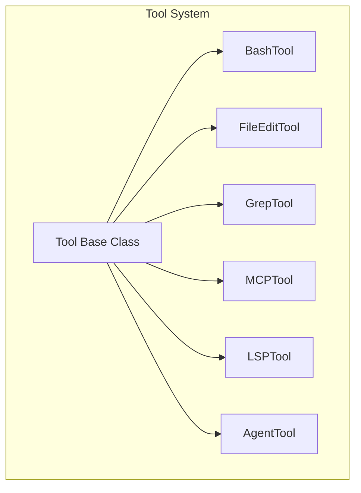
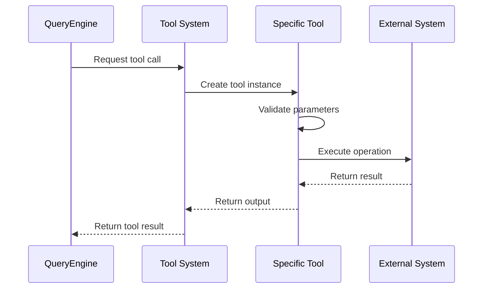
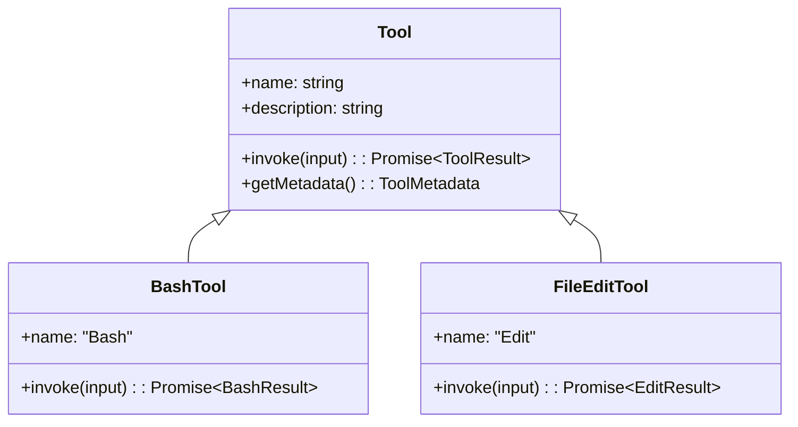

# Tool System

## Overview

The tool system is the execution unit of Claude Code, allowing AI agents to interact with the external world through tools. The system supports multiple tool types, including Bash execution, file editing, search, MCP integration, and more.

The tool system uses a unified interface design, where each tool implements the interface defined by the `Tool` base class. The core implementation is in [Tool.ts](/restored-src/src/Tool.ts).

## Architecture Position



## Features

| Feature | Description | Related Files |
|---------|-------------|---------------|
| Bash Execution | Execute shell commands | [BashTool/](/restored-src/src/tools/BashTool/) |
| File Editing | Read, write, edit files | [FileEditTool/](/restored-src/src/tools/FileEditTool/) |
| File Search | Pattern matching file search | [GlobTool/](/restored-src/src/tools/GlobTool/) |
| Code Search | Grep pattern search | [GrepTool/](/restored-src/src/tools/GrepTool/) |
| MCP Tools | Tools provided by MCP servers | [MCPTool/](/restored-src/src/tools/MCPTool/) |
| LSP Tools | Language Server Protocol | [LSPTool/](/restored-src/src/tools/LSPTool/) |
| Agent Tools | Sub-agent execution | [AgentTool/](/restored-src/src/tools/AgentTool/) |

## File Structure

```
restored-src/src/
├── Tool.ts                 # Tool base class
├── tools/                  # Tool implementation directory
│   ├── BashTool/          # Bash execution tool
│   │   ├── UI.tsx        # Bash tool UI
│   │   ├── prompt.ts     # Prompt templates
│   │   └── utils.ts      # Tool utilities
│   ├── FileEditTool/     # File editing tool
│   ├── FileReadTool/     # File reading tool
│   ├── GlobTool/         # File search tool
│   ├── GrepTool/         # Code search tool
│   ├── MCPTool/          # MCP tool
│   ├── LSPTool/          # LSP tool
│   ├── AgentTool/        # Agent tool
│   ├── WebFetchTool/     # Web fetch tool
│   ├── TaskStopTool/     # Task stop tool
│   ├── SleepTool/        # Sleep tool
│   ├── ConfigTool/       # Config tool
│   ├── SkillTool/        # Skill tool
│   └── BriefTool/        # Brief tool
```

## Core Workflow



## Tool Base Class Interface



## API Summary

| Tool | Description | Main Method |
|------|-------------|-------------|
| BashTool | Execute shell commands | `invoke(input: BashInput)` |
| FileEditTool | Edit file content | `invoke(input: EditInput)` |
| FileReadTool | Read file content | `invoke(input: ReadInput)` |
| GlobTool | Pattern match files | `invoke(input: GlobInput)` |
| GrepTool | Code search | `invoke(input: GrepInput)` |
| MCPTool | MCP tool calls | `invoke(input: MCPInput)` |
| LSPTool | LSP operations | `invoke(input: LSPInput)` |
| AgentTool | Sub-agent execution | `invoke(input: AgentInput)` |

## BashTool Detailed Description

BashTool is the most commonly used tool, allowing shell command execution:

```typescript
interface BashInput {
  command: string        // Command to execute
  context?: {
    cwd?: string        // Working directory
    env?: Record<string, string>
    timeout?: number    // Timeout in milliseconds
  }
}

interface BashResult {
  stdout: string         // Standard output
  stderr: string         // Standard error
  exitCode: number       // Exit code
  duration: number       // Execution duration in milliseconds
}
```

## File Editing Tool

The file editing tool supports multiple operations:

| Operation | Description | Parameters |
|-----------|-------------|------------|
| `create` | Create new file | `file_path`, `content` |
| `edit` | Edit file content | `file_path`, `old_string`, `new_string` |
| `delete` | Delete file | `file_path` |
| `rename` | Rename file | `old_path`, `new_path` |

## MCP Tool Integration

MCP tools are integrated through [MCPTool](/restored-src/src/tools/MCPTool/):

```typescript
interface MCPInput {
  server: string           // MCP server name
  tool: string             // Tool name
  arguments: Record<string, unknown>  // Tool parameters
}
```

## Best Practices

### Tool Calling Principles

| Principle | Description |
|-----------|-------------|
| Parameter Validation | Validate all parameters before `invoke` |
| Error Handling | Catch and properly handle execution errors |
| Timeout Control | Set timeouts for long-running operations |
| Result Caching | Cache reusable results |

### Avoiding Problems

| Problem | Solution |
|---------|----------|
| Command Injection | Use parameterized commands, avoid string concatenation |
| Path Traversal | Normalize and validate file paths |
| Timeout Runaway | Set reasonable default timeouts and allow configuration |
| Resource Leaks | Ensure child processes and file handles are properly closed |

## Source References

- [Tool.ts](/restored-src/src/Tool.ts)
- [tools/BashTool/](/restored-src/src/tools/BashTool/)
- [tools/FileEditTool/](/restored-src/src/tools/FileEditTool/)
- [tools/GrepTool/](/restored-src/src/tools/GrepTool/)

## Related Documents

- [Query Engine](query.md)
- [MCP Service](../../services/mcp.md)
- [Command System](commands.md)

---

*Generated by [Nium-Wiki v0.0.0](https://github.com/niuma996/nium-wiki) | 2026-03-31*
