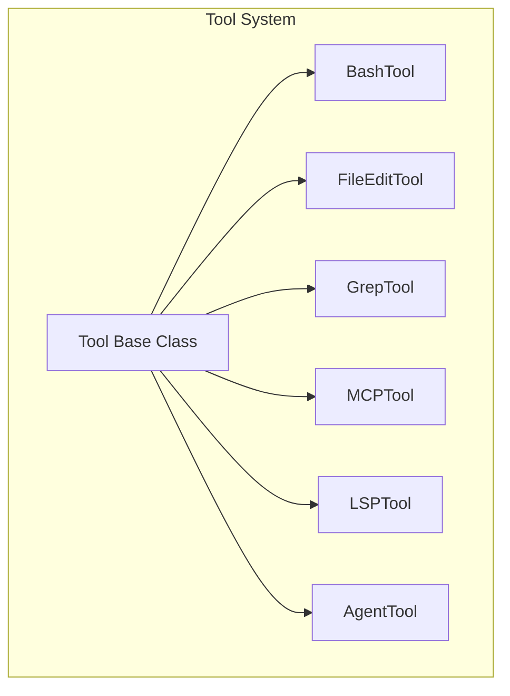
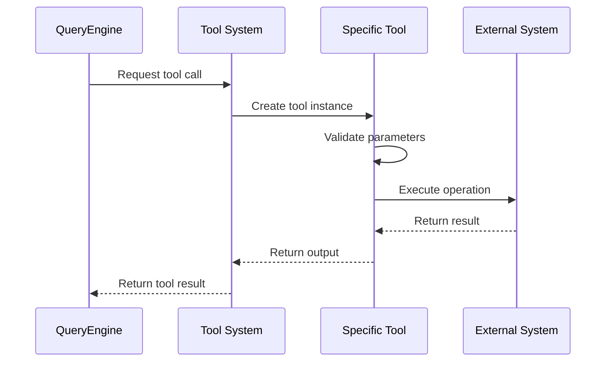
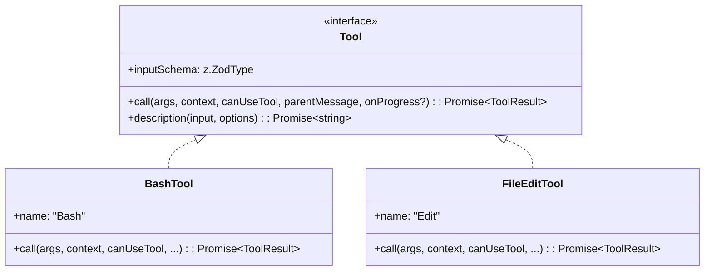

# Tool System

## Overview

The tool system is the execution unit of Claude Code, allowing AI agents to interact with the external world through tools. The system supports multiple tool types, including Bash execution, file editing, search, MCP integration, and more.

The tool system uses a unified TypeScript `Tool` interface design. The core implementation is in the [Tool.ts](/restored-src/src/Tool.ts) file.

> **Note**: `Tool` is a TypeScript `interface`, not a class base class. The actual methods are `call()` (execution) and `description()` (generate description), not `invoke()`/`getMetadata()`.

**Core Source Code Location**
- [Tool.ts](/restored-src/src/Tool.ts#L1) - Tool base class interface
- [tools.ts](/restored-src/src/tools.ts#L1) - Tool registration
- [tools/BashTool/](/restored-src/src/tools/BashTool/) - Bash tool implementation
- [tools/FileEditTool/](/restored-src/src/tools/FileEditTool/) - File edit tool

## Architecture Location



## Features

| Feature | Description | Related Files |
|---------|-------------|---------------|
| Bash Execution | Execute commands in terminal | [BashTool/](/restored-src/src/tools/BashTool/) |
| File Editing | Read, write, edit files | [FileEditTool/](/restored-src/src/tools/FileEditTool/) |
| File Search | Pattern matching file search | [GlobTool/](/restored-src/src/tools/GlobTool/) |
| Code Search | Grep pattern search | [GrepTool/](/restored-src/src/tools/GrepTool/) |
| MCP Tools | Tools provided by MCP servers | [MCPTool/](/restored-src/src/tools/MCPTool/) |
| LSP Tools | Language Server Protocol | [LSPTool/](/restored-src/src/tools/LSPTool/) |
| Agent Tools | Sub-agent execution | [AgentTool/](/restored-src/src/tools/AgentTool/) |

## File Structure

```
restored-src/src/
├── Tool.ts                 # Tool base class interface
├── tools.ts                # Tool registry
├── tools/                  # Tool implementation directory
│   ├── BashTool/          # Bash execution tool
│   │   ├── BashTool.ts    # Bash tool main implementation
│   │   ├── UI.tsx        # Bash tool UI
│   │   ├── prompt.ts     # Prompt templates
│   │   └── utils.ts      # Utility functions
│   ├── FileEditTool/     # File edit tool
│   │   ├── FileEditTool.ts
│   │   ├── UI.tsx
│   │   └── prompt.ts
│   ├── FileReadTool/     # File read tool
│   ├── GlobTool/         # File search tool
│   │   ├── GlobTool.ts
│   │   ├── UI.tsx
│   │   └── prompt.ts
│   ├── GrepTool/         # Code search tool
│   │   ├── GrepTool.ts
│   │   ├── UI.tsx
│   │   └── prompt.ts
│   ├── MCPTool/          # MCP tool
│   │   ├── MCPTool.ts
│   │   ├── UI.tsx
│   │   └── prompt.ts
│   ├── LSPTool/          # LSP tool
│   │   ├── LSPTool.ts
│   │   ├── UI.tsx
│   │   ├── prompt.ts
│   │   └── schemas.ts
│   ├── AgentTool/        # Agent tool
│   │   ├── AgentTool.ts
│   │   ├── UI.tsx
│   │   └── prompt.ts
│   ├── WebFetchTool/     # Web fetch tool
│   ├── WebSearchTool/    # Web search tool
│   ├── TaskStopTool/     # Task stop tool
│   ├── SleepTool/        # Sleep tool
│   ├── ConfigTool/       # Config tool
│   ├── SkillTool/        # Skill tool
│   └── BriefTool/        # Brief tool
```

**Source Code Mapping**
- [Tool.ts](/restored-src/src/Tool.ts) - Tool base class interface
- [tools.ts](/restored-src/src/tools.ts) - Tool registration logic
- [tools/BashTool/BashTool.ts](/restored-src/src/tools/BashTool/) - Bash tool implementation
- [tools/GlobTool/GlobTool.ts](/restored-src/src/tools/GlobTool/) - Glob tool implementation
- [tools/GrepTool/GrepTool.ts](/restored-src/src/tools/GrepTool/) - Grep tool implementation

## Core Workflow



## Tool Interface



> **Method Signature Note**: The parameters of `call(args, context, canUseTool, parentMessage, onProgress?)` include `canUseTool` (permission check) and `onProgress` (progress callback), not a simple `invoke(input)`.

## API Summary

| Tool | Description | Main Method | Source Location |
|------|-------------|-------------|-----------------|
| BashTool | Execute shell commands | `call(input, context, ...)` | [BashTool.ts](/restored-src/src/tools/BashTool/BashTool.ts) |
| FileEditTool | Edit file content | `call(input, context, ...)` | [FileEditTool.ts](/restored-src/src/tools/FileEditTool/FileEditTool.ts) |
| FileReadTool | Read file content | `call(input, context, ...)` | [FileReadTool.ts](/restored-src/src/tools/FileReadTool/) |
| GlobTool | Pattern matching files | `call(input, context, ...)` | [GlobTool.ts](/restored-src/src/tools/GlobTool/GlobTool.ts) |
| GrepTool | Code search | `call(input, context, ...)` | [GrepTool.ts](/restored-src/src/tools/GrepTool/GrepTool.ts) |
| MCPTool | MCP tool invocation | `call(input, context, ...)` | [MCPTool.ts](/restored-src/src/tools/MCPTool/MCPTool.ts) |
| LSPTool | LSP operations | `call(input, context, ...)` | [LSPTool.ts](/restored-src/src/tools/LSPTool/LSPTool.ts) |
| AgentTool | Sub-agent execution | `call(input, context, ...)` | [AgentTool.ts](/restored-src/src/tools/AgentTool/AgentTool.ts) |
| WebFetchTool | Web fetch | `call(input, context, ...)` | [WebFetchTool.ts](/restored-src/src/tools/WebFetchTool/) |
| WebSearchTool | Web search | `call(input, context, ...)` | [WebSearchTool.ts](/restored-src/src/tools/WebSearchTool/) |

## BashTool Detailed Description

BashTool is the most commonly used tool, allowing shell command execution. The following is an illustrative input/output structure (not the actual type names in source code — see [BashTool.ts](/restored-src/src/tools/BashTool/BashTool.ts) for the real implementation):

```typescript
// Illustrative structure (not actual source type names)
// Input: command is required, timeout is optional (milliseconds)
{
  command: string
  timeout?: number
}

// Output: stdout/stderr text + exit code
{
  stdout: string
  stderr: string
  exitCode: number
}
```

## File Edit Tool

The file edit tool supports the following operations (operation names match actual source parameters — see [FileEditTool.ts](/restored-src/src/tools/FileEditTool/FileEditTool.ts)):

| Operation | Description | Parameters |
|-----------|-------------|------------|
| `create` | Create new file | `file_path`, `content` |
| `str_replace` | Replace string in file | `file_path`, `old_string`, `new_string` |

## MCP Tool Integration

MCP tools are integrated through [MCPTool](/restored-src/src/tools/MCPTool/):

```typescript
interface MCPInput {
  server: string           // MCP server name
  tool: string             // Tool name
  arguments: Record<string, unknown>  // Tool arguments
}
```

## Best Practices

### Tool Invocation Principles

| Principle | Description |
|-----------|-------------|
| Parameter Validation | Validate all parameters before `call()` |
| Error Handling | Catch and properly handle execution errors |
| Timeout Control | Set timeouts for long-running operations |
| Result Caching | Cache reusable results |

### Issues to Avoid

| Issue | Solution |
|-------|----------|
| Command Injection | Use parameterized commands, avoid string concatenation |
| Path Traversal | Normalize and validate file paths |
| Timeout Runaway | Set reasonable default timeouts and allow configuration |
| Resource Leaks | Ensure child processes and file handles are properly closed |

## Source Code References

**Core Files**
- [Tool.ts](/restored-src/src/Tool.ts) - Tool base class interface
- [tools.ts](/restored-src/src/tools.ts) - Tool registry

**Tool Implementations**
- [tools/BashTool/BashTool.ts](/restored-src/src/tools/BashTool/) - Bash tool
- [tools/FileEditTool/](/restored-src/src/tools/FileEditTool/) - File edit tool
- [tools/GrepTool/](/restored-src/src/tools/GrepTool/) - Search tool
- [tools/GlobTool/](/restored-src/src/tools/GlobTool/) - File matching tool
- [tools/MCPTool/](/restored-src/src/tools/MCPTool/) - MCP tool
- [tools/AgentTool/](/restored-src/src/tools/AgentTool/) - Agent tool

**Tool UI and Prompts**
- [BashTool/UI.tsx](/restored-src/src/tools/BashTool/UI.tsx) - Bash UI
- [GlobTool/prompt.ts](/restored-src/src/tools/GlobTool/prompt.ts) - Glob prompt

## Related Documentation

- [Query Engine](query.md)
- [MCP Service](../../services/mcp.md)
- [Command System](commands.md)
- [Core Module Index](_index.md)

---

*Generated by [Nium-Wiki v0.0.0](https://github.com/niuma996/nium-wiki) | 2026-05-16*
