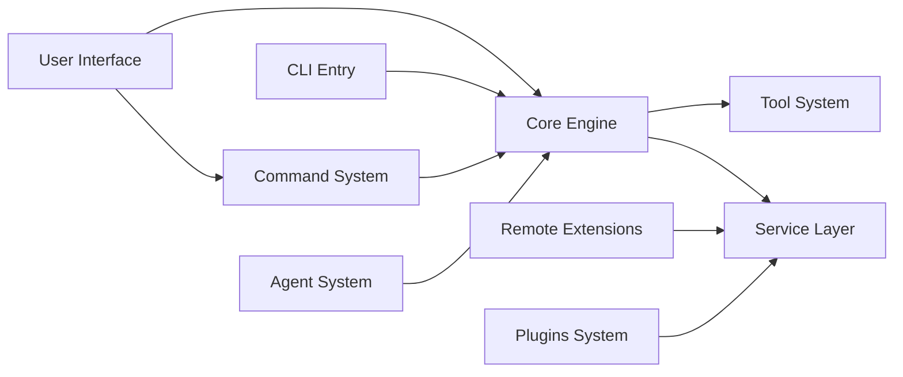

# Documentation Map

## Document Structure

```
wiki/
├── index.md              # Project home page
├── architecture.md       # System architecture
├── getting-started.md    # Getting started
├── doc-map.md           # Documentation index (this file)
│
├── cli/                 # CLI Core and Entry
│   ├── _index.md       # CLI module overview
│   ├── entrypoints.md   # CLI entry points
│   └── startup.md       # Startup and fast paths
│
├── agent/               # Agent and Coordination
│   ├── _index.md       # Agent module overview
│   ├── agent-tool.md    # Agent tool
│   └── fork-subagent.md # Fork subagent
│
├── remote/              # Remote and Service Extensions
│   ├── _index.md       # Remote extensions overview
│   ├── bridge.md       # Remote Control Bridge
│   └── mcp.md          # MCP client
│
├── plugins/             # Plugins and Skills System
│   ├── _index.md       # Plugin system overview
│   ├── builtin.md      # Built-in plugins
│   ├── bundled-skills.md # Bundled skills
│   └── companion.md    # Companion system
│
├── core/                # Core modules
│   ├── _index.md       # Core modules overview
│   ├── commands.md     # Command system
│   ├── tools.md        # Tool system
│   └── query.md        # Query engine
│
├── services/            # Service layer
│   ├── _index.md       # Service layer overview
│   ├── api.md          # API service
│   ├── mcp.md          # MCP service
│   └── oauth.md        # OAuth authentication
│
├── ui/                  # User interface
│   ├── _index.md       # UI layer overview
│   ├── repl.md         # REPL interface
│   └── ink.md          # Ink rendering engine
│
└── reference/           # Reference documentation
    ├── _index.md       # Reference docs overview
    ├── api.md          # API reference
    └── types.md        # Type definitions
```

## Module Dependencies



## Documentation Checklist

| Document | Description | Priority |
|----------|-------------|----------|
| [index.md](index.md) | Project home page | High |
| [architecture.md](architecture.md) | System architecture overview | High |
| [getting-started.md](getting-started.md) | Getting started guide | High |
| [doc-map.md](doc-map.md) | Documentation index | High |
| [cli/_index.md](cli/_index.md) | CLI Core and Entry overview | High |
| [cli/entrypoints.md](cli/entrypoints.md) | CLI entry points | High |
| [cli/startup.md](cli/startup.md) | Startup and fast paths | High |
| [agent/_index.md](agent/_index.md) | Agent and Coordination overview | High |
| [agent/agent-tool.md](agent/agent-tool.md) | Agent tool | High |
| [agent/fork-subagent.md](agent/fork-subagent.md) | Fork subagent | High |
| [remote/_index.md](remote/_index.md) | Remote and Service Extensions overview | High |
| [remote/bridge.md](remote/bridge.md) | Remote Control Bridge | High |
| [remote/mcp.md](remote/mcp.md) | MCP client | High |
| [plugins/_index.md](plugins/_index.md) | Plugins and Skills System overview | High |
| [plugins/builtin.md](plugins/builtin.md) | Built-in plugins | High |
| [plugins/bundled-skills.md](plugins/bundled-skills.md) | Bundled skills | High |
| [plugins/companion.md](plugins/companion.md) | Companion system | Medium |
| [core/commands.md](core/commands.md) | Command system | Medium |
| [core/tools.md](core/tools.md) | Tool system | Medium |
| [core/query.md](core/query.md) | Query engine | Medium |
| [services/api.md](services/api.md) | API service | Medium |
| [services/mcp.md](services/mcp.md) | MCP service | Medium |
| [services/oauth.md](services/oauth.md) | OAuth authentication | Medium |
| [ui/repl.md](ui/repl.md) | REPL interface | Medium |
| [ui/ink.md](ui/ink.md) | Ink rendering engine | Low |
| [reference/types.md](reference/types.md) | Type definitions | Low |

---

*Generated by [Nium-Wiki v0.0.0](https://github.com/niuma996/nium-wiki) | 2026-03-31*
