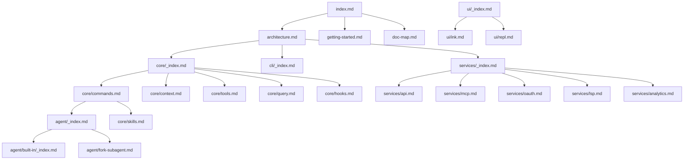

# Document Map

This document provides an index and relationship guide for all documentation in the Claude Code project.

## Document Structure

```
.nium-wiki/wiki/
├── index.md                  # Project home
├── architecture.md           # System architecture
├── getting-started.md        # Quick start
├── doc-map.md               # This document
│
├── core/                    # Core modules
│   ├── _index.md           # Core modules overview
│   ├── commands.md         # Command system
│   ├── context.md          # Context management
│   ├── hooks.md           # Hook system
│   ├── query.md           # Query engine
│   ├── skills.md          # Skills system
│   └── tools.md           # Tool system
│
├── cli/                     # CLI entry
│   ├── _index.md          # CLI overview
│   ├── entrypoints.md     # Entry points
│   └── startup.md         # Startup flow
│
├── agent/                   # Agent system
│   ├── _index.md          # Agent overview
│   ├── agent-tool.md      # Agent tool
│   ├── fork-subagent.md   # Sub-agent
│   ├── session-history.md # Session history
│   └── built-in/          # Built-in agents
│       ├── _index.md
│       ├── general-purpose-agent.md
│       ├── explore-agent.md
│       ├── plan-agent.md
│       ├── verification-agent.md
│       └── ...
│
├── services/               # Service layer
│   ├── _index.md          # Services overview
│   ├── api.md             # API service
│   ├── mcp.md             # MCP service
│   ├── oauth.md           # OAuth service
│   ├── lsp.md             # LSP service
│   ├── analytics.md       # Analytics service
│   ├── memory.md          # Memory service
│   ├── voice.md           # Voice service
│   └── ...
│
├── plugins/                # Plugin system
│   ├── _index.md          # Plugin overview
│   ├── builtin.md         # Built-in plugins
│   ├── bundled-skills.md  # Bundled skills
│   └── ...
│
├── remote/                 # Remote system
│   ├── _index.md          # Remote overview
│   └── bridge.md          # Bridge mode
│
├── ui/                     # User interface
│   ├── _index.md          # UI overview
│   ├── ink.md             # Ink components
│   └── repl.md            # REPL interface
│
├── buddy/                  # Companion system
│   ├── _index.md          # Buddy overview
│   ├── companion.md       # Companion
│   ├── buddy-prompt.md   # Buddy prompt
│   └── sprites.md         # Sprites
│
└── coordinator/           # Coordinator
    └── coordinator.md     # Task coordination
```

## Document Dependencies



## Module Document Mapping

| Module Path | Document Location | Description |
|------------|------------------|-------------|
| `src/main.tsx` | [core/_index.md](core/_index.md) | Main entry |
| `src/QueryEngine.ts` | [core/query.md](core/query.md) | Query engine |
| `src/Task.ts` | [core/_index.md](core/_index.md) | Task system |
| `src/Tool.ts` | [core/tools.md](core/tools.md) | Tool base class |
| `src/commands.ts` | [core/commands.md](core/commands.md) | Command system |
| `src/entrypoints/cli.tsx` | [cli/entrypoints.md](cli/entrypoints.md) | CLI entry |
| `src/services/api/` | [services/api.md](services/api.md) | API service |
| `src/services/mcp/` | [services/mcp.md](services/mcp.md) | MCP service |
| `src/services/oauth/` | [services/oauth.md](services/oauth.md) | OAuth service |
| `src/services/lsp/` | [services/lsp.md](services/lsp.md) | LSP service |
| `src/screens/REPL.tsx` | [ui/repl.md](ui/repl.md) | REPL interface |
| `src/ink/` | [ui/ink.md](ui/ink.md) | Ink components |
| `src/plugins/` | [plugins/_index.md](plugins/_index.md) | Plugin system |
| `src/bridge/` | [remote/bridge.md](remote/bridge.md) | Bridge mode |

## Source Path Mapping

| Source File | Wiki Document | Description |
|------------|--------------|-------------|
| `/restored-src/src/main.tsx` | [index.md](index.md) | Project home |
| `/restored-src/src/entrypoints/cli.tsx` | [cli/entrypoints.md](cli/entrypoints.md) | CLI entry points |
| `/restored-src/src/QueryEngine.ts` | [core/query.md](core/query.md) | Query engine |
| `/restored-src/src/Task.ts` | [core/_index.md](core/_index.md) | Task system |
| `/restored-src/src/Tool.ts` | [core/tools.md](core/tools.md) | Tool system |
| `/restored-src/src/commands.ts` | [core/commands.md](core/commands.md) | Command system |

## Reading Paths

### Developer Getting Started
1. [Home](index.md) - Project overview
2. [Quick Start](getting-started.md) - Installation and configuration
3. [System Architecture](architecture.md) - Architecture understanding
4. [CLI Entry](cli/entrypoints.md) - Entry points details

### Core Development
1. [Command System](core/commands.md) - Command implementation
2. [Query Engine](core/query.md) - Query processing
3. [Tool System](core/tools.md) - Tool implementation
4. [Hook System](core/hooks.md) - Extension mechanism

### Service Integration
1. [API Service](services/api.md) - API client
2. [MCP Service](services/mcp.md) - MCP protocol
3. [OAuth Service](services/oauth.md) - Authentication
4. [LSP Service](services/lsp.md) - Language server

### UI Development
1. [REPL Interface](ui/repl.md) - Interactive interface
2. [Ink Components](ui/ink.md) - Terminal UI components
3. [Companion](buddy/companion.md) - Companion system

## Related Documents

- [Home](index.md)
- [Architecture Documentation](architecture.md)
- [Quick Start](getting-started.md)

---

*Generated by [Nium-Wiki v0.0.0](https://github.com/niuma996/nium-wiki) | 2026-05-12*
