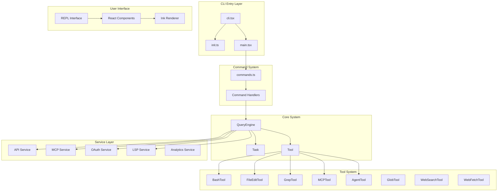

# Claude Code

> Anthropic AI Terminal Assistant — Use Claude directly from the command line

Claude Code is a powerful command-line tool that allows developers to use Anthropic's AI assistant Claude directly in the terminal. Claude can understand codebases, edit files, execute terminal commands, and handle various complex workflows.

This repository contains TypeScript source code restored via source maps from the npm package (`@anthropic-ai/claude-code`), version 2.1.88. This source code is for research purposes only and does not represent the official internal development repository structure.

## Architecture Preview



## Documentation Navigation

| Document | Description | Audience |
|----------|-------------|----------|
| [Architecture](architecture.md) | System architecture, module dependencies, design patterns | Developers, contributors |
| [Getting Started](getting-started.md) | Installation, configuration, basic usage | All users |
| [Document Map](doc-map.md) | Index and relationships of all documents | Contributors |

## Core Features

| Feature | Description | Module |
|---------|-------------|--------|
| Command System | 80+ slash commands (/help, /commit, /review, etc.) | [commands.ts](/restored-src/src/commands.ts) |
| Tool Execution | Tools available to AI agents (Bash, file editing, Grep, etc.) | [tools/](/restored-src/src/tools/) |
| MCP Integration | Model Context Protocol support | [services/mcp/](/restored-src/src/services/mcp/) |
| REPL Interface | Interactive terminal user interface | [screens/REPL.tsx](/restored-src/src/screens/REPL.tsx) |
| Authentication | OAuth and API Key authentication | [services/oauth/](/restored-src/src/services/oauth/) |
| Plugin System | Extension functionality and custom skills | [plugins/](/restored-src/src/plugins/) |
| Bridge Mode | Remote control of Claude Code | [bridge/](/restored-src/src/bridge/) |
| Analytics Service | Telemetry and metrics collection | [services/analytics/](/restored-src/src/services/analytics/) |

## Core Modules

| Module | Description | Path |
|--------|-------------|------|
| CLI Entry | Command-line entry and fast paths | [entrypoints/cli.tsx](/restored-src/src/entrypoints/cli.tsx) |
| Command System | Slash command management | [commands/](/restored-src/src/commands/) |
| Query Engine | AI query processing | [QueryEngine.ts](/restored-src/src/QueryEngine.ts) |
| Task System | Task management and execution | [Task.ts](/restored-src/src/Task.ts) |
| Tool Base | Tool abstraction and execution | [Tool.ts](/restored-src/src/Tool.ts) |
| State Management | React state and app state | [state/](/restored-src/src/state/) |

## Quick Start

```bash
# Install Claude Code
npm install -g @anthropic-ai/claude-code

# Start interactive session
claude

# View help
claude --help
```

**Expected Output:**

```
Claude Code 2.1.88
Use Claude to work with your codebase.

Usage:
  claude [options] [command]

Available commands:
  help     Show help information
  config   Configuration settings
  login    Login to Claude
  logout   Logout from Claude
  ...
```

## Project Statistics

| Metric | Value |
|--------|-------|
| Restored Version | 2.1.88 |
| Source Files | 1901 TypeScript/TSX files |
| Total Files | 1905+ |
| Main Modules | Core system, command system, tool system, service layer, UI layer |
| Tech Stack | TypeScript, Node.js, Ink (React) |

---

*Generated by [Nium-Wiki v0.0.0](https://github.com/niuma996/nium-wiki) | 2026-05-12*
