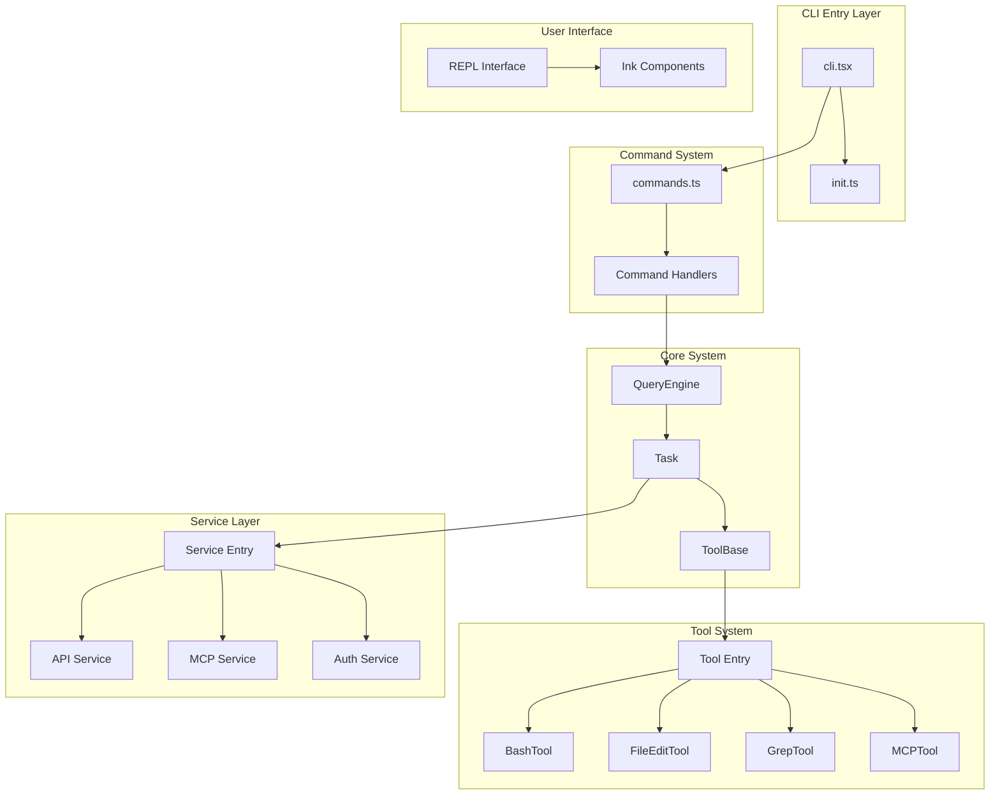

# Claude Code

> Anthropic AI Terminal Assistant — Use Claude directly in your command line

Claude Code is a powerful command-line tool that enables developers to use Anthropic's AI assistant Claude directly in the terminal. Claude can understand codebases, edit files, execute terminal commands, and handle various complex workflows.

This repository contains TypeScript source code restored from the npm package (`@anthropic-ai/claude-code`) via source map, version 2.1.88. This source code is for research purposes only and does not represent the official internal development repository structure.

## Architecture Preview



## Documentation Navigation

| Document | Description | Audience |
|----------|-------------|----------|
| [Architecture](architecture.md) | System architecture, module dependencies, design patterns | Developers, Contributors |
| [Getting Started](getting-started.md) | Installation, configuration, basic usage | All users |
| [Doc Map](doc-map.md) | Index and relationships of all documents | Contributors |

## Core Features

| Feature | Description | Module |
|---------|-------------|--------|
| Command System | Support for 80+ slash commands (/help, /commit, /review, etc.) | [commands.ts](/restored-src/src/commands.ts) |
| Tool Execution | Tools available to AI agents (Bash, file editing, Grep, etc.) | [tools/](/restored-src/src/tools/) |
| MCP Integration | Model Context Protocol support | [services/mcp/](/restored-src/src/services/mcp/) |
| REPL Interface | Interactive terminal user interface | [screens/REPL.tsx](/restored-src/src/screens/REPL.tsx) |
| Authentication System | OAuth and API Key authentication | [services/oauth/](/restored-src/src/services/oauth/) |
| Plugin System | Extend functionality and custom skills | [plugins/](/restored-src/src/plugins/) |

## Quick Start

```bash
# Install Claude Code
npm install -g @anthropic-ai/claude-code

# Start an interactive session
claude

# View help
claude --help
```

**Expected Output:**

```
Claude Code 2.1.88
Use Claude to work on your codebase.

Usage:
  claude [options] [command]

Available commands:
  help     Show help information
  config   Configure settings
  login    Log in to Claude
  logout   Log out
  ...
```

## Project Statistics

| Metric | Value |
|--------|-------|
| Restored Version | 2.1.88 |
| Source Files | 1884 .ts/.tsx files |
| Total Files | 1905 |
| Main Modules | 2 (package, restored-src) |
| Tech Stack | TypeScript, Node.js, Ink (React) |

---

*Generated by [Nium-Wiki v0.0.0](https://github.com/niuma996/nium-wiki) | 2026-03-31*
