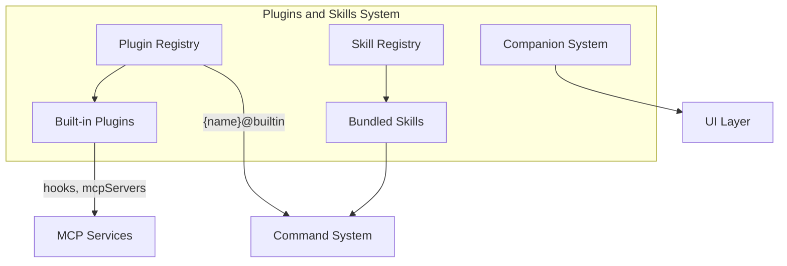

# Plugins and Skills System

## Overview

The Plugins and Skills System is Claude Code's extensibility framework, allowing users and the community to extend the CLI's functionality through plugins and skills. The module supports three extension mechanisms:

1. **Built-in Plugins**: Plugins bundled with the CLI, enableable/disableable via the UI
2. **Bundled Skills**: Skills compiled into the CLI binary, requiring no additional installation
3. **Companions**: Randomized mascot characters for CLI entertainment

## Submodules

| Module | Description | Document |
|--------|-------------|----------|
| [Built-in Plugins](builtin.md) | Built-in plugin registration and enablement | [builtin.md](builtin.md) |
| [Bundled Skills](bundled-skills.md) | Compile-time bundled skill system | [bundled-skills.md](bundled-skills.md) |
| [Companion System](companion.md) | Randomized mascot characters | [companion.md](companion.md) |

## Architecture Position

## Plugin vs Skill: Core Differences

| Dimension | Plugin | Skill |
|-----------|--------|-------|
| Source | From marketplace, user, or project | Compiled into CLI at build time |
| UI Entry | `/plugin` command | `/skill` command |
| Enable Method | One-click toggle in UI | Always available |
| Can Contain | Skills, Hooks, MCP servers | Skills only |
| Config Location | User settings | Source code |
| Update Method | Pull from marketplace | CLI version update |

## Source References

- [builtinPlugins.ts](/restored-src/src/plugins/builtinPlugins.ts)
- [bundledSkills.ts](/restored-src/src/skills/bundledSkills.ts)
- [companion.ts](/restored-src/src/buddy/companion.ts)
- [types/plugin.ts](/restored-src/src/types/plugin.ts)
- [commands.ts](/restored-src/src/commands.ts)

## Related Documents

- [Architecture Overview](../architecture.md)
- [Home](../index.md)
- [Built-in Plugins](builtin.md)
- [Bundled Skills](bundled-skills.md)
- [Companion System](companion.md)

---

*Generated by [Nium-Wiki v0.0.0](https://github.com/niuma996/nium-wiki) | 2026-03-31*
