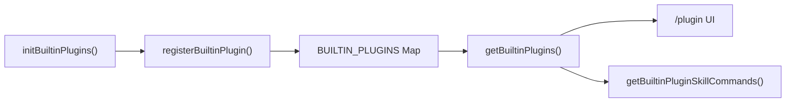

# Built-in Plugins

## Overview

Built-in plugins are plugins bundled with the Claude Code CLI, providing enable/disable management through the `/plugin` UI. Each built-in plugin can provide skills, session hooks, and MCP servers, and can dynamically control availability through GrowthBook feature switches.

## Plugin Identification

Built-in plugins use the `{name}@builtin` format ID, distinguishing them from marketplace plugins (`{name}@{marketplace}`):

```typescript
export const BUILTIN_MARKETPLACE_NAME = 'builtin'

function isBuiltinPluginId(pluginId: string): boolean {
  return pluginId.endsWith(`@${BUILTIN_MARKETPLACE_NAME}`)
}
```

## Registration Flow



### Registration

```typescript
// Called at initialization
export function registerBuiltinPlugin(
  definition: BuiltinPluginDefinition,
): void {
  BUILTIN_PLUGINS.set(definition.name, definition)
}
```

## Enable/Disable Management

`getBuiltinPlugins()` returns enabled and disabled plugin lists based on user settings:

```typescript
export function getBuiltinPlugins(): {
  enabled: LoadedPlugin[]
  disabled: LoadedPlugin[]
} {
  const settings = getSettings_DEPRECATED()

  for (const [name, definition] of BUILTIN_PLUGINS) {
    // 1. Check availability
    if (definition.isAvailable && !definition.isAvailable()) {
      continue
    }

    // 2. Determine enabled state: user setting > default > true
    const pluginId = `${name}@${BUILTIN_MARKETPLACE_NAME}`
    const userSetting = settings?.enabledPlugins?.[pluginId]
    const isEnabled = userSetting !== undefined
      ? userSetting === true
      : (definition.defaultEnabled ?? true)
  }
}
```

## Plugin Definition Structure

```typescript
type BuiltinPluginDefinition = {
  // Basic info
  name: string                      // Plugin name (unique identifier)
  description: string              // Description (UI display)
  version: string                  // Version number

  // Enable control
  defaultEnabled?: boolean        // Default enabled state (default: true)
  isAvailable?: () => boolean      // Dynamic availability check

  // Provided features
  skills?: BundledSkillDefinition[]   // Skill list
  hooks?: HooksSettings           // Session-level hooks
  mcpServers?: McpServerConfig[] // MCP server configurations
}
```

## Source References

- [builtinPlugins.ts](/restored-src/src/plugins/builtinPlugins.ts)
- [types/plugin.ts](/restored-src/src/types/plugin.ts)
- [bundledSkills.ts](/restored-src/src/skills/bundledSkills.ts)
- [commands.ts](/restored-src/src/commands.ts)

## Related Documents

- [Plugins and Skills System](../plugins/_index.md)
- [Bundled Skills](bundled-skills.md)

---

*Generated by [Nium-Wiki v0.0.0](https://github.com/niuma996/nium-wiki) | 2026-03-31*
