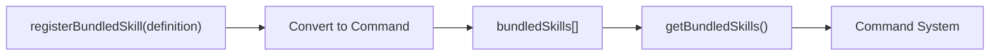

# Bundled Skills

## Overview

Bundled Skills are skills compiled and packaged with the Claude Code CLI, available without additional installation. Unlike built-in plugins, bundled skills have no enable/disable control and are always available, providing only skill functionality.

## Skill Definition

[bundledSkills.ts](/restored-src/src/skills/bundledSkills.ts) defines the `BundledSkillDefinition` type:

```typescript
type BundledSkillDefinition = {
  name: string                      // Skill name (slash command)
  description: string              // Description (/help display)
  aliases?: string[]               // Aliases
  whenToUse?: string               // Use scenario
  argumentHint?: string            // Argument hint
  allowedTools?: string[]          // Allowed tool list
  model?: string                   // Specified model
  disableModelInvocation?: boolean
  userInvocable?: boolean          // User-invocable (default: true)
  isEnabled?: () => boolean        // Dynamic enable check
  hooks?: HooksSettings            // Hook configuration
  context?: 'inline' | 'fork'      // Execution context
  agent?: string                   // Associated agent type

  /** Reference files: extracted to disk on first call */
  files?: Record<string, string>

  getPromptForCommand: (
    args: string,
    context: ToolUseContext,
  ) => Promise<ContentBlockParam[]>
}
```

## Registration Mechanism

### Registration Flow



## Reference File Extraction

Bundled skills can include reference files that are extracted to disk on first invocation:

```typescript
export function registerBundledSkill(definition: BundledSkillDefinition): void {
  const { files } = definition
  let skillRoot: string | undefined
  let getPromptForCommand = definition.getPromptForCommand

  // If skill includes files, extract on first call
  if (files && Object.keys(files).length > 0) {
    skillRoot = getBundledSkillExtractDir(definition.name)

    let extractionPromise: Promise<string | null> | undefined
    const inner = definition.getPromptForCommand

    getPromptForCommand = async (args, ctx) => {
      extractionPromise ??= extractBundledSkillFiles(definition.name, files)
      const extractedDir = await extractionPromise
      const blocks = await inner(args, ctx)
      if (extractedDir === null) return blocks
      return prependBaseDir(blocks, extractedDir)
    }
  }
}
```

## Safe Write Mechanism

Reference file extraction uses multiple security measures to prevent symlink attacks:

```typescript
const SAFE_WRITE_FLAGS =
  process.platform === 'win32'
    ? 'wx'  // Windows: exclusive create mode
    : O_WRONLY | O_CREAT | O_EXCL | O_NOFOLLOW
    // Unix: exclusive create + don't follow symlinks

async function safeWriteFile(p: string, content: string): Promise<void> {
  const fh = await open(p, SAFE_WRITE_FLAGS, 0o600)
  try {
    await fh.writeFile(content, 'utf8')
  } finally {
    await fh.close()
  }
}
```

### Path Safety Validation

```typescript
function resolveSkillFilePath(baseDir: string, relPath: string): string {
  const normalized = normalize(relPath)

  // Prevent path traversal attacks
  if (
    isAbsolute(normalized) ||
    normalized.split(pathSep).includes('..') ||
    normalized.split('/').includes('..')
  ) {
    throw new Error(`bundled skill file path escapes skill dir: ${relPath}`)
  }

  return join(baseDir, normalized)
}
```

## Source References

- [bundledSkills.ts](/restored-src/src/skills/bundledSkills.ts)
- [filesystem.ts](/restored-src/src/utils/permissions/filesystem.js)
- [builtinPlugins.ts](/restored-src/src/plugins/builtinPlugins.ts)

## Related Documents

- [Plugins and Skills System](../plugins/_index.md)
- [Built-in Plugins](builtin.md)

---

*Generated by [Nium-Wiki v0.0.0](https://github.com/niuma996/nium-wiki) | 2026-03-31*
