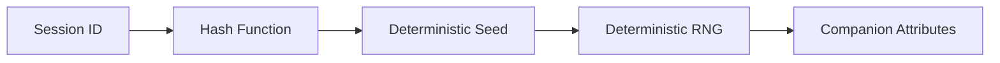

# Companion System

## Overview

The Companion System is Claude Code's entertainment feature that generates a unique "mascot" character for each user/session through a deterministic random algorithm. This character is displayed in the CLI interface, adding a personalized touch to the command-line experience.

The key characteristic of the companion system is **determinism**: the same input (session ID) always produces the same companion, ensuring consistent user experience.

## Core Mechanism

[companion.ts](/restored-src/src/buddy/companion.ts) provides the companion generation logic:

```typescript
export function roll(seed: string): Companion
```

### Determinism and Randomness



The system uses the session ID as a seed, generates deterministic random numbers through a hash function, then uses those random numbers to select a companion from the predefined pool.

## Companion Pool

The companion pool includes various types:

| Type | Examples | Description |
|------|---------|-------------|
| Animal | Duck, Fox, Hamster | Random animal characters |
| Tech | Robot, Terminal Sprite | Developer style |
| Classic | Cat, Dog, Panda | Popular choices |

## Design Decisions

### Why Not Random Every Time?

If a companion were randomly generated each time, users would experience inconsistent character appearances across sessions, breaking immersion. Therefore, companions use the session ID as a seed, ensuring the same companion is always produced for the same session.

### Lightweight Design

The companion system is intentionally lightweight:
- Character definitions stored in a single file
- No external resources (character descriptions are plain text)
- No impact on CLI performance (calculated only once at initialization)

## Source References

- [companion.ts](/restored-src/src/buddy/companion.ts)
- [buddy/](/restored-src/src/buddy/)

## Related Documents

- [Plugins and Skills System](../plugins/_index.md)
- [Built-in Plugins](builtin.md)

---

*Generated by [Nium-Wiki v0.0.0](https://github.com/niuma996/nium-wiki) | 2026-03-31*
