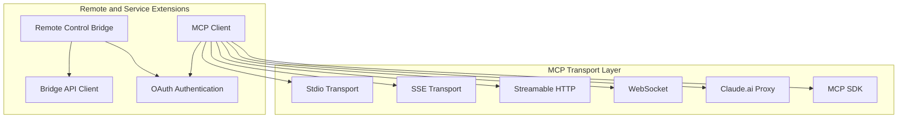

# Remote and Service Extensions

## Overview

The Remote and Service Extensions module is the core layer for Claude Code to interact with external systems, containing two key subsystems:

1. **Remote Control Bridge**: Registers the local machine as a remote work environment, enabling claude.ai to remotely control the local Claude Code instance
2. **MCP Client**: Implements the Model Context Protocol to connect and manage MCP servers, providing external tool capabilities to the AI

Together, these two subsystems support Claude Code's remote collaboration and extensibility capabilities.

## Submodules

| Module | Description | Document |
|--------|-------------|----------|
| [Remote Control Bridge](bridge.md) | Remote control bridge system | [bridge.md](bridge.md) |
| [MCP Client](mcp.md) | Model Context Protocol client | [mcp.md](mcp.md) |

## Architecture Position



## Key Design Decisions

### 1. OAuth Authentication Handling

Both the MCP client and Bridge system depend on OAuth authentication. The client implements automatic token refresh to ensure long-running connections aren't interrupted by token expiration.

### 2. Transport Type Auto-Selection

```typescript
// Auto-select transport based on config type
if (serverRef.type === 'sse') {
  transport = new SSEClientTransport(...)
} else if (serverRef.type === 'http') {
  transport = new StreamableHTTPClientTransport(...)
} else if (serverRef.type === 'stdio') {
  transport = new StdioClientTransport(...)
}
```

### 3. Session Ingress JWT

The Bridge system uses session ingress JWT (Session Ingress Token) for WebSocket authentication. This token is obtained via OAuth token exchange and needs refresh approximately every 3 hours and 55 minutes.

### 4. Multi-Session Spawn Modes

Bridge supports three session spawn modes, controlled by the GrowthBook feature switch `tengu_ccr_bridge_multi_session`:

| Mode | Description | Worktree Support |
|------|-------------|-----------------|
| `single-session` | Single session, handles one work item at a time | ❌ |
| `same-dir` | Multiple sessions, all sharing working directory | ❌ |
| `worktree` | Multiple sessions, each using isolated Git Worktree | ✅ |

## Key Types

| Type | Definition Location | Description |
|------|-------------------|-------------|
| `BridgeConfig` | [types.ts](/restored-src/src/bridge/types.ts) | Bridge configuration |
| `SessionHandle` | [types.ts](/restored-src/src/bridge/types.ts) | Session handle |
| `MCPServerConnection` | [client.ts](/restored-src/src/services/mcp/client.ts) | MCP server connection state |
| `ScopedMcpServerConfig` | [types.ts](/restored-src/src/services/mcp/types.ts) | Scoped MCP configuration |
| `WorkSecret` | [types.ts](/restored-src/src/bridge/types.ts) | Work secret (API credentials) |

## Source References

- [bridgeMain.ts](/restored-src/src/bridge/bridgeMain.ts)
- [bridgeApi.ts](/restored-src/src/bridge/bridgeApi.ts)
- [bridgeConfig.ts](/restored-src/src/bridge/bridgeConfig.ts)
- [client.ts](/restored-src/src/services/mcp/client.ts)
- [types.ts](/restored-src/src/bridge/types.ts)
- [mcp/types.ts](/restored-src/src/services/mcp/types.ts)

## Related Documents

- [Architecture Overview](../architecture.md)
- [Home](../index.md)
- [Remote Control Bridge](bridge.md)
- [MCP Client](mcp.md)

---

*Generated by [Nium-Wiki v0.0.0](https://github.com/niuma996/nium-wiki) | 2026-03-31*
