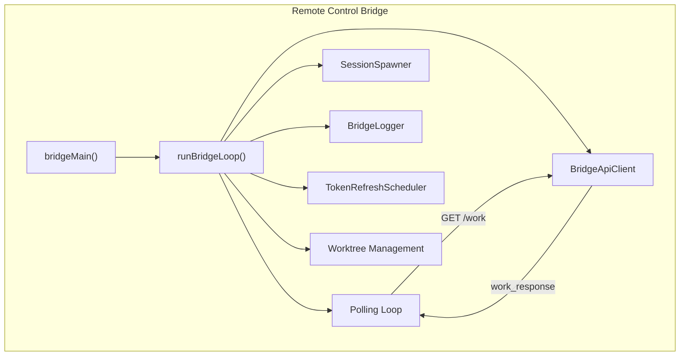
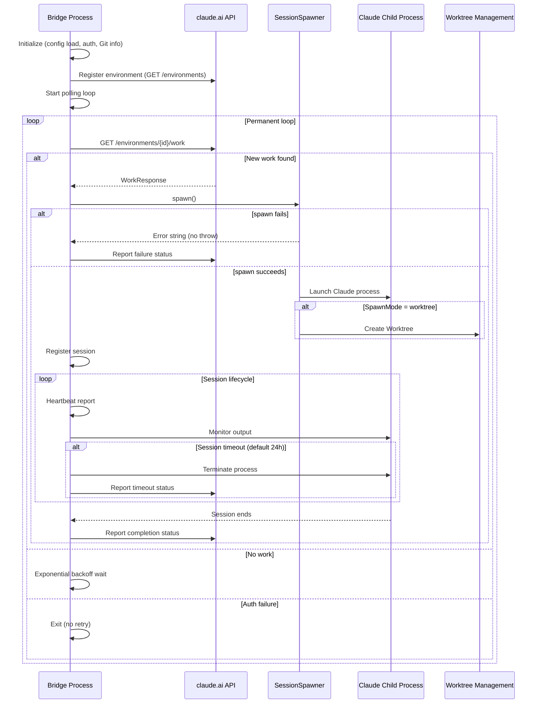

# Remote Control Bridge

## Overview

Remote Control Bridge is Claude Code's remote work environment registration and management system. Through the `claude remote-control` command, users can register their local machine as a remote work environment for claude.ai, enabling remote control of the local Claude Code instance from the web interface.

## Core Entry

```bash
# Main command (multiple aliases)
claude remote-control
claude rc          # Short alias
claude remote      # Legacy alias
claude sync        # Legacy alias
claude bridge      # Legacy alias
```

## System Architecture



## Core Data Structures

### BridgeConfig

```typescript
type BridgeConfig = {
  environmentId: string
  environmentSecret: string
  apiBaseUrl: string
  maxSessions: number       // Maximum concurrent sessions
  spawnMode: SpawnMode     // single-session | worktree | same-dir
  permissionMode?: PermissionMode
  name?: string
  debugFile?: string
}
```

### SpawnMode

```typescript
type SpawnMode = 'single-session' | 'worktree' | 'same-dir'

// single-session: handles one work item, exits after completion
// worktree: each session uses isolated Git Worktree (recommended)
// same-dir: all sessions share working directory (potential conflicts)
```

## Main Loop: `runBridgeLoop`

The `runBridgeLoop` in [bridgeMain.ts](/restored-src/src/bridge/bridgeMain.ts) is the core polling loop of Bridge:



## State Management

```typescript
const activeSessions = new Map<string, SessionHandle>()
const sessionStartTimes = new Map<string, number>()
const sessionWorkIds = new Map<string, string>()
const sessionIngressTokens = new Map<string, string>()  // Stored separately, not overwritten on refresh
const sessionTimers = new Map<string, ReturnType<typeof setTimeout>>()
const completedWorkIds = new Set<string>()
const sessionWorktrees = new Map<string, { worktreePath, worktreeBranch, gitRoot }>()
const timedOutSessions = new Set<string>()
const titledSessions = new Set<string>()
```

## Backoff Strategy

Bridge implements exponential backoff for various errors:

```typescript
const DEFAULT_BACKOFF: BackoffConfig = {
  connInitialMs: 2_000,      // Initial: 2 seconds
  connCapMs: 120_000,        // Cap: 2 minutes
  connGiveUpMs: 600_000,     // Give up: 10 minutes
  generalInitialMs: 500,     // General: 500ms
  generalCapMs: 30_000,      // Cap: 30 seconds
  generalGiveUpMs: 600_000,  // Give up: 10 minutes
}
```

| Error Type | Strategy |
|-----------|----------|
| Connection failure | Exponential backoff, starting from 2s, max 2 minutes |
| API error | Exponential backoff, max 30 seconds |
| Auth failure | No retry, exit immediately |
| Timeout | Session-level timeout monitoring (default 24 hours) |

## CLI Arguments

| Argument | Description | Default |
|---------|-------------|---------|
| `--verbose` | Verbose log output | false |
| `--sandbox` | Sandbox mode | false |
| `--session-timeout` | Session timeout (ms) | 86400000 (24h) |
| `--permission-mode` | Permission mode | Inherit user settings |
| `--name` | Session name | Auto-derive |
| `--spawn` | Spawn mode | Interactive selection |
| `--capacity` | Max concurrent sessions | 32 |
| `--session-id` | Resume specific session | - |
| `--continue` | Resume from pointer file | - |

## Source References

- [bridgeMain.ts](/restored-src/src/bridge/bridgeMain.ts)
- [bridgeApi.ts](/restored-src/src/bridge/bridgeApi.ts)
- [bridgeConfig.ts](/restored-src/src/bridge/bridgeConfig.ts)
- [sessionRunner.ts](/restored-src/src/bridge/sessionRunner.ts)
- [workSecret.ts](/restored-src/src/bridge/workSecret.ts)
- [types.ts](/restored-src/src/bridge/types.ts)

## Related Documents

- [Remote and Service Extensions](../remote/_index.md)
- [MCP Client](mcp.md)

---

*Generated by [Nium-Wiki v0.0.0](https://github.com/niuma996/nium-wiki) | 2026-03-31*
