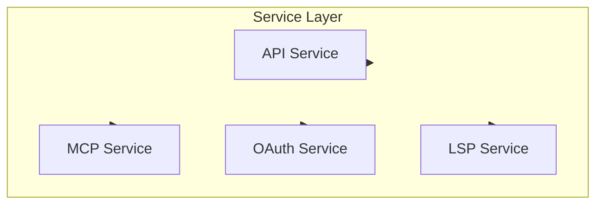

# Service Layer

## Overview

The service layer provides Claude Code's infrastructure functionality, including API communication, MCP protocol, OAuth authentication, and more.

## Submodules

| Module | Description | Document |
|--------|-------------|----------|
| [API Service](api.md) | Claude API communication | [api.md](api.md) |
| [MCP Service](mcp.md) | Model Context Protocol | [mcp.md](mcp.md) |
| [OAuth Authentication](oauth.md) | OAuth authentication flow | [oauth.md](oauth.md) |

## Architecture Position

## Related Documents

- [Architecture Docs](../architecture.md)
- [Home](../index.md)

---

*Generated by [Nium-Wiki v0.0.0](https://github.com/niuma996/nium-wiki) | 2026-03-31*
