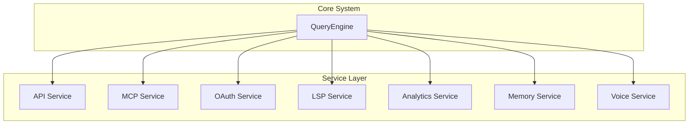
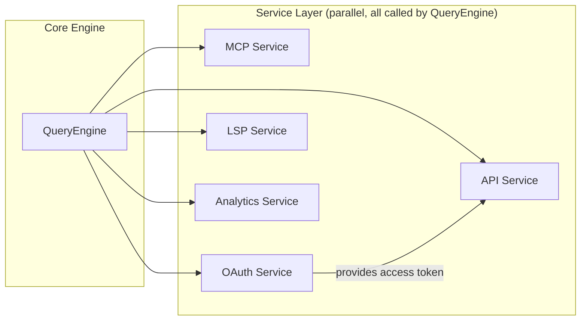

# Service Layer

## Overview

The service layer provides Claude Code's infrastructure functionality, including API communication, MCP protocol, OAuth authentication, LSP support, and analytics services.

## Architecture Position

## Service Modules

| Service | Path | Description |
|---------|------|-------------|
| API | [services/api/](/restored-src/src/services/api/) | Claude API client and communication |
| MCP | [services/mcp/](/restored-src/src/services/mcp/) | Model Context Protocol support |
| OAuth | [services/oauth/](/restored-src/src/services/oauth/) | OAuth authentication flow |
| LSP | [services/lsp/](/restored-src/src/services/lsp/) | Language Server Protocol |
| Analytics | [services/analytics/](/restored-src/src/services/analytics/) | Telemetry and metrics collection |
| Memory | [services/memory/](/restored-src/src/services/memory/) | Memory management |
| Voice | [services/voice/](/restored-src/src/services/voice/) | Voice functionality |

## API Service

The API service is responsible for all communication with the Claude API.

### Main Features

- **API Client**: Encapsulates all API calls
- **Error Handling**: Retry logic and error classification
- **Usage Tracking**: Records and reports API usage
- **Logging**: Request and response logging

### Key Files

- [client.ts](/restored-src/src/services/api/client.ts) - API client
- [claude.ts](/restored-src/src/services/api/claude.ts) - Claude API wrapper
- [errors.ts](/restored-src/src/services/api/errors.ts) - Error handling
- [usage.ts](/restored-src/src/services/api/usage.ts) - Usage tracking

## MCP Service

MCP (Model Context Protocol) service provides a standardized tool interface.

### Main Features

- **MCP Client**: Manages MCP server connections
- **Tool Invocation**: Unified tool invocation interface
- **Resource Management**: MCP resource access
- **Authentication**: MCP authentication support

### Key Files

- [client.ts](/restored-src/src/services/mcp/client.ts) - MCP client
- [config.ts](/restored-src/src/services/mcp/config.ts) - MCP configuration
- [auth.ts](/restored-src/src/services/mcp/auth.ts) - MCP authentication

## OAuth Service

OAuth service handles user authentication.

### Main Features

- **Authorization Code Flow**: Standard OAuth 2.0 authorization code flow
- **Token Management**: Access token and refresh token management
- **Encryption**: Secure token storage

### Key Files

- [client.ts](/restored-src/src/services/oauth/client.ts) - OAuth client
- [crypto.ts](/restored-src/src/services/oauth/crypto.ts) - Encryption utilities

## LSP Service

LSP service integrates Language Server Protocol.

### Main Features

- **Diagnostics**: Code diagnostics and error hints
- **Completion**: Code completion suggestions
- **Go to Definition**: Navigation support

### Key Files

- [manager.ts](/restored-src/src/services/lsp/manager.ts) - LSP manager
- [LSPClient.ts](/restored-src/src/services/lsp/LSPClient.ts) - LSP client

## Analytics Service

Analytics service handles telemetry and metrics collection.

### Main Features

- **Event Logging**: User behavior event recording
- **Metrics Collection**: Performance and usage metrics
- **GrowthBook**: A/B testing support

### Key Files

- [sink.ts](/restored-src/src/services/analytics/sink.ts) - Event sink
- [datadog.ts](/restored-src/src/services/analytics/datadog.ts) - DataDog integration

## Service Dependencies

## Related Documents

- [API Service](api.md)
- [MCP Service](mcp.md)
- [OAuth Service](oauth.md)
- [LSP Service](lsp.md)
- [Analytics Service](analytics.md)
- [Architecture Documentation](../architecture.md)

---

*Generated by [Nium-Wiki v0.0.0](https://github.com/niuma996/nium-wiki) | 2026-05-12*
