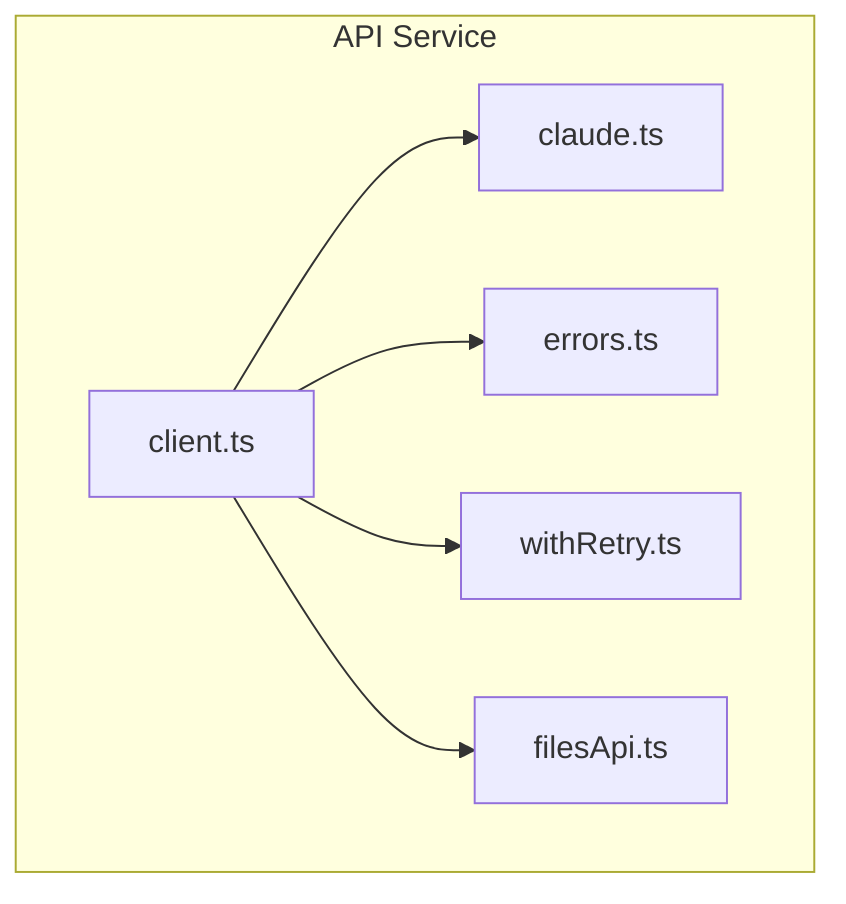
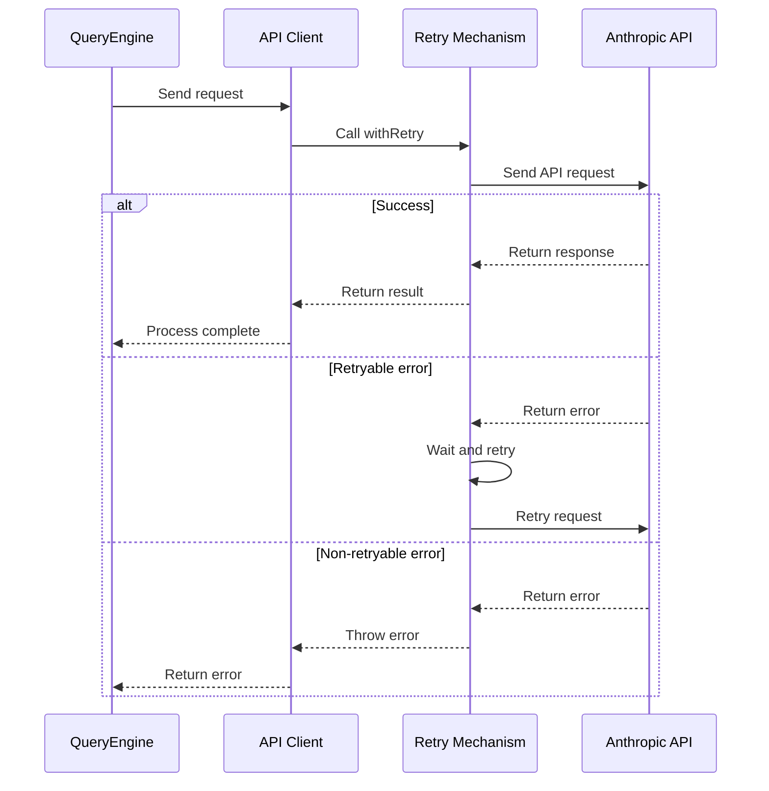
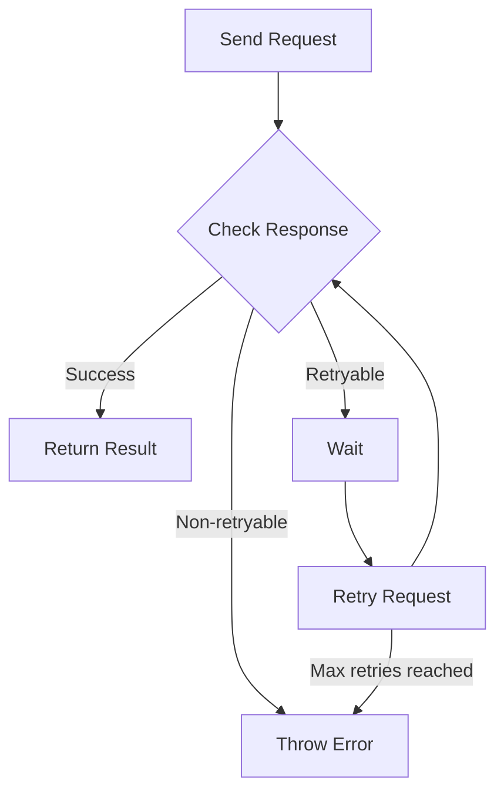

# API Service

## Overview

The API service is the bridge between Claude Code and the Anthropic API, responsible for handling all API requests, retry logic, and error handling.

The core implementation is in the [services/api/](/restored-src/src/services/api/) directory.

## Architecture Position



## Features

| Feature | Description | Related Files |
|---------|-------------|---------------|
| API Client | Unified API request handling | [client.ts](/restored-src/src/services/api/client.ts) |
| Claude Integration | Claude model call wrapper | [claude.ts](/restored-src/src/services/api/claude.ts) |
| Error Handling | Unified error types and handling | [errors.ts](/restored-src/src/services/api/errors.ts) |
| Retry Mechanism | Exponential backoff retry logic | [withRetry.ts](/restored-src/src/services/api/withRetry.ts) |
| File API | File upload and processing | [filesApi.ts](/restored-src/src/services/api/filesApi.ts) |

## File Structure

```
restored-src/src/services/api/
├── client.ts              # Main API client
├── claude.ts             # Claude model API
├── errors.ts             # Error type definitions
├── withRetry.ts          # Retry logic
├── filesApi.ts          # File API
├── bootstrap.ts         # Bootstrap initialization
├── logging.ts           # Logging service
├── usage.ts             # Usage tracking
└── grove.ts             # Grove integration
```

## Core Workflow



## API Client

### Request Configuration

```typescript
interface ApiRequest {
  method: 'GET' | 'POST' | 'PUT' | 'DELETE'
  path: string
  body?: unknown
  headers?: Record<string, string>
  timeout?: number
}
```

### Response Handling

```typescript
interface ApiResponse<T> {
  data: T
  status: number
  headers: Headers
}
```

## Error Types

| Error Type | HTTP Status | Description |
|------------|-------------|-------------|
| `ApiError` | 4xx/5xx | General API error |
| `RateLimitError` | 429 | Rate limit exceeded |
| `AuthenticationError` | 401 | Authentication failed |
| `AuthorizationError` | 403 | Insufficient permissions |
| `NotFoundError` | 404 | Resource not found |
| `ValidationError` | 422 | Request validation failed |
| `TimeoutError` | - | Request timeout |

## Retry Mechanism



Retry configuration:

```typescript
interface RetryConfig {
  maxRetries: number       // Max retry attempts
  initialDelay: number     // Initial delay in milliseconds
  maxDelay: number        // Max delay in milliseconds
  backoffMultiplier: number  // Backoff multiplier
  retryableStatuses: number[]  // Retryable status codes
}
```

## API Endpoints

| Endpoint | Method | Description |
|----------|--------|-------------|
| `/v1/messages` | POST | Send message |
| `/v1/models` | GET | Get available models |
| `/v1/files` | POST | Upload file |
| `/v1/files/{id}` | GET | Get file |

## Authentication

API requests use Bearer Token authentication:

```typescript
headers: {
  'Authorization': `Bearer ${apiKey}`,
  'x-api-key': apiKey,
  'anthropic-version': '2023-06-01'
}
```

## Best Practices

### Error Handling

| Best Practice | Description |
|---------------|-------------|
| Always check response status | Check status even if request succeeds |
| Handle retries appropriately | Avoid infinite retries |
| Log requests and responses | For debugging purposes |
| Set timeouts | Set reasonable timeouts for long operations |

### Performance Optimization

| Optimization | Description |
|-------------|-------------|
| Connection reuse | Use keep-alive to reuse connections |
| Request compression | Compress large request bodies |
| Streaming responses | Use streaming API to reduce latency |

## Source References

- [client.ts](/restored-src/src/services/api/client.ts)
- [claude.ts](/restored-src/src/services/api/claude.ts)
- [errors.ts](/restored-src/src/services/api/errors.ts)
- [withRetry.ts](/restored-src/src/services/api/withRetry.ts)

## Related Documents

- [Query Engine](../core/query.md)
- [OAuth Authentication](oauth.md)
- [MCP Service](mcp.md)

---

*Generated by [Nium-Wiki v0.0.0](https://github.com/niuma996/nium-wiki) | 2026-03-31*
