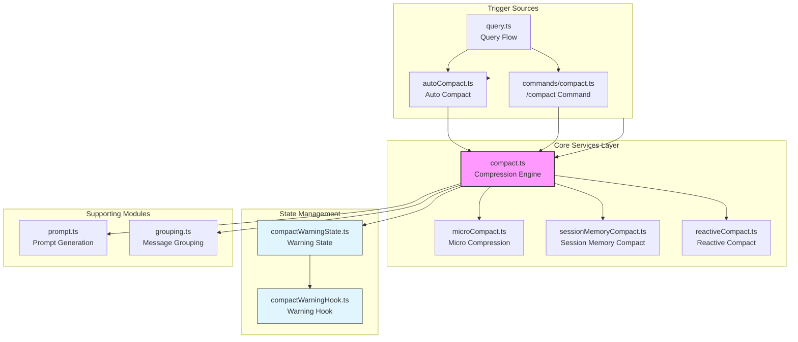
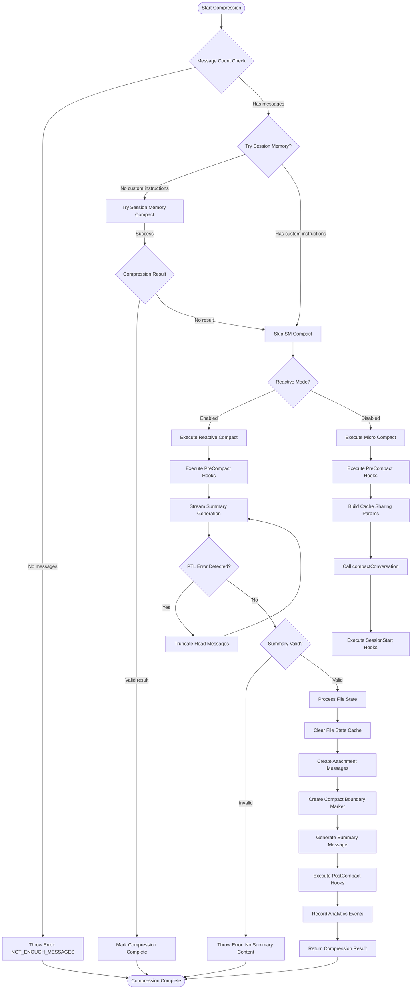
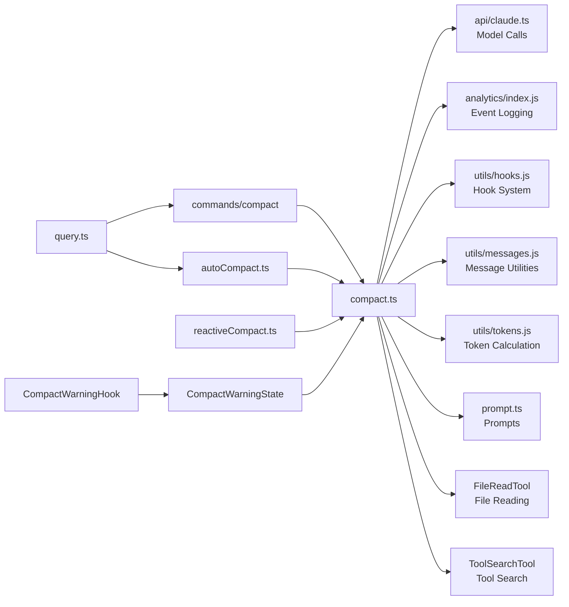

# Compact Module

## 1. Module Overview

The Compact module is a core context management component of Claude Code responsible for compressing conversation history through AI summarization when it becomes too long, thereby maintaining the efficiency and accuracy of model responses. When the number of tokens consumed by a conversation approaches the model's context window limit, this module automatically or manually triggers a compression process, condensing old conversation messages into a concise summary while preserving the latest messages and key information.

This module implements three compression strategies: **Full Compact** is used to compress the entire conversation history; **Partial Compact** supports compression forward or backward from a specific message position, suitable for selectively forgetting early context; **Session Memory Compact** uses a lightweight rule engine for rapid compression of specific session information without requiring AI API calls. These three strategies together form a multi-layered context management solution that can perform deep compression when needed and quickly handle simple scenarios.

Technically, the compact module employs numerous optimization strategies: using `FileReadTool` to limit token budgets to prevent summaries from becoming too large; leveraging Prompt Cache sharing mechanisms to reduce API call overhead; supporting tool search integration to provide better context during compression; and automatically restoring recently accessed files and skill information after compression to ensure conversation continuity.

**Source references**
- [compact.ts](/restored-src/src/services/compact/compact.ts#L1-L1705)
- [compact.ts (command)](restored-src/src/commands/compact/compact.ts#L1-L287)
- [compactWarningState.ts](/restored-src/src/services/compact/compactWarningState.ts#L1-L18)
- [compactWarningHook.ts](/restored-src/src/services/compact/compactWarningHook.ts#L1-L16)

## 2. Architecture Position



**Diagram sources**
- [compact.ts](/restored-src/src/services/compact/compact.ts)

## 3. Feature Table

| Feature | Description | Related API |
|---------|-------------|-------------|
| Full Compact | Generate AI-powered summary to compress entire conversation history | `compactConversation()` |
| Partial Compact | Selectively compress messages from a specified position (supports forward/backward direction) | `partialCompactConversation()` |
| Session Memory Compact | Rule-based lightweight compression without API calls | `trySessionMemoryCompaction()` |
| Micro Compact | Pre-processing to reduce token count before formal compression | `microcompactMessages()` |
| Prompt Cache Sharing | Reuse main conversation's cache prefix to reduce API overhead | `runForkedAgent()` |
| Tool Search Integration | Enable tool search during compression for better context | `isToolSearchEnabled()` |
| File Restoration | Restore recently accessed file contents after compression | `createPostCompactFileAttachments()` |
| Skill Restoration | Restore invoked skill contents after compression | `createSkillAttachmentIfNeeded()` |
| Async Agent Tracking | Preserve background async agent information | `createAsyncAgentAttachmentsIfNeeded()` |
| Plan Mode Preservation | Ensure continuation of plan mode after compression | `createPlanModeAttachmentIfNeeded()` |
| Warning State Management | Control auto-compact warning display and hiding | `suppressCompactWarning()` |

## 4. File Structure

```
restored-src/src/services/compact/
├── compact.ts                    # Core compression engine with full and partial compact logic
├── compactWarningState.ts        # Compression warning state management (React-independent)
├── compactWarningHook.ts         # React Hook subscription for compression warnings
├── prompt.ts                     # Compression prompt template generation and formatting
├── grouping.ts                   # Message grouping by API round logic
├── microCompact.ts               # Micro compression pre-processing module
├── autoCompact.ts                # Auto compact trigger logic
├── reactiveCompact.ts            # Reactive compact implementation
├── sessionMemoryCompact.ts       # Session memory lightweight compression
├── postCompactCleanup.ts         # Post-compression cleanup tasks
└── timeBasedMCConfig.ts          # Time-based compression configuration

restored-src/src/commands/compact/
└── compact.ts                    # /compact CLI command entry point
```

## 5. Core Workflow Diagram



**Diagram sources**
- [compact.ts](/restored-src/src/services/compact/compact.ts#L387-L763)
- [compact.ts (command)](restored-src/src/commands/compact/compact.ts#L40-L137)

## 6. API Summary

| API | Type | Description |
|-----|------|-------------|
| `compactConversation()` | `async function` | Execute full conversation compression, generate summary and return result |
| `partialCompactConversation()` | `async function` | Execute partial compression, selectively compress messages from specified position |
| `stripImagesFromMessages()` | `function` | Remove image and document blocks from messages to prevent oversized summaries |
| `stripReinjectedAttachments()` | `function` | Remove re-injected skill discovery/listing attachments |
| `truncateHeadForPTLRetry()` | `function` | Truncate oldest API round groups on PTL errors |
| `buildPostCompactMessages()` | `function` | Build post-compact message array from CompactionResult |
| `annotateBoundaryWithPreservedSegment()` | `function` | Add preserved message segment metadata to boundary marker |
| `mergeHookInstructions()` | `function` | Merge user instructions with Hook instructions |
| `createCompactCanUseTool()` | `function` | Create tool usage permission function during compression (deny all) |
| `createPostCompactFileAttachments()` | `async function` | Create file attachments for post-compact restoration |
| `createPlanAttachmentIfNeeded()` | `function` | Create plan file attachment (if exists) |
| `createSkillAttachmentIfNeeded()` | `function` | Create attachment for invoked skills |
| `createPlanModeAttachmentIfNeeded()` | `async function` | Create plan mode attachment |
| `createAsyncAgentAttachmentsIfNeeded()` | `async function` | Create async agent status attachments |
| `suppressCompactWarning()` | `function` | Suppress compression warning |
| `clearCompactWarningSuppression()` | `function` | Clear compression warning suppression state |
| `useCompactWarningSuppression()` | `function` | React Hook to subscribe to compression warning state |

## 7. Usage Examples

### Quick Start: Execute Full Compression

```typescript
import {
  compactConversation,
  CompactionResult,
} from '../services/compact/compact.js'
import type { ToolUseContext } from '../Tool.js'
import type { Message } from '../types/message.js'

async function performFullCompact(
  messages: Message[],
  context: ToolUseContext,
): Promise<CompactionResult> {
  const result = await compactConversation(
    messages,
    context,
    {
      systemPrompt: context.systemPrompt,
      userContext: context.userContext,
      systemContext: context.systemContext,
      toolUseContext: context,
      forkContextMessages: messages,
    },
    false, // suppressFollowUpQuestions
    undefined, // customInstructions
    false, // isAutoCompact
  )

  console.log('Compression completed')
  console.log('Pre-compact tokens:', result.preCompactTokenCount)
  console.log('Post-compact tokens:', result.truePostCompactTokenCount)
  return result
}
```

### Example: Execute Partial Compression (Preserving Subsequent Messages)

```typescript
import { partialCompactConversation } from '../services/compact/compact.js'

async function compactUpToMessage(
  allMessages: Message[],
  pivotIndex: number,
  context: ToolUseContext,
): Promise<void> {
  const result = await partialCompactConversation(
    allMessages,
    pivotIndex,
    context,
    {
      systemPrompt: context.systemPrompt,
      userContext: context.userContext,
      systemContext: context.systemContext,
      toolUseContext: context,
      forkContextMessages: allMessages.slice(0, pivotIndex),
    },
    'Optional user feedback here', // userFeedback
    'up_to', // direction: compress messages before pivot
  )

  console.log(`Compressed ${result.summaryMessages.length} summary messages`)
  console.log(`Kept ${result.messagesToKeep?.length ?? 0} messages`)
}
```

### Example: Compression Warning State Management

```typescript
import {
  suppressCompactWarning,
  clearCompactWarningSuppression,
  useCompactWarningSuppression,
} from '../services/compact/compactWarningState.js'

// Clear warning suppression before compression starts
clearCompactWarningSuppression()

// Execute compression...

// Suppress warning after successful compression
suppressCompactWarning()

// Use in React component
function CompactWarningBanner() {
  const isSuppressed = useCompactWarningSuppression()

  if (isSuppressed) {
    return null
  }

  return <div className="warning-banner">Context running low</div>
}
```

### Example: Custom Compression Instructions

```typescript
async function compactWithInstructions(
  messages: Message[],
  context: ToolUseContext,
): Promise<void> {
  const customInstructions = `
    Focus on:
    - All file modifications and their purposes
    - Any errors encountered and solutions
    - User preferences and feedback mentioned
    - Current work in progress
  `

  await compactConversation(
    messages,
    context,
    cacheSafeParams,
    false, // suppressFollowUpQuestions
    customInstructions,
    false, // isAutoCompact
  )
}
```

## 8. Best Practices

### Recommended

- **Use Session Memory Compact for simple scenarios**: When there are no custom instructions, the system first attempts lightweight Session Memory compression, which is faster and cheaper than full AI summarization
- **Provide context feedback for manual compression**: Providing context of current work through the `customInstructions` parameter generates more accurate summaries
- **Leverage file restoration**: The system automatically restores recently accessed files after compression, eliminating the need for re-reading to continue work
- **Use partial compression for long-running tasks**: For multi-phase work, use `partialCompactConversation` to selectively compress early phases while preserving recent work context
- **Monitor token budgets**: Use constants like `POST_COMPACT_TOKEN_BUDGET`, `POST_COMPACT_MAX_TOKENS_PER_FILE` to monitor and manage post-compression token consumption

### Avoid

- **Frequent compression triggers**: Each compression consumes API tokens and time; set `autoCompactThreshold` reasonably to avoid over-compression
- **Interrupting during compression**: User pressing ESC aborts compression, potentially causing message loss or state inconsistency
- **Compressing conversations with few messages**: Compression on conversations with only a few messages has minimal effect and wastes resources
- **Ignoring post-compression error notifications**: The system displays errors on compression failure; take appropriate action based on error type

## 9. Design Decisions & Trade-offs

| Decision | Alternatives Considered | Rationale |
|----------|------------------------|-----------|
| Use Forked Agent instead of direct API calls | Directly call `queryModelWithStreaming` | Forked Agent can reuse the main conversation's Prompt Cache (prefix sharing), significantly reducing API costs and latency. Experimental data shows cache hit rate of 98% when enabled |
| Group by API round instead of user round | Group by user messages | API round grouping has finer granularity, allowing reactive compact to work in single-round conversations, which is critical for SDK/CCR/eval scenarios |
| Preserve file state instead of only metadata | Discard file state | Immediately restoring recently accessed files after compression avoids the model needing to re-read files, maintaining work continuity |
| Separate token budget per skill | Unified skill budget or complete discard | Each skill's header typically contains the most important setup/usage instructions; separate budgets ensure critical information is preserved |
| Use `useSyncExternalStore` instead of React state | Directly use React Context | `compactWarningState.ts` remains React-independent, ensuring normal operation in non-React environments like Print Mode |
| Prioritize micro compression over AI summarization | Directly perform AI summarization | Micro compression uses lightweight rules to reduce tokens, avoiding unnecessary API calls; AI is only called when micro compression cannot meet requirements |

## 10. Dependencies & Related Docs



**Diagram sources**
- [compact.ts](/restored-src/src/services/compact/compact.ts)
- [compact.ts (command)](restored-src/src/commands/compact/compact.ts)

| Document | Relationship |
|----------|-------------|
| [Architecture](/.nium-wiki/wiki_en/architecture.md) | System architecture overview |
| [Context](/.nium-wiki/wiki_en/core/context.md) | Core context management |
| [Query Flow](/.nium-wiki/wiki_en/core/query.md) | Conversation query flow |
| [Hooks](/.nium-wiki/wiki_en/core/hooks.md) | Hook system |

---

*Generated by [Nium-Wiki v0.0.5](https://github.com/niuma996/nium-wiki) | 2026-04-02*
