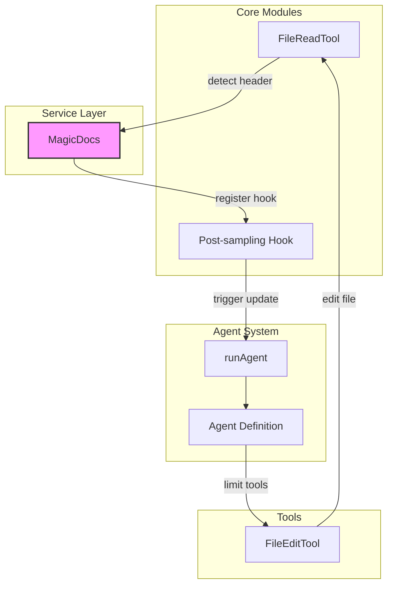
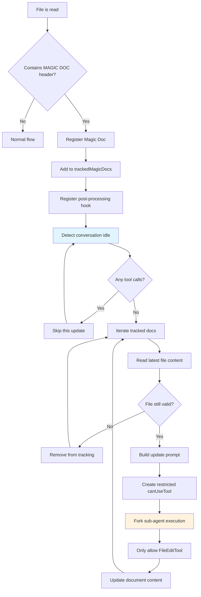
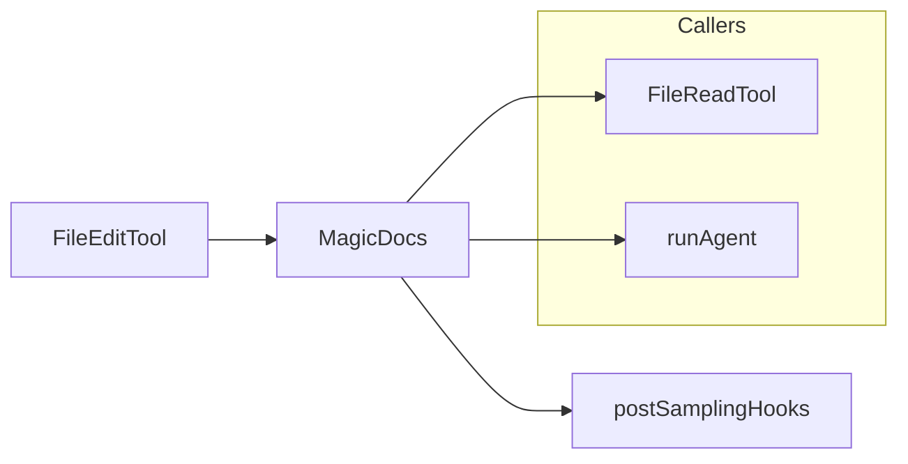

# MagicDocs Automatic Documentation

## 1. Module Overview

MagicDocs is an automatic documentation maintenance system that provides intelligent documentation updates through specially marked Markdown files. When a file contains a `# MAGIC DOC: [title]` header, the system automatically tracks and updates the document content in the background.

This module solves the problem of documentation becoming outdated as code evolves. It uses a post-sampling hook mechanism to automatically analyze conversation content during idle periods,沉淀ing new learnings, insights, and important information into corresponding Magic Doc files. MagicDocs uses a separate sub-agent to perform update operations, strictly limiting it to only the Edit tool, ensuring the security and controllability of documentation modifications.

The entire system is based on an event-driven architecture: File read → Header detection → Registration tracking → Post-processing hook trigger → Fork sub-agent execution.

## 2. Architecture Position



## 3. Feature Table

| Feature | Description | Related API |
|---------|-------------|-------------|
| Header Detection | Detects Magic Doc header markers in files | `detectMagicDocHeader()` |
| File Registration | Adds Magic Doc files to the tracking list | `registerMagicDoc()` |
| Post-processing Update | Automatically updates tracked docs during idle | `updateMagicDocs` hook |
| Sub-agent Execution | Uses Fork sub-agent for documentation updates | `runAgent()` |
| Tool Restrictions | Limits sub-agent to edit only specified files | `canUseTool()` |
| Custom Prompts | Supports loading custom update prompts from config | `loadMagicDocsPrompt()` |

## 4. File Structure

```
restored-src/src/services/MagicDocs/
├── magicDocs.ts        # Main implementation: detection, registration, update logic
└── prompts.ts         # Prompt templates and variable substitution
```

## 5. Core Workflow Diagram



## 6. API Summary

| API | Type | Description |
|-----|------|-------------|
| `initMagicDocs()` | `function` | Initialize MagicDocs system, register file listeners and post-processing hooks |
| `detectMagicDocHeader(content)` | `function` | Detect Magic Doc header in given content |
| `registerMagicDoc(filePath)` | `function` | Register a file as a Magic Doc tracking object |
| `clearTrackedMagicDocs()` | `function` | Clear all tracked Magic Docs |
| `buildMagicDocsUpdatePrompt()` | `function` | Build update prompt with variable substitution |
| `trackedMagicDocs` | `Map` | Stores tracked Magic Doc paths |

> Full API reference: [MagicDocs API](./api/magicdocs.md)

## 7. Usage Examples

### Quick Start: Create a Magic Doc File

```typescript
// Add Magic Doc header to any .md file
// # MAGIC DOC: Project Architecture
// *Record core architecture decisions and design patterns*

// File content will be automatically tracked by MagicDocs
// When Claude Code reads this file, it will be registered for tracking
```

### Example: Add Custom Update Instructions

```typescript
// Magic Doc supports italic instructions after the header
// # MAGIC DOC: API Usage Guide
// *Only update endpoint list and parameter descriptions, skip example code*

// MagicDocs will parse instructions and prioritize them during updates
```

### Example: Custom Prompt Configuration

```typescript
// Create custom prompt at ~/.claude/magic-docs/prompt.md
// Supports variables: {{docContents}}, {{docPath}}, {{docTitle}}

// Custom prompt will override the default template
```

## 8. Best Practices

### Recommended

- Use descriptive titles like `# MAGIC DOC: [Module Name] Design Decisions`
- Provide clear update instructions in the italic line, specifying document focus areas
- Place Magic Docs at key project locations like architecture documents, API documentation
- Periodically review auto-generated documentation content to ensure it meets expectations

### Avoid

- Including conversation history or change logs in Magic Docs — the system updates in-place, not appending
- Creating overly granular Magic Docs — focus on high-level architecture, not every function
- Relying on Magic Doc as the sole documentation source — it's supplementary, not a replacement

## 9. Design Decisions & Trade-offs

| Decision | Alternatives Considered | Rationale |
|----------|------------------------|-----------|
| Only allow FileEditTool | Allow more tools | Limiting tool scope prevents sub-agent from executing unintended operations, ensuring update security |
| Use Fork sub-agent | Direct update execution | Fork isolates execution context, avoiding pollution of main conversation state |
| Register on file read | Scan on startup | Lazy loading reduces startup overhead, only tracking files actually used |
| Update on conversation idle | Real-time update | Avoids interfering with user's current workflow |
| Support custom prompts | Fixed prompt template | Allows users to customize update behavior based on project needs |

## 10. Dependencies & Related Docs



| Document | Relationship |
|----------|-------------|
| [Architecture](../architecture.md) | System architecture overview |
| [FileReadTool](../core/tools.md) | File reading dependency |
| [Agent System](../agent/agent-tool.md) | Sub-agent execution mechanism |
| [Hook System](../core/hooks.md) | Post-processing hook mechanism |
| [MagicDocs API](./magicdocs.md#api-reference) | API reference documentation |

---

## API Reference

### Module Overview

The MagicDocs module provides core APIs for automatic documentation maintenance. File header detection, tracking management, and update prompt building are all exported through this module.

```typescript
import {
  initMagicDocs,
  detectMagicDocHeader,
  registerMagicDoc,
  clearTrackedMagicDocs,
  buildMagicDocsUpdatePrompt,
} from '../../services/MagicDocs/magicDocs'
```

### API Overview

| API | Type | Description |
|-----|------|-------------|
| `initMagicDocs()` | `async function` | Initialize MagicDocs system |
| `detectMagicDocHeader()` | `function` | Detect Magic Doc header |
| `registerMagicDoc()` | `function` | Register Magic Doc file |
| `clearTrackedMagicDocs()` | `function` | Clear tracking list |
| `buildMagicDocsUpdatePrompt()` | `async function` | Build update prompt |

### Type Definitions

#### `MagicDocInfo`

```typescript
type MagicDocInfo = {
  path: string
}
```

| Property | Type | Required | Default | Description |
|----------|------|----------|---------|-------------|
| `path` | `string` | Yes | - | Absolute path of Magic Doc file |

#### `MagicDocHeader`

```typescript
type MagicDocHeader = {
  title: string
  instructions?: string
}
```

| Property | Type | Required | Default | Description |
|----------|------|----------|---------|-------------|
| `title` | `string` | Yes | - | Title extracted from `# MAGIC DOC: [title]` |
| `instructions` | `string` | No | - | Custom instructions from italic line after header |

### Functions

#### `initMagicDocs`

```typescript
function initMagicDocs(): Promise<void>
```

Initialize MagicDocs system, registering file read listener and post-processing hook. Only enabled when `USER_TYPE === 'ant'`.

**Parameters:** None

**Returns:** `Promise<void>`

---

#### `detectMagicDocHeader`

```typescript
function detectMagicDocHeader(
  content: string,
): { title: string; instructions?: string } | null
```

Detect if the given content contains a Magic Doc header. Header format is `# MAGIC DOC: [title]`, with an optional italic instruction line after the title.

| Parameter | Type | Required | Description |
|-----------|------|----------|-------------|
| `content` | `string` | Yes | File content string |

**Returns:** Title and optional instructions, or `null`

---

#### `registerMagicDoc`

```typescript
function registerMagicDoc(filePath: string): void
```

Register a file as a Magic Doc tracking object. Each file path is only registered once.

| Parameter | Type | Required | Description |
|-----------|------|----------|-------------|
| `filePath` | `string` | Yes | Absolute path of Magic Doc file |

---

#### `clearTrackedMagicDocs`

```typescript
function clearTrackedMagicDocs(): void
```

Clear all tracked Magic Doc files. Used for testing or reset scenarios.

---

#### `buildMagicDocsUpdatePrompt`

```typescript
async function buildMagicDocsUpdatePrompt(
  docContents: string,
  docPath: string,
  docTitle: string,
  instructions?: string,
): Promise<string>
```

Build Magic Doc update prompt. Supports loading custom prompt template from `~/.claude/magic-docs/prompt.md`, with `{{variable}}` syntax for variable substitution.

| Parameter | Type | Required | Description |
|-----------|------|----------|-------------|
| `docContents` | `string` | Yes | Current file content |
| `docPath` | `string` | Yes | File path |
| `docTitle` | `string` | Yes | Document title |
| `instructions` | `string` | No | Custom instructions |

---

### Constants

| Constant | Description |
|----------|-------------|
| `MAGIC_DOC_HEADER_PATTERN` | `/^#\s*MAGIC\s+DOC:\s*(.+)$/im` — Regex to match Magic Doc headers |
| `ITALICS_PATTERN` | `/^[_*](.+?)[_*]\s*$/m` — Regex to match italic instruction lines |
| `trackedMagicDocs` | `Map<string, MagicDocInfo>` — Global tracking list |

---

*Generated by [Nium-Wiki v0.0.0](https://github.com/niuma996/nium-wiki) | 2026-04-02*
