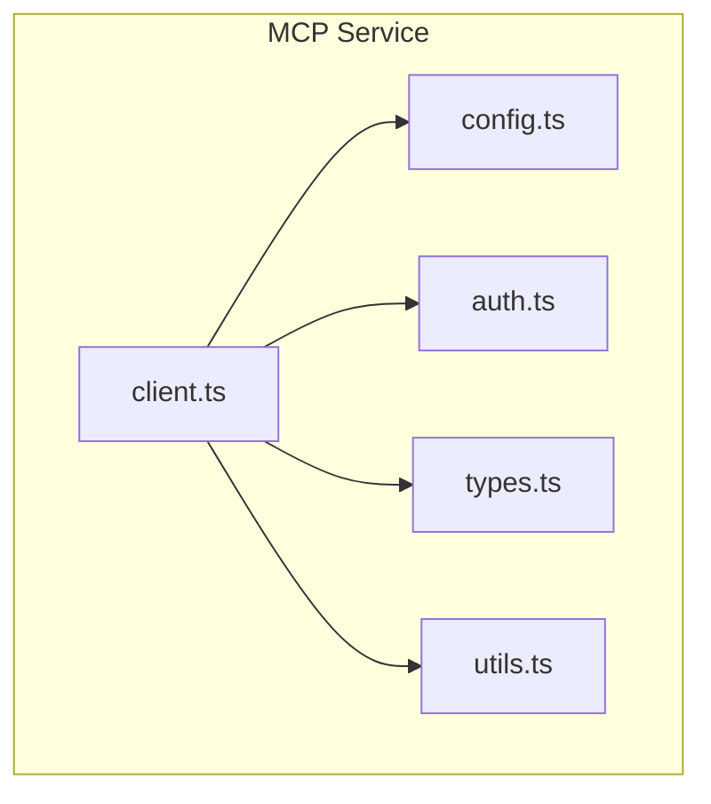
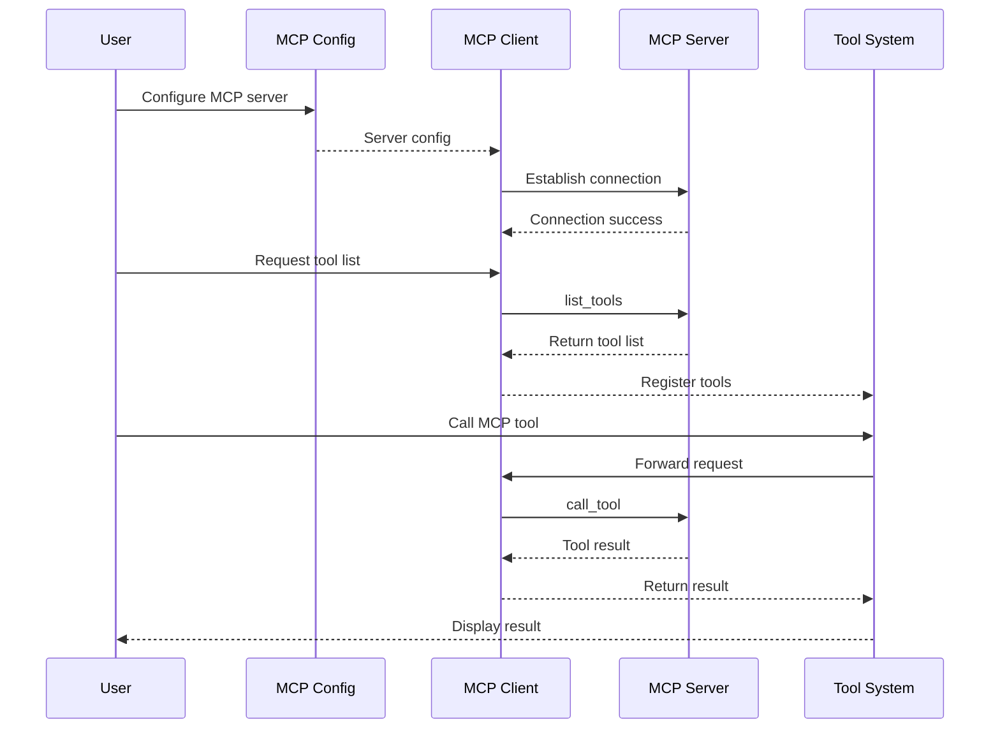
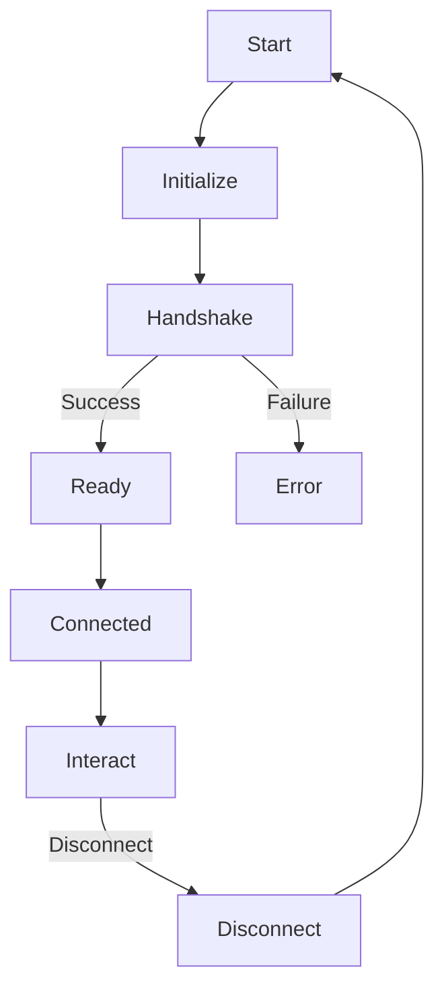
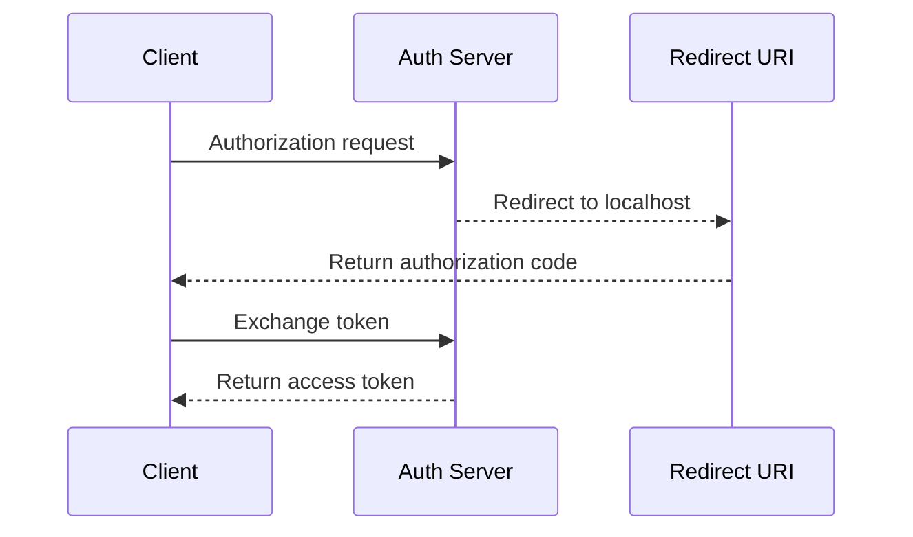

# MCP Service

## Overview

MCP (Model Context Protocol) service is the bridge between Claude Code and MCP servers, allowing Claude to access external tools and data sources through a standardized protocol.

The core implementation is in the [services/mcp/](/restored-src/src/services/mcp/) directory.

## Architecture Position



## Features

| Feature | Description | Related Files |
|---------|-------------|---------------|
| MCP Client | Communication with MCP servers | [client.ts](/restored-src/src/services/mcp/client.ts) |
| Configuration Management | MCP server configuration | [config.ts](/restored-src/src/services/mcp/config.ts) |
| Authentication Support | MCP authentication handling | [auth.ts](/restored-src/src/services/mcp/auth.ts) |
| Type Definitions | Request/response types | [types.ts](/restored-src/src/services/mcp/types.ts) |
| OAuth Port | OAuth redirect handling | [oauthPort.ts](/restored-src/src/services/mcp/oauthPort.ts) |

## File Structure

```
restored-src/src/services/mcp/
├── client.ts              # MCP client
├── config.ts             # Configuration management
├── auth.ts               # Authentication handling
├── types.ts              # Type definitions
├── utils.ts              # Utility functions
├── oauthPort.ts          # OAuth port handling
├── claudeai.ts           # Claude.ai MCP
└── xaa.ts                # XAA integration
```

## Core Workflow



## MCP Protocol

### Connection Flow



### Message Types

| Type | Direction | Description |
|------|-----------|-------------|
| `initialize` | Client→Server | Initialize connection |
| `initialized` | Server→Client | Initialization confirmation |
| `tools/list` | Client→Server | Request tool list |
| `tools/list/result` | Server→Client | Return tool list |
| `tools/call` | Client→Server | Call tool |
| `tools/call/result` | Server→Client | Return tool result |
| `ping` | Bidirectional | Heartbeat |
| `disconnect` | Bidirectional | Disconnect |

## Configuration Format

```typescript
interface MCPServerConfig {
  name: string                    // Server name
  command: string                 // Start command
  args?: string[]                 // Command arguments
  env?: Record<string, string>    // Environment variables
  url?: string                    // Server URL (for HTTP)
  auth?: MCPAuthConfig            // Authentication config
}
```

### Local Server Configuration

```json
{
  "mcpServers": {
    "filesystem": {
      "command": "npx",
      "args": ["-y", "@anthropic/mcp-server-filesystem"],
      "args": ["/home/user/projects"]
    }
  }
}
```

### HTTP Server Configuration

```json
{
  "mcpServers": {
    "remote": {
      "url": "https://api.example.com/mcp",
      "auth": {
        "type": "bearer",
        "token": "<token>"
      }
    }
  }
}
```

## Authentication

### OAuth 2.0 Flow



### Authentication Types

| Type | Description | Config Field |
|------|-------------|--------------|
| `none` | No authentication | - |
| `bearer` | Bearer Token | `token` |
| `apiKey` | API Key | `apiKey` |
| `oauth2` | OAuth 2.0 | `clientId`, `clientSecret`, `scopes` |

## Tool Integration

Tools provided by MCP servers are integrated into the tool system through [MCPTool](/restored-src/src/tools/MCPTool/):

```typescript
interface MCPToolInput {
  server: string                      // Server name
  tool: string                        // Tool name
  arguments: Record<string, unknown>  // Tool parameters
}
```

## Error Handling

| Error Type | Description | Handling Strategy |
|------------|-------------|-------------------|
| `ConnectionError` | Connection failed | Retry or notify user |
| `TimeoutError` | Request timeout | Retry or show timeout message |
| `AuthError` | Authentication failed | Re-authenticate |
| `ToolNotFoundError` | Tool doesn't exist | Show tool unavailable |
| `ToolExecutionError` | Tool execution failed | Return error message |

## Best Practices

### Server Configuration

| Practice | Description |
|----------|-------------|
| Use local servers | Reduce network latency |
| Configure timeouts | Avoid long waits |
| Error retries | Handle temporary connection issues |
| Secure authentication | Use OAuth or API Key |

### Tool Usage

| Practice | Description |
|----------|-------------|
| Parameter validation | Validate parameters before calling |
| Error handling | Properly handle tool execution errors |
| Resource cleanup | Ensure resources are properly released |

## Source References

- [client.ts](/restored-src/src/services/mcp/client.ts)
- [config.ts](/restored-src/src/services/mcp/config.ts)
- [types.ts](/restored-src/src/services/mcp/types.ts)
- [auth.ts](/restored-src/src/services/mcp/auth.ts)

## Related Documents

- [Tool System](../core/tools.md)
- [API Service](api.md)
- [OAuth Authentication](oauth.md)

---

*Generated by [Nium-Wiki v0.0.0](https://github.com/niuma996/nium-wiki) | 2026-03-31*
