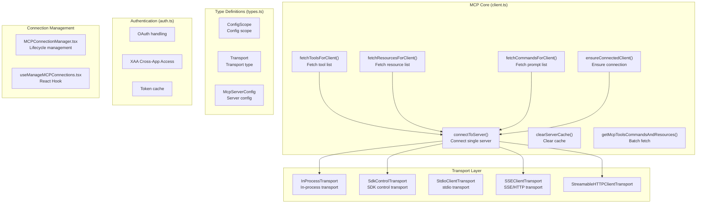
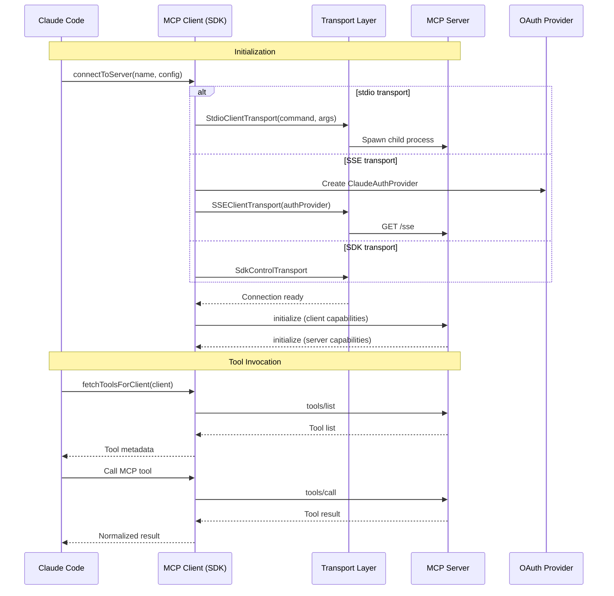

# MCP Service

## Overview

The MCP (Model Context Protocol) Service is the core module for Claude Code to interact with external MCP servers. MCP is a standardized protocol defined by Anthropic, enabling AI models to call external tools, access resources, and use prompt templates through a unified interface.

The service is built on `@modelcontextprotocol/sdk` and provides:
- Calling tools provided by remote MCP servers
- Reading resources exposed by MCP servers
- Fetching prompt templates from MCP servers
- Handling MCP OAuth authentication and session management

## Architecture



## Core Types

### ConfigScope — Configuration Scope

```typescript
export const ConfigScopeSchema = z.enum([
  'local',      // Local project .mcp.json
  'user',       // User-level ~/.claude/settings.json
  'project',    // Project-level .claude/settings.json
  'dynamic',    // Dynamic config
  'enterprise', // Enterprise managed
  'claudeai',  // Claude.ai hosted
  'managed',   // Managed MCP
])
```

### Transport — Transport Type

```typescript
export const TransportSchema = z.enum([
  'stdio',    // Standard I/O (local process)
  'sse',      // Server-Sent Events
  'sse-ide',  // IDE internal SSE
  'http',     // HTTP
  'ws',       // WebSocket
  'sdk',      // SDK control transport
])
```

### McpStdioServerConfig — stdio Server Config

```typescript
export const McpStdioServerConfigSchema = z.object({
  type: z.literal('stdio').optional(),
  command: z.string().min(1),
  args: z.array(z.string()).default([]),
  env: z.record(z.string(), z.string()).optional(),
})
```

## Core API

### Connection Management

| Function | Description | Signature |
|----------|-------------|-----------|
| `connectToServer` | Connect single MCP server (memoized) | `(name, serverRef, stats?) => Promise<MCPServerConnection>` |
| `ensureConnectedClient` | Ensure server is connected | `(name, serverRef) => Promise<MCPServerConnection>` |
| `clearServerCache` | Clear server connection cache | `(name?) => Promise<void>` |
| `getServerCacheKey` | Generate cache key | `(name, serverRef) => string` |
| `areMcpConfigsEqual` | Compare two configs for equality | `(a, b) => boolean` |
| `reconnectMcpServerImpl` | Reconnect to server | `(name, serverRef) => Promise<MCPServerConnection>` |

### Tool/Resource/Prompt Fetching

| Function | Description | Signature |
|----------|-------------|-----------|
| `fetchToolsForClient` | Fetch server tool list (LRU cached) | `(client) => Promise<ListToolsResult>` |
| `fetchResourcesForClient` | Fetch server resource list (LRU cached) | `(client) => Promise<ListResourcesResult>` |
| `fetchCommandsForClient` | Fetch server prompt list (LRU cached) | `(client) => Promise<ListPromptsResult>` |
| `getMcpToolsCommandsAndResources` | Batch fetch tools and resources | `(servers) => Promise<{commands, resources}[]>` |

### Tool Invocation

| Function | Description | Signature |
|----------|-------------|-----------|
| `callMCPToolWithUrlElicitationRetry` | Call MCP tool (with Elicitation retry) | `(params) => Promise<TransformedMCPResult>` |
| `processMCPResult` | Process MCP result | `(result) => Promise<TransformedMCPResult>` |
| `transformMCPResult` | Transform MCP result format | `(result, compactSchema) => Promise<TransformedMCPResult>` |
| `inferCompactSchema` | Infer compact schema | `(value, depth?) => string` |
| `mcpToolInputToAutoClassifierInput` | Encode tool input for security classifier | `(toolName, args) => unknown` |

### Authentication Management

| Function | Description | Signature |
|----------|-------------|-----------|
| `clearMcpAuthCache` | Clear MCP auth cache | `() => void` |
| `isMcpSessionExpiredError` | Check if error is session expired | `(error) => boolean` |

### IDE Integration

| Function | Description | Signature |
|----------|-------------|-----------|
| `callIdeRpc` | Call IDE RPC | `(method, params) => Promise<unknown>` |

## File Structure

```
restored-src/src/services/mcp/
├── client.ts                 # Core: connectToServer, fetchTools/Resources/Commands
├── types.ts                 # Zod Schema type definitions (ConfigScope, Transport, McpServerConfig)
├── config.ts                # MCP configuration handling
├── auth.ts                  # OAuth/XAA authentication handling
├── headersHelper.ts          # HTTP header helpers
├── utils.ts                 # Common utility functions
├── xaa.ts                   # Cross-App Access (SEP-990)
├── xaaIdpLogin.ts           # XAA IdP login
├── oauthPort.ts             # OAuth port handling
├── officialRegistry.ts       # Official MCP server registry
├── normalization.ts          # MCP result normalization
├── mcpStringUtils.ts        # String utilities
├── channelAllowlist.ts      # Channel allowlist
├── channelNotification.ts   # Channel notifications
├── channelPermissions.ts   # Channel permissions
├── elicitationHandler.ts    # Elicitation handling
├── envExpansion.ts          # Environment variable expansion
├── vscodeSdkMcp.ts          # VSCode SDK MCP
├── claudeai.ts             # Claude.ai integration
├── InProcessTransport.ts    # In-process transport
├── SdkControlTransport.ts  # SDK control transport
├── MCPConnectionManager.tsx # Connection manager component
└── useManageMCPConnections.tsx # React Hook
```

### Responsibilities

| File | Responsibility |
|------|----------------|
| client.ts | Core: connection management, tool/resource/prompt fetching, caching, batch processing |
| types.ts | All Zod Schema type definitions |
| auth.ts | OAuth token management, XAA cross-app access |
| config.ts | Server configuration handling and loading |
| normalization.ts | MCP response result normalization |
| MCPConnectionManager.tsx | MCP server lifecycle management React component |
| useManageMCPConnections.tsx | React Hook for MCP connection management |

## Protocol Flow



## Caching Mechanism

```mermaid
flowchart LR
    A[First call] --> B["connectToServer memoize"]
    B --> C["fetchToolsForClient LRU(100)"]
    C --> D["fetchResourcesForClient LRU(100)"]
    D --> E["fetchCommandsForClient LRU(100)"]
    E --> F[Return result]
    F --> G[Cache key: name + jsonStringify(config)]
    G --> H[Subsequent calls]
    H --> I[Return cached directly]
```

**Batch connection**: Default batch of 3 stdio servers concurrent, 20 for remote servers.

## Error Handling

| Error Type | Description |
|------------|-------------|
| `McpAuthError` | MCP authentication failure |
| `McpToolCallError` | MCP tool invocation failed |
| `McpSessionExpiredError` | MCP session expired |
| `ErrorCode.RPC_ERROR` | JSON-RPC error |
| `ErrorCode.InvalidParams` | Invalid parameters |

## Source References

- [services/mcp/client.ts](/restored-src/src/services/mcp/client.ts) — Core implementation
- [services/mcp/types.ts](/restored-src/src/services/mcp/types.ts) — Type definitions
- [services/mcp/auth.ts](/restored-src/src/services/mcp/auth.ts) — Authentication handling

## Related Documentation

- [Services Index](_index.md)
- [Agent Tool](../agent/agent-tool.md) — Tool calling framework
- [Home](../index.md)

---

*Generated by [Nium-Wiki v0.0.0](https://github.com/niuma996/nium-wiki) | 2026-04-08*
