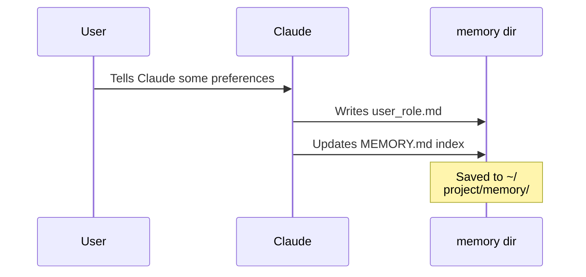

# Memory Service

## Overview

The Memory Service is Claude Code's file-based persistent memory system, managing the AI's long-term memory through a `MEMORY.md` index paired with topic files. This service enables Claude Code to retain user preferences, project context, and external system references across sessions, providing more personalized interactions.

**⚠️ Important Clarification**: The Memory Service is **not** a vector database or semantic search system. It is a file-system-backed factual memory store implemented through file read/write and grep searches. There is no SQLite, vector storage, or embedding generation involved.

## Architecture

```mermaid
flowchart TB
    subgraph MemoryCore["Memory Core (memdir.ts)"]
        buildMemoryLines["buildMemoryLines()<br/>Generate prompt template"]
        buildMemoryPrompt["buildMemoryPrompt()<br/>Include MEMORY.md content"]
        loadMemoryPrompt["loadMemoryPrompt()<br/>Entry: load memory prompt"]
        truncateEntrypoint["truncateEntrypointContent()<br/>Truncate index content"]
    end

    subgraph MemoryTypes["Type System (memoryTypes.ts)"]
        MEMORY_TYPES["MEMORY_TYPES = ['user', 'feedback', 'project', 'reference']"]
        parseMemoryType["parseMemoryType()"]
        WHAT_NOT_TO_SAVE["WHAT_NOT_TO_SAVE_SECTION"]
        WHEN_TO_ACCESS["WHEN_TO_ACCESS_SECTION"]
        TRUSTING_RECALL["TRUSTING_RECALL_SECTION"]
    end

    subgraph MemoryAge["Freshness Management (memoryAge.ts)"]
        memoryAge["memoryAge() / memoryAgeDays()"]
        memoryFreshnessNote["memoryFreshnessNote()"]
        memoryFreshnessText["memoryFreshnessText()"]
    end

    subgraph MemoryPaths["Path Management (paths.ts)"]
        getAutoMemPath["getAutoMemPath()"]
        isAutoMemoryEnabled["isAutoMemoryEnabled()"]
    end

    subgraph Modes["Multi-Mode Support"]
        Individual["Individual Mode<br/>(single MEMORY.md)"]
        TeamMem["Team Mode (TEAMMEM)<br/>(private + team dirs)"]
        Kairos["Kairos Daily Log (KAIROS)<br/>(append-only log)"]
    end

    buildMemoryLines --> MEMORY_TYPES
    buildMemoryLines --> WHAT_NOT_TO_SAVE
    buildMemoryLines --> WHEN_TO_ACCESS
    buildMemoryLines --> TRUSTING_RECALL
    loadMemoryPrompt --> buildMemoryPrompt
    loadMemoryPrompt --> Individual
    loadMemoryPrompt --> TeamMem
    loadMemoryPrompt --> Kairos
```



## Core Concepts

### Memory File Structure

```
memory/                          # Memory directory (~/.claude/projects/<slug>/memory/)
├── MEMORY.md                   # Index file (one link per line)
├── user/                       # User preference memories
│   ├── user_role.md
│   └── user_preferences.md
├── feedback/                   # User feedback memories
│   └── feedback_testing.md
├── project/                    # Project context memories
│   └── project_memory.md
└── reference/                 # External system pointers
    └── external_refs.md
```

### MEMORY.md Index Format

```markdown
# auto memory

...

## MEMORY.md

- [Title](file.md) — one-line hook
- [User role](user_role.md) — data scientist focused on logging
- [Feedback: no summaries](feedback_testing.md) — user dislikes trailing summaries
```

### Memory Types (MEMORY_TYPES)

```typescript
export const MEMORY_TYPES = ['user', 'feedback', 'project', 'reference'] as const
export type MemoryType = (typeof MEMORY_TYPES)[number]
```

| Type | Description | Example |
|------|-------------|---------|
| `user` | User role, goals, knowledge background | User is a data scientist focused on observability |
| `feedback` | User guidance on how to approach work (avoid/keep) | Don't mock the database in tests; user prefers concise replies |
| `project` | Ongoing work context, goals, deadlines | Mobile team freeze non-critical merges on March 5 |
| `reference` | External system pointers | Linear "INGEST" project tracks pipeline bugs |

### Frontmatter Format

```markdown
---
name: {{memory name}}
description: {{one-line description — used to decide relevance in future conversations, so be specific}}
type: {{user, feedback, project, reference}}
---

{{memory content — for feedback/project types, structure as: rule/fact, then **Why:** and **How to apply:** lines}}
```

## File Structure

```
restored-src/src/memdir/
├── memdir.ts          # Core: buildMemoryPrompt, loadMemoryPrompt, truncateEntrypointContent
├── memoryTypes.ts     # Type definitions, TYPES_SECTION, frontmatter examples
├── memoryAge.ts       # Memory freshness calculation functions
├── memoryScan.ts     # Scan memory files
├── paths.ts          # Path management (getAutoMemPath, isAutoMemoryEnabled)
├── teamMemPaths.ts   # Team memory paths (TEAMMEM feature)
└── teamMemPrompts.ts # Team memory prompt building
```

### Responsibilities

| File | Responsibility |
|------|----------------|
| memdir.ts | Core: generate memory prompts, MEMORY.md truncation, load entry point |
| memoryTypes.ts | Define four memory types, frontmatter format examples, section text |
| memoryAge.ts | Calculate memory age, generate staleness warning text |
| paths.ts | Get memory directory path, check if auto memory is enabled |
| teamMemPaths.ts | Team memory paths (when TEAMMEM feature is on) |
| teamMemPrompts.ts | Team + individual memory combined prompt building |

## Core API

### memdir.ts Exports

| Function | Description | Signature |
|----------|-------------|-----------|
| `loadMemoryPrompt` | Main entry: load memory prompt based on feature switches | `() => Promise<string \| null>` |
| `buildMemoryPrompt` | Build full prompt with MEMORY.md content | `(params) => string` |
| `buildMemoryLines` | Generate prompt skeleton (without content) | `(displayName, memoryDir, extraGuidelines?) => string[]` |
| `truncateEntrypointContent` | Truncate MEMORY.md content | `(raw: string) => EntrypointTruncation` |
| `ensureMemoryDirExists` | Ensure memory directory exists | `(memoryDir: string) => Promise<void>` |

### memoryTypes.ts Exports

| Export | Description |
|--------|-------------|
| `MEMORY_TYPES` | Memory type constant array `['user', 'feedback', 'project', 'reference']` |
| `parseMemoryType(raw)` | Parse frontmatter value to `MemoryType` |
| `TYPES_SECTION_INDIVIDUAL` | Type description text for individual mode |
| `TYPES_SECTION_COMBINED` | Type description text for team mode (with scope tags) |
| `WHAT_NOT_TO_SAVE_SECTION` | Explicitly prohibited content types |
| `WHEN_TO_ACCESS_SECTION` | Guidance on when to access memories |
| `TRUSTING_RECALL_SECTION` | Guidance on how to trust recalled memories |
| `MEMORY_FRONTMATTER_EXAMPLE` | Frontmatter example |

### memoryAge.ts Exports

| Function | Description |
|----------|-------------|
| `memoryAgeDays(mtimeMs)` | Days elapsed since mtime (floor-rounded) |
| `memoryAge(mtimeMs)` | Human-readable age string ("today", "yesterday", "N days ago") |
| `memoryFreshnessText(mtimeMs)` | Staleness warning text (>1 day returns text, else empty string) |
| `memoryFreshnessNote(mtimeMs)` | Staleness warning wrapped in `<system-reminder>` tags |

## Three Operating Modes

### 1. Individual Mode (Default)

Normal sessions use a single directory structure, with memories managed via `MEMORY.md` index + topic files:



### 2. Team Mode (TEAMMEM)

Shares private and team directories, supporting team collaboration:

```
memory/
├── MEMORY.md              # Merged index
├── user/                  # Personal memories (not shared)
├── feedback/              # Personal feedback
├── project/              # Personal project context
├── reference/            # Personal external pointers
└── team/                 # Team-shared directory
    ├── team_feedback.md
    ├── team_project.md
    └── team_reference.md
```

### 3. Kairos Log Mode (KAIROS)

Long-lived sessions use append-only logs to avoid frequently rewriting MEMORY.md:

```
memory/
└── logs/
    └── YYYY/
        └── MM/
            └── YYYY-MM-DD.md   # Daily append log
```

A nightly `/dream` skill distills logs into `MEMORY.md` and topic files.

## Truncation Mechanism

`MEMORY.md` has two layers of truncation protection:

| Limit | Value | Description |
|-------|-------|-------------|
| Line limit | `MAX_ENTRYPOINT_LINES = 200` | Truncates after last line when exceeded |
| Byte limit | `MAX_ENTRYPOINT_BYTES = 25_000` | Truncates at last newline when exceeded |

```typescript
export function truncateEntrypointContent(raw: string): EntrypointTruncation {
  // 1. Line truncation (priority)
  // 2. Byte truncation (at last newline)
  // Returns { content, lineCount, byteCount, wasLineTruncated, wasByteTruncated }
}
```

## Freshness Handling

When memory freshness exceeds 1 day, the system automatically injects a warning:

```typescript
// memoryFreshnessNote() returns:
// <system-reminder>Memory is 3 days old. Memories are point-in-time observations,
// not live state — claims about code behavior or file:line citations may be
// outdated. Verify against current code before asserting as fact.</system-reminder>
```

This addresses user reports of "stale code-state memories being asserted as fact."

## Source References

- [memdir/memdir.ts](/restored-src/src/memdir/memdir.ts) — Core implementation
- [memdir/memoryTypes.ts](/restored-src/src/memdir/memoryTypes.ts) — Type definitions
- [memdir/memoryAge.ts](/restored-src/src/memdir/memoryAge.ts) — Freshness calculation
- [memdir/paths.ts](/restored-src/src/memdir/paths.ts) — Path management

## Related Documentation

- [Services Index](_index.md)
- [Team Memory Sync](team-memory-sync.md) — Multi-user memory sharing
- [Agent Tool](../agent/agent-tool.md) — Agent tool calling
- [Home](../index.md)

---

*Generated by [Nium-Wiki v0.0.0](https://github.com/niuma996/nium-wiki) | 2026-04-08*
