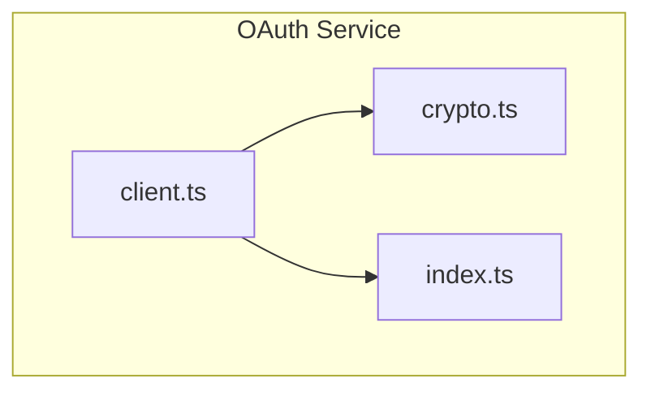
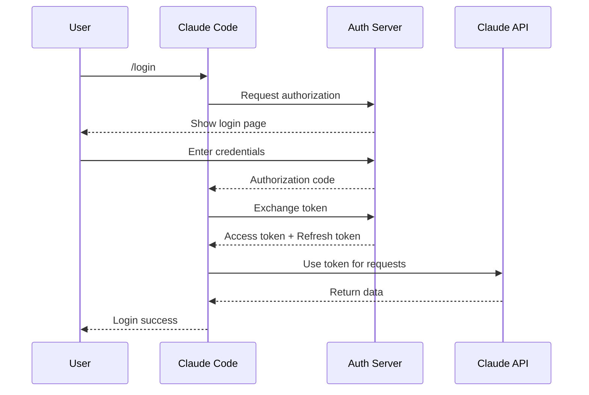
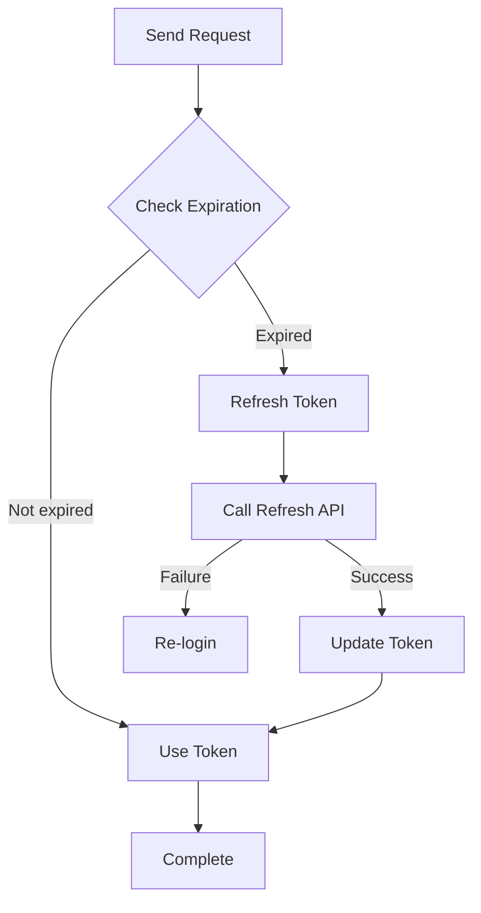
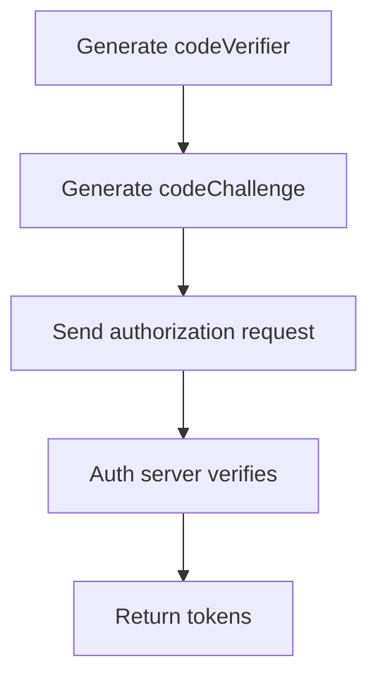

# OAuth Authentication

## Overview

The OAuth service handles user authentication flows for Claude Code, supporting OAuth 2.0 standard authentication. The service manages token storage, token refresh, and session management.

The core implementation is in the [services/oauth/](/restored-src/src/services/oauth/) directory.

## Architecture Position



## Features

| Feature | Description | Related Files |
|---------|-------------|---------------|
| OAuth Client | Standard OAuth 2.0 flow | [client.ts](/restored-src/src/services/oauth/client.ts) |
| Crypto Utilities | Encrypted token storage | [crypto.ts](/restored-src/src/services/oauth/crypto.ts) |
| Token Management | Access and refresh tokens | [index.ts](/restored-src/src/services/oauth/index.ts) |

## File Structure

```
restored-src/src/services/oauth/
├── client.ts              # OAuth client
├── crypto.ts             # Crypto utilities
└── index.ts             # Export entry
```

## OAuth 2.0 Flow



## Token Management

### Token Types

| Type | Purpose | Expiration |
|------|---------|------------|
| `accessToken` | API request authentication | 1 hour |
| `refreshToken` | Refresh access token | 30 days |
| `idToken` | User identity information | 1 hour |

### Token Storage

```typescript
interface TokenStore {
  accessToken: string      // Encrypted storage
  refreshToken: string      // Encrypted storage
  expiresAt: number         // Expiration timestamp
  tokenType: string         // Token type
}
```

### Token Refresh Flow



## Authentication Configuration

### OAuth Parameters

```typescript
interface OAuthConfig {
  clientId: string                 // OAuth client ID
  clientSecret?: string             // Client secret
  authorizationUrl: string          // Authorization endpoint
  tokenUrl: string                  // Token endpoint
  redirectUri: string               // Redirect URI
  scopes: string[]                  // Requested scopes
}
```

### Default Configuration

```typescript
const DEFAULT_OAUTH_CONFIG: OAuthConfig = {
  authorizationUrl: 'https://auth.anthropic.com/oauth/authorize',
  tokenUrl: 'https://auth.anthropic.com/oauth/token',
  redirectUri: 'http://localhost:8080/callback',
  scopes: ['api:read', 'api:write']
}
```

## PKCE Extension

Use PKCE (Proof Key for Code Exchange) for enhanced security:



## Security Considerations

### Token Encryption

| Measure | Description |
|---------|-------------|
| Static encryption | Encrypt tokens using system key |
| Memory security | Clean sensitive data from memory promptly |
| Secure storage | Use system keychain for storage |

### PKCE

| Measure | Description |
|---------|-------------|
| codeVerifier | Random 43-128 character string |
| codeChallenge | SHA256 hash with S256 method |
| One-time use | Authorization code can only be used once |

## Error Handling

| Error Type | Description | Handling |
|------------|-------------|----------|
| `AuthCodeError` | Authorization code error | Re-obtain |
| `TokenError` | Token request failed | Check config or re-authenticate |
| `RefreshError` | Refresh token failed | Re-login |
| `InvalidScopeError` | Invalid scope | Adjust permissions |

## API Summary

| Function | Description | Return Type |
|----------|-------------|-------------|
| `getAccessToken()` | Get current access token | `string \| null` |
| `refreshTokens()` | Refresh access token | `Promise<TokenStore>` |
| `revokeTokens()` | Revoke tokens | `Promise<void>` |
| `isAuthenticated()` | Check authentication status | `boolean` |

## Usage Examples

### Login Flow

```typescript
import { startLogin } from '@/services/oauth/client'

// Start OAuth login flow
await startLogin()
```

### Check Authentication Status

```typescript
import { isAuthenticated, getAccessToken } from '@/services/oauth/client'

if (isAuthenticated()) {
  const token = getAccessToken()
  // Use token
}
```

### Logout

```typescript
import { logout } from '@/services/oauth/client'

await logout()
```

## Source References

- [client.ts](/restored-src/src/services/oauth/client.ts)
- [crypto.ts](/restored-src/src/services/oauth/crypto.ts)
- [index.ts](/restored-src/src/services/oauth/index.ts)

## Related Documents

- [API Service](api.md)
- [MCP Service](mcp.md)
- [Getting Started](../getting-started.md)

---

*Generated by [Nium-Wiki v0.0.0](https://github.com/niuma996/nium-wiki) | 2026-03-31*
