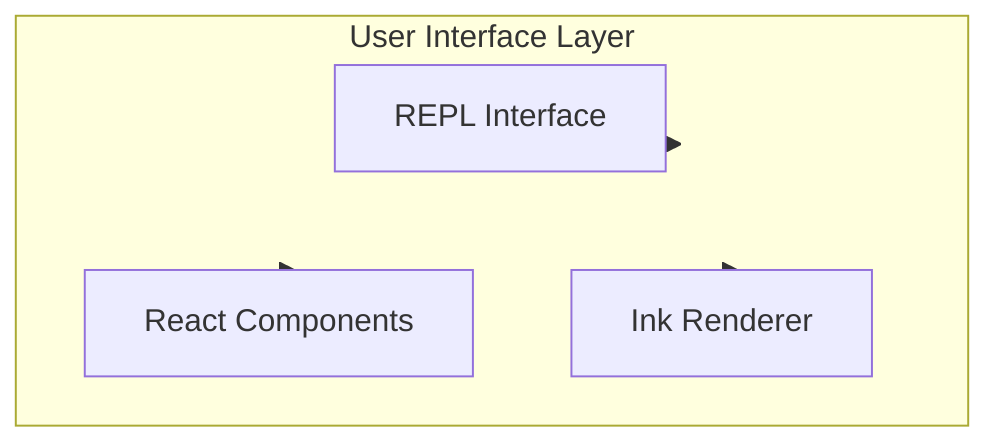

# User Interface Layer

## Overview

The user interface layer uses Ink to render interactive terminal UI, providing the REPL interface and component-based user interface.

## Submodules

| Module | Description | Document |
|--------|-------------|----------|
| [REPL Interface](repl.md) | Interactive command-line interface | [repl.md](repl.md) |
| [Ink Engine](ink.md) | Ink rendering engine | [ink.md](ink.md) |

## Architecture Position

## Related Documents

- [Architecture Docs](../architecture.md)
- [Home](../index.md)

---

*Generated by [Nium-Wiki v0.0.0](https://github.com/niuma996/nium-wiki) | 2026-03-31*
