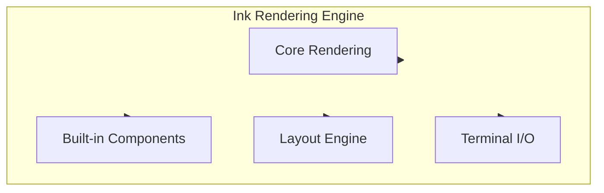
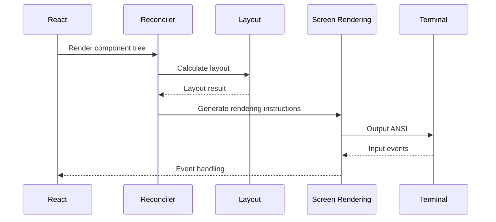
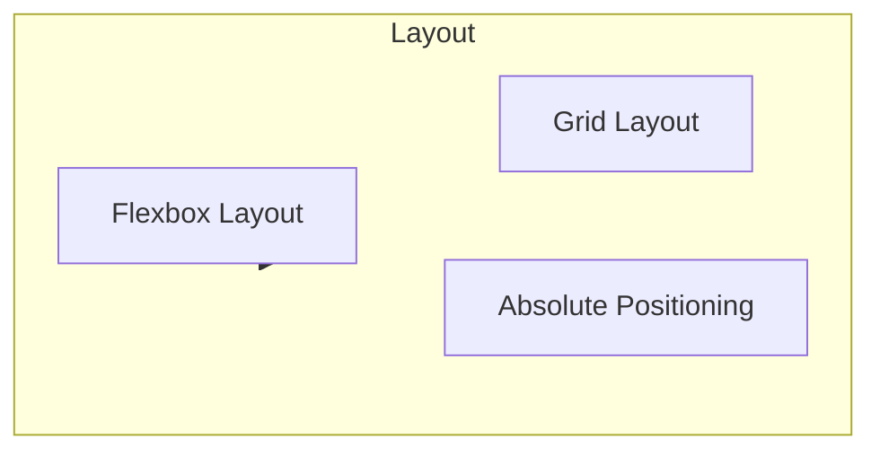

# Ink Rendering Engine

## Overview

Ink is a React-like terminal UI library. Claude Code uses it to render interactive command-line interfaces. Ink provides a component-based, declarative UI development experience while supporting ANSI escape sequence rendering.

The core implementation is in the [ink/](/restored-src/src/ink/) directory.

## Architecture Position



## Features

| Feature | Description | Related Files |
|---------|-------------|---------------|
| Core Rendering | React renderer | [render-to-screen.ts](/restored-src/src/ink/render-to-screen.ts) |
| Layout Engine | Yoga layout | [layout/yoga.ts](/restored-src/src/ink/layout/yoga.ts) |
| Terminal Parsing | ANSI parsing | [termio/](/restored-src/src/ink/termio/) |
| Built-in Components | Box, Text, etc. | [components/](/restored-src/src/ink/components/) |

## File Structure

```
restored-src/src/ink/
├── ink.tsx                # Main entry
├── render-to-screen.ts   # Screen rendering
├── renderer.ts           # React renderer
├── reconciler.ts         # React reconciler
├── screen.ts            # Screen management
├── styles.ts            # Style system
├── instances.ts         # Instance management
├── components/          # Built-in components
│   ├── Box.tsx
│   ├── Text.tsx
│   ├── Button.tsx
│   ├── Link.tsx
│   ├── Spacer.tsx
│   └── App.tsx
├── hooks/               # Hooks
│   ├── use-input.ts
│   ├── use-stdin.ts
│   └── use-app.ts
├── layout/              # Layout
│   ├── engine.ts
│   ├── geometry.ts
│   ├── node.ts
│   └── yoga.ts
├── termio/              # Terminal I/O
│   ├── ansi.ts
│   ├── parser.ts
│   ├── types.ts
│   └── ...
└── events/              # Event system
    ├── input-event.ts
    ├── click-event.ts
    └── ...
```

## Rendering Flow



## Built-in Components

### Box Component

Box is the basic container component:

```tsx
import { Box, Text } from 'ink'

<Box>
  <Text>Hello World</Text>
</Box>
```

### Text Component

The Text component is used to display text:

```tsx
<Text color="green" bold>
  Success!
</Text>
```

### Button Component

Button component supports interaction:

```tsx
<Button onPress={() => console.log('clicked')}>
  Click me
</Button>
```

## Style System

| Style Property | Type | Description |
|----------------|------|-------------|
| `color` | string | Text color |
| `backgroundColor` | string | Background color |
| `bold` | boolean | Bold |
| `italic` | boolean | Italic |
| `dim` | boolean | Dim |
| `underline` | boolean | Underline |
| `margin` | number | Margin |
| `padding` | number | Padding |
| `flexDirection` | string | Direction |
| `alignItems` | string | Alignment |

## Layout Engine

Ink uses the Yoga layout engine:



## Event System

| Event | Description | Handling |
|-------|-------------|----------|
| `keypress` | Keyboard press | `useInput` hook |
| `mouse` | Mouse events | `click-event.ts` |
| `focus` | Focus events | `focus-event.ts` |
| `resize` | Terminal size | `terminal-querier.ts` |

## ANSI Support

### Colors

```typescript
// Standard colors
<Text color="red">Red</Text>
<Text color="#ff0000">Hexadecimal</Text>

// 256 colors
<Text color="ansi256">256 colors</Text>

// True color
<Text color="rgb(255, 0, 0)">RGB</Text>
```

### Escape Sequences

```typescript
// Cursor control
'\x1b[?25l'  // Hide cursor
'\x1b[?25h'  // Show cursor
'\x1b[2J'    // Clear screen

// Movement
'\x1b[{n}A'  // Move up n lines
'\x1b[{n}B'  // Move down n lines
```

## Hooks

### useInput

Handle user input:

```typescript
import { useInput } from 'ink'

useInput((input, key) => {
  if (key.return) {
    console.log('Enter pressed')
  }
})
```

### useApp

Get App instance:

```typescript
import { useApp } from 'ink'

const { exit } = useApp()
```

## Performance Optimization

| Optimization | Description |
|--------------|-------------|
| Selective Rendering | Only update changed nodes |
| Batch Updates | Merge multiple state updates |
| Layout Caching | Cache layout calculation results |
| Minimize Output | Reduce terminal refreshes |

## Source References

- [ink.tsx](/restored-src/src/ink/ink.tsx)
- [render-to-screen.ts](/restored-src/src/ink/render-to-screen.ts)
- [renderer.ts](/restored-src/src/ink/renderer.ts)
- [components/Box.tsx](/restored-src/src/ink/components/Box.tsx)
- [layout/yoga.ts](/restored-src/src/ink/layout/yoga.ts)

## Related Documents

- [REPL Interface](repl.md)
- [Architecture Docs](../architecture.md)

---

*Generated by [Nium-Wiki v0.0.0](https://github.com/niuma996/nium-wiki) | 2026-03-31*
