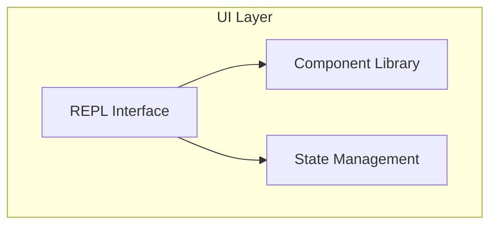
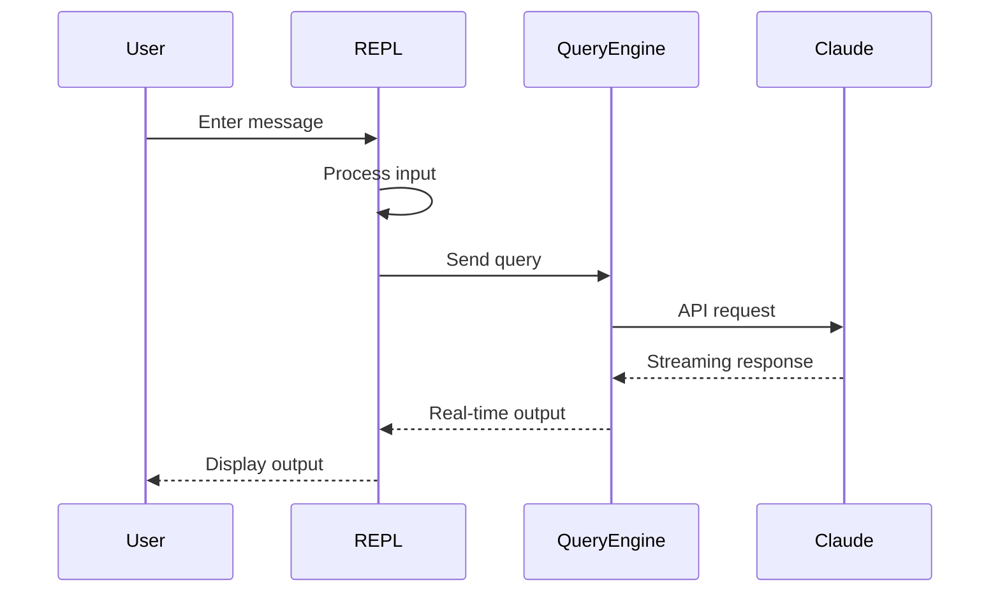
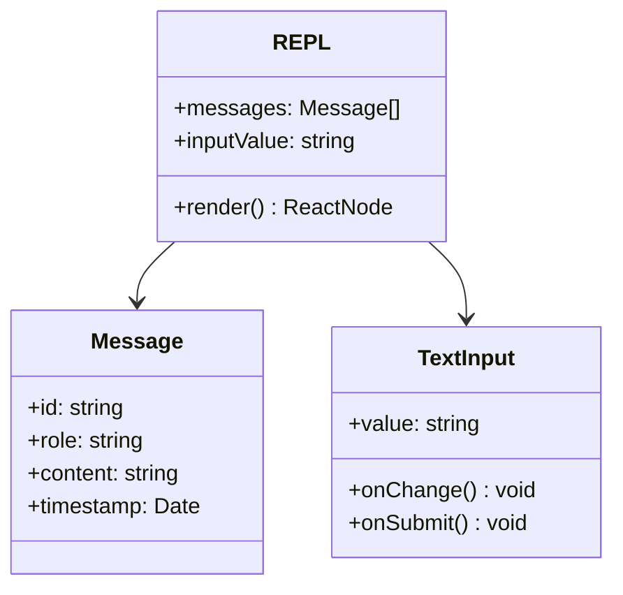
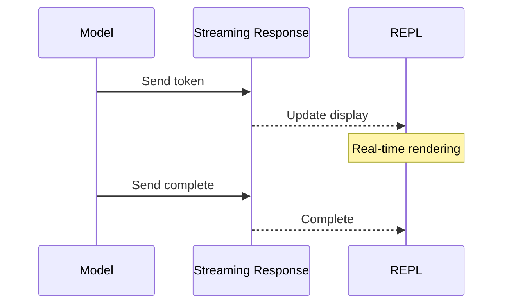

# REPL Interface

## Overview

REPL (Read-Eval-Print Loop) interface is the primary user interaction interface for Claude Code, providing an interactive command-line experience. The interface uses Ink for rendering, supporting real-time input, output display, and command completion.

The core implementation is in [screens/REPL.tsx](/restored-src/src/screens/REPL.tsx).

## Architecture Position



## Features

| Feature | Description | Related Files |
|---------|-------------|---------------|
| Command Input | User input handling | [components/TextInput.tsx](/restored-src/src/components/TextInput.tsx) |
| Message Display | Conversation message rendering | [components/Message.tsx](/restored-src/src/components/Message.tsx) |
| Streaming Output | Real-time streaming display | [components/Messages.tsx](/restored-src/src/components/Messages.tsx) |
| Command Completion | Smart command completion | [hooks/useTypeahead.tsx](/restored-src/src/hooks/useTypeahead.tsx) |

## File Structure

```
restored-src/src/
├── screens/
│   └── REPL.tsx              # REPL main interface
├── components/                # React components
│   ├── Message.tsx           # Message component
│   ├── MessageRow.tsx       # Message row
│   ├── Messages.tsx         # Message list
│   ├── TextInput.tsx        # Text input
│   ├── SearchBox.tsx        # Search box
│   ├── Onboarding.tsx      # Onboarding screen
│   └── ...
├── hooks/                    # React Hooks
│   ├── useInputBuffer.ts   # Input buffer
│   ├── useTextInput.ts     # Text input
│   ├── useCommandQueue.ts  # Command queue
│   └── ...
└── ink/                      # Ink rendering engine
```

## Core Workflow



## Interface Components



## State Management

| State | Description | Management |
|-------|-------------|------------|
| Message List | Conversation history | React State |
| Input Value | Current input | React State |
| Send Status | Sending/complete | React State |
| Error State | Error messages | React State |
| Configuration | User configuration | AppState Store |

## Input Processing

### Input Buffer

```typescript
interface InputBuffer {
  value: string           // Current input value
  cursor: number         // Cursor position
  history: string[]      // History records
  historyIndex: number   // History index
}
```

### Command Parsing

| Type | Prefix | Description |
|------|--------|-------------|
| Normal Message | None | Sent directly to model |
| Slash Command | `/` | Execute built-in command |
| Special Command | `--` | CLI options |

## Streaming Output

REPL supports real-time streaming output:



## User Experience

### Command Completion

| Feature | Trigger | Description |
|---------|---------|-------------|
| Slash Commands | Type `/` | Show available commands |
| Argument Completion | Space after command | Show argument options |
| File Path | Type path | Auto-complete files |

### Keyboard Shortcuts

| Shortcut | Function |
|----------|---------|
| `Ctrl+C` | Cancel current input |
| `Ctrl+L` | Clear screen |
| `Ctrl+R` | Search history |
| `↑/↓` | Browse history |
| `Tab` | Complete |
| `Esc` | Cancel |

## Rendering Optimization

| Optimization | Description |
|--------------|-------------|
| Virtual List | Only render visible messages |
| Incremental Rendering | Streaming updates instead of full refresh |
| Debouncing | Input debouncing to reduce rendering |
| Memoization | Cache components to avoid re-rendering |

## Source References

- [REPL.tsx](/restored-src/src/screens/REPL.tsx)
- [components/Message.tsx](/restored-src/src/components/Message.tsx)
- [components/TextInput.tsx](/restored-src/src/components/TextInput.tsx)
- [hooks/useInputBuffer.ts](/restored-src/src/hooks/useInputBuffer.ts)

## Related Documents

- [Ink Engine](ink.md)
- [Architecture Docs](../architecture.md)

---

*Generated by [Nium-Wiki v0.0.0](https://github.com/niuma996/nium-wiki) | 2026-03-31*
