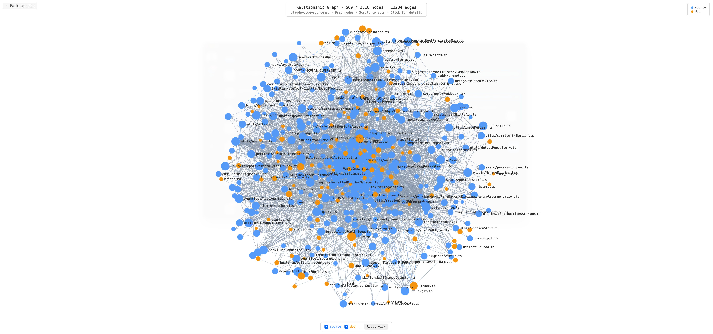
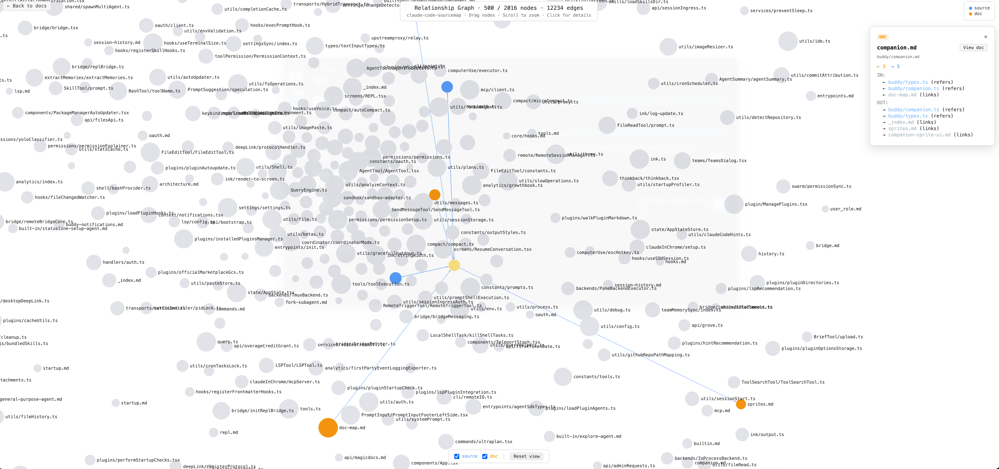

# claude-code-sourcemap-wiki

> For learning and reference only

**[English](./README_en.md)** | **[中文](./README.md)**

***

Auto-generated Wiki documentation based on [claude-code-sourcemap](https://github.com/ChinaSiro/claude-code-sourcemap)

Built  [nium-wiki](https://github.com/niuma996/nium-wiki) (skill)

## Preview Locally

```bash
npx nium-wiki serve
```

After startup, visit [localhost:4000](http://localhost:4000) to view.

## Directory Structure

- `.nium-wiki/wiki/` — Chinese Wiki documentation
  - `core/` — Core systems (QueryEngine, Task, Tool, commands, hooks, skills)
  - `agent/` — Agent tool and built-in agents
  - `cli/` — CLI entrypoints and fast paths
  - `coordinator/` — Coordinator and multi-agent scheduling
  - `buddy/` — Buddy companion sprite UI and notification system
  - `plugins/` — Plugin system and bundled skills
  - `services/` — API, MCP, MagicDocs, and other service layers
  - `remote/` — Bridge mode and remote control
  - `ui/` — React/Ink UI components
- `.nium-wiki/wiki_en/` — English Wiki documentation (same structure)
- `insights/` — Notes and discoveries from code reading sessions

## Screenshots

### Local Server


### Dependency Graph (Global)



### Dependency Graph (Local)



## Related Links

- [claude-code-sourcemap](https://github.com/ChinaSiro/claude-code-sourcemap)
- [nium-wiki](https://github.com/niuma996/nium-wiki)

